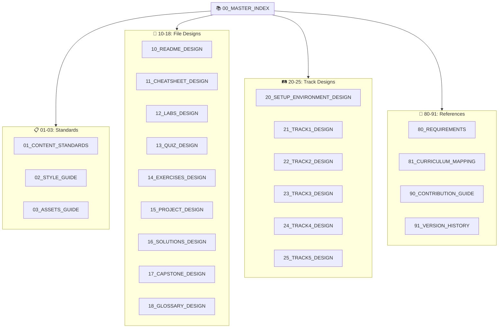

# 📚 MASTER INDEX - Design Files Directory

---

## 📋 DOCUMENT INFORMATION (Thông tin tài liệu)

| Thuộc tính | Giá trị |
|------------|---------|
| **Tên** | 00_MASTER_INDEX |
| **Phiên bản** | 1.3 |
| **Ngày tạo** | 2025-12-28 |
| **Tổng số files** | 23 |
| **Mô tả** | Mục lục điều hướng tới tất cả Design Files |

---

## 1. 🎯 OVERVIEW (Tổng quan)



---

## 2. 📋 STANDARDS (Quy chuẩn chung)

| # | File | Mô tả | Link |
|---|------|-------|------|
| 01 | **01_CONTENT_STANDARDS.md** | Quy tắc chung: ngôn ngữ, YAML, hình ảnh | [Xem](./01_CONTENT_STANDARDS.md) |
| 02 | **02_STYLE_GUIDE.md** | Quy ước viết code samples | [Xem](./02_STYLE_GUIDE.md) |
| 03 | **03_ASSETS_GUIDE.md** | Quy chuẩn hình ảnh, Mermaid, emojis | [Xem](./03_ASSETS_GUIDE.md) |

---

## 3. 📁 FILE DESIGNS (Thiết kế 9 loại file)

### Navigation Flow (Luồng điều hướng)

```
📖 README → 📝 CHEATSHEET → 🔬 LABS → ❓ QUIZ → ✏️ EXERCISES → 🚀 PROJECT → ✅ SOLUTIONS
```

| # | Icon | File | Mục đích | Link |
|---|------|------|----------|------|
| 10 | 📖 | **10_README_DESIGN.md** | 4 cấp độ README | [Xem](./10_README_DESIGN.md) |
| 11 | 📝 | **11_CHEATSHEET_DESIGN.md** | Tra cứu nhanh | [Xem](./11_CHEATSHEET_DESIGN.md) |
| 12 | 🔬 | **12_LABS_DESIGN.md** | Thực hành có hướng dẫn | [Xem](./12_LABS_DESIGN.md) |
| 13 | ❓ | **13_QUIZ_DESIGN.md** | Câu hỏi trắc nghiệm | [Xem](./13_QUIZ_DESIGN.md) |
| 14 | ✏️ | **14_EXERCISES_DESIGN.md** | Bài tập tình huống | [Xem](./14_EXERCISES_DESIGN.md) |
| 15 | 🚀 | **15_PROJECT_DESIGN.md** | Mini project | [Xem](./15_PROJECT_DESIGN.md) |
| 16 | ✅ | **16_SOLUTIONS_DESIGN.md** | Đáp án chi tiết | [Xem](./16_SOLUTIONS_DESIGN.md) |
| 17 | 🏆 | **17_CAPSTONE_DESIGN.md** | Capstone Project cuối Track | [Xem](./17_CAPSTONE_DESIGN.md) |
| 18 | 📖 | **18_GLOSSARY_DESIGN.md** | Từ điển thuật ngữ | [Xem](./18_GLOSSARY_DESIGN.md) |

---

## 4. 🛤️ TRACK DESIGNS (Thiết kế các Track)

| # | Track | Mô tả | Link |
|---|-------|-------|------|
| 20 | **20_SETUP_ENVIRONMENT_DESIGN.md** | Thiết lập môi trường | [Xem](./20_SETUP_ENVIRONMENT_DESIGN.md) |
| 21 | **21_TRACK1_DESIGN.md** | Foundation & Static Web | [Xem](./21_TRACK1_DESIGN.md) |
| 22 | **22_TRACK2_DESIGN.md** | Orchestration & Automation | [Xem](./22_TRACK2_DESIGN.md) |
| 23 | **23_TRACK3_DESIGN.md** | Cloud, Network & System Design | [Xem](./23_TRACK3_DESIGN.md) |
| 24 | **24_TRACK4_DESIGN.md** | DevSecOps | [Xem](./24_TRACK4_DESIGN.md) |
| 25 | **25_TRACK5_DESIGN.md** | Career Path | [Xem](./25_TRACK5_DESIGN.md) |

---

## 5. 📘 REFERENCES (Tài liệu tham khảo)

| # | File | Mô tả | Link |
|---|------|-------|------|
| 80 | **80_REQUIREMENTS.md** | Yêu cầu kỹ thuật tổng thể | [Xem](./80_REQUIREMENTS.md) |
| 81 | **81_CURRICULUM_MAPPING.md** | Ánh xạ chương trình học | [Xem](./81_CURRICULUM_MAPPING.md) |
| 90 | **90_CONTRIBUTION_GUIDE.md** | Hướng dẫn đóng góp | [Xem](./90_CONTRIBUTION_GUIDE.md) |
| 91 | **91_VERSION_HISTORY.md** | Lịch sử phiên bản | [Xem](./91_VERSION_HISTORY.md) |

---

## 6. 🔧 HOW TO USE (Cách sử dụng)

### Reading Order (Thứ tự đọc)

```
00 → 01 → 02 → 10-17 → 2X (Track tương ứng)
```

1. **00_MASTER_INDEX** → Hiểu tổng quan
2. **01_CONTENT_STANDARDS** → Quy tắc chung
3. **02_STYLE_GUIDE** → Quy ước viết code
4. **10-17** → File design tương ứng
5. **2X_TRACKx_DESIGN** → Track đang làm

---

## 7. 📊 STATISTICS (Thống kê)

| Group (Nhóm) | Range (Số thứ tự) | Count (Số lượng) | Files |
|--------------|-------------------|------------------|-------|
| Standards | 00-03 | 4 | MASTER_INDEX, CONTENT_STANDARDS, STYLE_GUIDE, ASSETS_GUIDE |
| File Designs | 10-18 | 9 | README → GLOSSARY |
| Track Designs | 20-25 | 6 | SETUP + TRACK1-5 |
| References | 80-91 | 4 | REQUIREMENTS, CURRICULUM, CONTRIBUTION, VERSION |
| **Total** | | **23** | |

---

## 8. 📅 CHANGE LOG (Lịch sử cập nhật)

| Date (Ngày) | Version | Changes (Thay đổi) |
|-------------|---------|-------------------|
| 2025-12-28 | 1.0 | Tạo mới bộ Design Files hoàn chỉnh |
| 2025-12-28 | 1.1 | Đánh số thứ tự tên file (00-91) |
| 2025-12-28 | 1.2 | Chuẩn hóa header format: ENGLISH (Tiếng Việt) |
| 2025-12-28 | 1.3 | Thêm 03_ASSETS_GUIDE và 18_GLOSSARY_DESIGN |

---

*Updated: 2025-12-28 | Version: 1.3*
