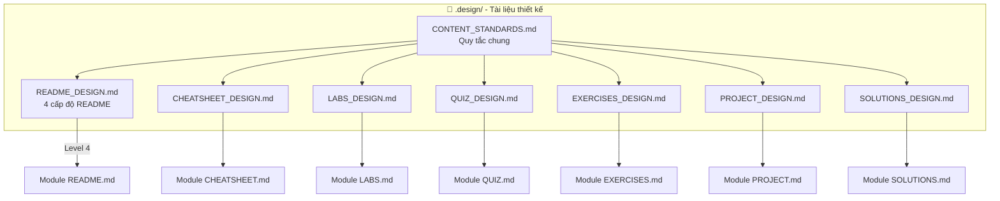
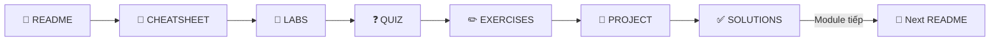

# 📋 CONTENT STANDARDS - Quy Chuẩn Viết Nội Dung

---

## 📋 DOCUMENT INFORMATION (Thông tin tài liệu)

| Thuộc tính | Giá trị |
|------------|---------|
| **Tên** | Content Standards |
| **Phiên bản** | 2.0 |
| **Ngày tạo** | 2025-12-28 |
| **Mô tả** | Quy tắc chung cho việc viết nội dung - Tham chiếu tới các file design chi tiết |

---

## 1. 🗺️ NAVIGATION MAP (Sơ đồ điều hướng)



### 1.1 Danh sách File Design

| File | Mô tả | Link |
|------|-------|------|
| **CONTENT_STANDARDS.md** | Quy tắc chung (ngôn ngữ, YAML, hình ảnh) | *File này* |
| **README_DESIGN.md** | 4 cấp độ README (Project/Setup/Track/Module) | [Xem](./README_DESIGN.md) |
| **CHEATSHEET_DESIGN.md** | Tra cứu nhanh lệnh, snippets | [Xem](./CHEATSHEET_DESIGN.md) |
| **LABS_DESIGN.md** | Thực hành có hướng dẫn | [Xem](./LABS_DESIGN.md) |
| **QUIZ_DESIGN.md** | Câu hỏi trắc nghiệm | [Xem](./QUIZ_DESIGN.md) |
| **EXERCISES_DESIGN.md** | Bài tập tình huống | [Xem](./EXERCISES_DESIGN.md) |
| **PROJECT_DESIGN.md** | Mini project | [Xem](./PROJECT_DESIGN.md) |
| **SOLUTIONS_DESIGN.md** | Đáp án chi tiết | [Xem](./SOLUTIONS_DESIGN.md) |

---

## 2. 🔄 MODULE NAVIGATION FLOW (Luồng điều hướng)



**Thứ tự điều hướng bắt buộc:**

```
README → CHEATSHEET → LABS → QUIZ → EXERCISES → PROJECT → SOLUTIONS
```

**Navigation Footer mẫu:**

```markdown
---

[⬅️ README](./README.md) | [📚 Track](../README.md) | [LABS ➡️](./LABS.md)
```

---

## 3. 📝 GENERAL RULES (Quy tắc chung)

### 3.1 YAML Front-matter (Bắt buộc)

```yaml
---
module: "X.Y"                    # Số module (1.1, 2.3...)
title: "<Tên Module> – <Loại>"   # VD: "Docker Fundamentals – Labs"
track: "<Số Track>"              # 1, 2, 3, 4, 5
version: "1.0"                   # Phiên bản nội dung
last_updated: "YYYY-MM-DD"       # Ngày cập nhật cuối
---
```

### 3.2 Quy tắc ngôn ngữ ⭐

| Thành phần | Quy tắc | Ví dụ |
|------------|---------|-------|
| Tiêu đề (H1, H2) | Tiếng Anh hoặc Song ngữ | `## Docker Fundamentals` |
| Nội dung giải thích | Tiếng Việt tự nhiên | "Chúng ta sẽ tạo một container..." |
| **Thuật ngữ chuyên ngành** | **GIỮ NGUYÊN tiếng Anh** | Container, Pod, Cluster, Pipeline... |

**KHÔNG dịch thuật ngữ:**

| ❌ SAI | ✅ ĐÚNG |
|--------|---------|
| "Triển khai một vỏ đậu lên cụm" | "Deploy một Pod lên Cluster" |
| "Đường ống tích hợp liên tục" | "CI/CD Pipeline" |

### 3.3 Header Format ⭐⭐ MỚI

**Quy tắc:** Tiêu đề section dùng format **ENGLISH (Tiếng Việt)**

| ❌ SAI | ✅ ĐÚNG |
|--------|---------|
| `## 1. CÁCH SỬ DỤNG` | `## 1. HOW TO USE (Cách sử dụng)` |
| `## 2. TỔNG QUAN` | `## 2. OVERVIEW (Tổng quan)` |
| `## 3. GUIDES & REFERENCES` | `## 3. REFERENCES (Tài liệu tham khảo)` |

**Ví dụ chuẩn:**

```markdown
## 1. 🎯 OVERVIEW (Tổng quan)
## 2. 📋 REQUIREMENTS (Yêu cầu)
## 3. 🔧 HOW TO USE (Cách sử dụng)
## 4. 📊 STATISTICS (Thống kê)
## 5. 📅 CHANGE LOG (Lịch sử cập nhật)
```

### 3.4 Encoding - Tránh lỗi ký tự ⭐⭐ MỚI

**Quy tắc:**

- File phải lưu dạng **UTF-8 without BOM**
- Emoji phải copy từ nguồn chuẩn (không dùng ký tự đặc biệt lạ)
- Kiểm tra trước khi commit: không có ký tự `�` hoặc `?`

**Emoji chuẩn cho sections:**

| Section | Emoji |
|---------|-------|
| Overview/Tổng quan | 🎯 |
| Requirements | 📋 |
| How to Use | 🔧 |
| Statistics | 📊 |
| Change Log | 📅 |
| References | 📚 |
| Checklist | ✅ |
| Warning | ⚠️ |
| Tip | 💡 |
| Note | 📝 |

### 3.5 Phong cách viết (Writing Style)

- **Đại từ:** Dùng "Bạn" và "Chúng ta"
- **Văn phong:** Cổ vũ, khuyến khích nhưng ngắn gọn
- **Câu ngắn:** Mỗi câu ≤ 50 từ, mỗi đoạn ≤ 5 câu

### 3.6 Callout/Blockquote

```markdown
> 💡 **Mẹo:** Dùng phím Tab để tự động điền lệnh.

> ⚠️ **Cảnh báo:** Không chạy lệnh này trên production!

> 📝 **Ghi chú:** Xem thêm tại Glossary.

> ✅ **Thực hành tốt:** Luôn sử dụng multi-stage build.
```

### 3.7 Link thuật ngữ về GLOSSARY

Lần **đầu tiên** xuất hiện thuật ngữ → Link về GLOSSARY:

```markdown
[Docker](../../resources/GLOSSARY.md#docker) là nền tảng [containerization](../../resources/GLOSSARY.md#container) phổ biến nhất.
```

---

## 4. 🖼️ IMAGE GUIDELINES (Quy định hình ảnh)

### 4.1 Loại hình ảnh

| Loại | Công cụ | Format | Khi nào dùng |
|------|---------|--------|--------------|
| Architecture/Flow | **Mermaid.js** ⭐ | Inline code | Logic diagram, flowchart |
| Diagram phức tạp | Excalidraw, Draw.io | SVG/PNG | Khi Mermaid không đủ |
| Screenshot Terminal | **Text block** | Code block | Để học viên copy được |
| Screenshot GUI | PNG/WebP | < 500KB | Giao diện thực tế |

### 4.2 Đặt tên file ảnh

```
module_X.Y_step_Z_mota.png
```

**Ví dụ:** `1.4_step_2_docker_build.png`

### 4.3 Vị trí lưu ảnh

| Loại | Vị trí |
|------|--------|
| Ảnh chung (logo, icon) | `/assets/images/` |
| Ảnh riêng module | `<module_folder>/images/` |

---

## 5. 📊 7 FILE TYPES OVERVIEW (Tổng quan 7 loại file)

| File | Icon | Mục đích | Độ dài | Design File |
|------|------|----------|--------|-------------|
| README.md | 📖 | Giáo trình lý thuyết | 500-1500 dòng | [README_DESIGN.md](./README_DESIGN.md) |
| CHEATSHEET.md | 📝 | Tra cứu nhanh | 200-500 dòng | [CHEATSHEET_DESIGN.md](./CHEATSHEET_DESIGN.md) |
| LABS.md | 🔬 | Thực hành có hướng dẫn | 300-800 dòng | [LABS_DESIGN.md](./LABS_DESIGN.md) |
| QUIZ.md | ❓ | Câu hỏi trắc nghiệm | 200-400 dòng | [QUIZ_DESIGN.md](./QUIZ_DESIGN.md) |
| EXERCISES.md | ✏️ | Bài tập tự suy luận | 150-300 dòng | [EXERCISES_DESIGN.md](./EXERCISES_DESIGN.md) |
| PROJECT.md | 🚀 | Mini project | 200-500 dòng | [PROJECT_DESIGN.md](./PROJECT_DESIGN.md) |
| SOLUTIONS.md | ✅ | Đáp án chi tiết | 300-800 dòng | [SOLUTIONS_DESIGN.md](./SOLUTIONS_DESIGN.md) |

---

## 6. ✅ GENERAL CHECKLIST (Checklist chung)

### 6.1 Mọi file phải có

- [ ] YAML front-matter đầy đủ
- [ ] Thuật ngữ lần đầu link về GLOSSARY
- [ ] Callout cho mẹo/cảnh báo
- [ ] **Navigation Footer** ⭐
- [ ] Không có lỗi chính tả

### 6.2 Do's and Don'ts

| ✅ NÊN LÀM | ❌ KHÔNG NÊN LÀM |
|------------|------------------|
| Sử dụng Mermaid.js cho diagram | Dịch thuật ngữ chuyên ngành |
| Link thuật ngữ về GLOSSARY | Bỏ qua Navigation Footer |
| Kiểm tra lệnh trước khi đưa vào | Để lại placeholder |
| Test trên môi trường thực | Dùng ảnh cho logic diagram |

---

## 7. 📚 REFERENCES (Tham khảo)

### Nguồn nội bộ

| File | Mô tả |
|------|-------|
| [MASTER_BLUEPRINT.md](./MASTER_BLUEPRINT.md) | Blueprint tổng thể |
| [GLOSSARY.md](../resources/GLOSSARY.md) | Từ điển thuật ngữ |
| [SOFTWARE_LINKS.md](../resources/SOFTWARE_LINKS.md) | Links download tools |

### Nguồn bên ngoài

- [GeeksforGeeks DevOps Tutorial](https://www.geeksforgeeks.org/devops/devops-tutorial/)
- [Docker Official Docs](https://docs.docker.com/)
- [Kubernetes Documentation](https://kubernetes.io/docs/)

---

*Cập nhật: 2025-12-28 | Phiên bản: 2.0*

