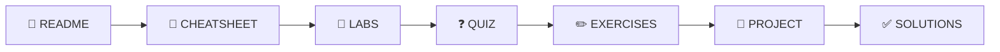

# 🖼️ ASSETS GUIDE - Quy Chuẩn Hình Ảnh & Tài Nguyên

---

## 📋 DOCUMENT INFORMATION (Thông tin tài liệu)

| Thuộc tính | Giá trị |
|------------|---------|
| **Tên** | 03_ASSETS_GUIDE |
| **Phiên bản** | 1.0 |
| **Ngày tạo** | 2025-12-28 |
| **Mô tả** | Quy chuẩn cho hình ảnh, icons, diagrams trong tài liệu |

---

## 1. 🎯 PURPOSE (Mục đích)

File này định nghĩa quy chuẩn cho:

- Hình ảnh (screenshots, diagrams)
- Icons và Emojis
- Mermaid diagrams
- ASCII art diagrams

---

## 2. 📁 DIRECTORY STRUCTURE (Cấu trúc thư mục)

```
DevOps-Journey/
├── assets/                      # Assets dùng chung toàn project
│   ├── images/
│   │   ├── logos/               # Logo project, tracks
│   │   ├── icons/               # Icons chung
│   │   └── diagrams/            # Diagrams tổng quan
│   └── templates/               # Templates chung
│
└── Track1_Foundation/
    └── 1.1_Git_Basics/
        └── images/              # Assets riêng cho module
            ├── 1.1_step_1_git_init.png
            └── 1.1_architecture.png
```

---

## 3. 🖼️ IMAGE TYPES (Loại hình ảnh)

| Loại | Format | Max Size | Khi nào dùng |
|------|--------|----------|--------------|
| **Screenshot Terminal** | Text block | - | Để học viên copy được ⭐ |
| **Screenshot GUI** | PNG/WebP | < 500KB | Giao diện thực tế |
| **Architecture Diagram** | Mermaid ⭐ | - | Logic diagram, flowchart |
| **Complex Diagram** | SVG/PNG | < 1MB | Khi Mermaid không đủ |
| **Logo/Icon** | SVG/PNG | < 100KB | Branding |

---

## 4. 📝 NAMING CONVENTION (Quy tắc đặt tên)

### 4.1 Pattern (Mẫu)

```
<module>_<type>_<description>.<ext>
```

### 4.2 Examples (Ví dụ)

| File name | Mô tả |
|-----------|-------|
| `1.1_step_1_git_init.png` | Screenshot bước 1 module 1.1 |
| `1.4_architecture_docker.png` | Diagram kiến trúc Docker |
| `2.3_output_kubectl_get.png` | Output của lệnh kubectl |
| `logo_track1.svg` | Logo Track 1 |

### 4.3 Rules (Quy tắc)

- ✅ Lowercase toàn bộ
- ✅ Dùng underscore `_` thay cho space
- ✅ Không dấu tiếng Việt
- ✅ Mô tả ngắn gọn, rõ ràng
- ❌ Không dùng ký tự đặc biệt: `!@#$%^&*()`

---

## 5. 📐 MERMAID DIAGRAMS (Sơ đồ Mermaid)

### 5.1 Khi nào dùng Mermaid

| ✅ Dùng Mermaid | ❌ Không dùng Mermaid |
|-----------------|----------------------|
| Flowcharts | Diagrams có icon phức tạp |
| Sequence diagrams | Network topology chi tiết |
| Class diagrams | Diagrams cần styling đặc biệt |
| State diagrams | Cloud architecture với icons |
| ER diagrams | |

### 5.2 Template Mermaid

```markdown


```

### 5.3 Mermaid Style Guide

| Quy tắc | Ví dụ |
|---------|-------|
| Dùng emoji cho nodes | `A[📖 README]` |
| Arrow labels ngắn gọn | `A -->|next| B` |
| Subgraph cho nhóm | `subgraph Group["Label"]` |
| Comment cho phức tạp | `%% This is a comment` |

---

## 6. 📊 ASCII DIAGRAMS (Sơ đồ ASCII)

Dùng cho architecture diagrams phức tạp:

```

┌─────────────────────────────────────────────┐
│                   NGINX                      │
│                 (Port 80)                    │
└──────────────────────┬──────────────────────┘
                       │
         ┌─────────────┼─────────────┐
         │             │             │
         ▼             ▼             ▼
    ┌─────────┐   ┌─────────┐   ┌─────────┐
    │  App 1  │   │  App 2  │   │  App 3  │
    └─────────┘   └─────────┘   └─────────┘

```

### 6.1 ASCII Characters Reference

| Character | Dùng cho |
|-----------|----------|
| `─` `│` | Lines |
| `┌` `┐` `└` `┘` | Corners |
| `├` `┤` `┬` `┴` `┼` | Intersections |
| `▲` `▼` `◀` `▶` | Arrows |
| `█` `░` | Blocks |

---

## 7. 😀 EMOJI USAGE (Sử dụng Emoji)

### 7.1 Standard Emojis for Headers

| Section | Emoji |
|---------|-------|
| Overview/Tổng quan | 🎯 |
| Structure/Cấu trúc | 📁 |
| Requirements | 📋 |
| How to Use | 🔧 |
| Statistics | 📊 |
| Change Log | 📅 |
| References | 📚 |
| Checklist | ✅ |
| Warning | ⚠️ |
| Tip | 💡 |
| Note | 📝 |

### 7.2 File Type Emojis

| File | Emoji |
|------|-------|
| README | 📖 |
| CHEATSHEET | 📝 |
| LABS | 🔬 |
| QUIZ | ❓ |
| EXERCISES | ✏️ |
| PROJECT | 🚀 |
| SOLUTIONS | ✅ |
| CAPSTONE | 🏆 |

### 7.3 Emoji Sources

- ✅ Copy từ [Emojipedia](https://emojipedia.org/)
- ✅ Windows: `Win + .`
- ❌ Không dùng ký tự đặc biệt không chuẩn

---

## 8. 📸 SCREENSHOT GUIDELINES (Hướng dẫn chụp màn hình)

### 8.1 Terminal Output

**❌ KHÔNG dùng hình ảnh:**
```

[hình ảnh terminal]

```

**✅ Dùng code block:**
```bash
$ docker ps
CONTAINER ID   IMAGE   STATUS
abc123         nginx   Up 2 minutes
```

### 8.2 GUI Screenshots

| Tiêu chí | Yêu cầu |
|----------|---------|
| Resolution | Tối thiểu 1280px width |
| Format | PNG hoặc WebP |
| Size | < 500KB |
| Annotations | Dùng arrows/boxes highlight |
| Sensitive data | Che/blur passwords, tokens |

---

## 9. ✅ CHECKLIST (Danh sách kiểm tra)

### Before adding image (Trước khi thêm ảnh)

- [ ] Đúng format (PNG/WebP/SVG)
- [ ] Đúng naming convention
- [ ] Size < 500KB (hoặc < 1MB cho complex)
- [ ] Đặt đúng thư mục
- [ ] Không chứa sensitive data
- [ ] Alt text mô tả rõ ràng

### Mermaid diagrams

- [ ] Render đúng trên GitHub
- [ ] Có emoji cho nodes (nếu phù hợp)
- [ ] Labels ngắn gọn, dễ đọc

---

## 10. 📚 RELATED FILES (Files liên quan)

| File | Liên quan |
|------|-----------|
| [01_CONTENT_STANDARDS.md](./01_CONTENT_STANDARDS.md) | Quy tắc chung |
| [02_STYLE_GUIDE.md](./02_STYLE_GUIDE.md) | Code formatting |
| [10_README_DESIGN.md](./10_README_DESIGN.md) | Cách dùng images trong README |

---

*Cập nhật: 2025-12-28 | Phiên bản: 1.0*
