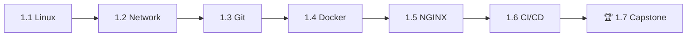
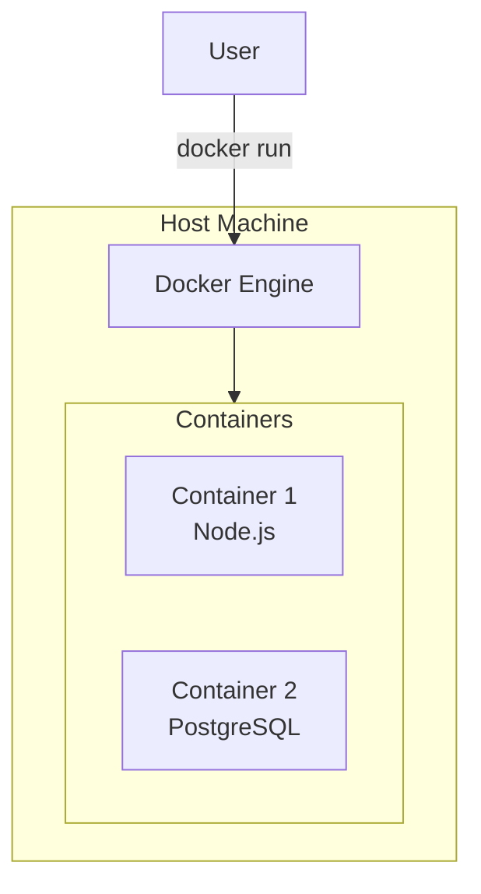

# 📖 README DESIGN - Quy Chuẩn Thiết Kế README

---

## 📋 DOCUMENT INFORMATION (Thông tin tài liệu)

| Thuộc tính | Giá trị |
|------------|---------|
| **Tên** | README Design Specification |
| **Phiên bản** | 1.0 |
| **Ngày tạo** | 2025-12-28 |
| **Mô tả** | Quy chuẩn thiết kế cho 4 cấp độ README trong dự án |

---

## 1. 🎯 OVERVIEW (Tổng quan)

### 1.1 Mục đích

Định nghĩa quy chuẩn thiết kế cho **4 cấp độ README** khác nhau trong dự án DevOps-Journey:

```
DevOps-Journey/
│
├── README.md                           # 📘 Level 1: PROJECT README
│
├── Setup_Environment/
│   └── README.md                       # 📗 Level 2: SETUP README
│
├── Track1_Foundation_StaticWeb/
│   └── README.md                       # 📙 Level 3: TRACK README
│
└── Track1_Foundation_StaticWeb/
    └── 1.1_Linux_Bash/
        └── README.md                   # 📕 Level 4: MODULE README
```

### 1.2 So sánh 4 Cấp Độ

| Level | Loại | Mục đích | Độ dài |
|-------|------|----------|--------|
| 1 | **PROJECT** | Catalog tổng quan, điều hướng toàn bộ khóa học | 150-300 dòng |
| 2 | **SETUP** | Hướng dẫn cài đặt môi trường, điều hướng theo OS | 100-200 dòng |
| 3 | **TRACK** | Giới thiệu Track, danh sách modules, prerequisites | 100-200 dòng |
| 4 | **MODULE** | Giáo trình lý thuyết chi tiết | 500-1500 dòng |

---

## 2. 📘 LEVEL 1: PROJECT README (README dự án)

### 2.1 Mục đích

- Landing page cho toàn bộ dự án
- Catalog điều hướng tới tất cả Tracks và Modules
- Thu hút người học với design đẹp

### 2.2 Required Sections

| # | Section | Mô tả | Bắt buộc |
|---|---------|-------|----------|
| 1 | **Header với Badge** | Logo, shields badges | ✅ |
| 2 | **Giới thiệu** | 3-5 câu về khóa học | ✅ |
| 3 | **Đối tượng** | Bảng beginner/intermediate/advanced | ✅ |
| 4 | **Mục lục khóa học** | Danh sách tất cả Tracks + Modules với links | ✅ |
| 5 | **Tài liệu bổ trợ** | Links GLOSSARY, SOFTWARE_LINKS | ✅ |
| 6 | **Bắt đầu từ đâu?** | Hướng dẫn cho người mới | ✅ |
| 7 | **Cấu trúc Module** | Giải thích 7 files chuẩn | ✅ |
| 8 | **Công cụ cần chuẩn bị** | Tóm tắt tools | ⭕ |
| 9 | **Tiến độ học tập** | Checklist theo dõi | ⭕ |
| 10 | **Đóng góp** | Hướng dẫn contribute | ⭕ |
| 11 | **License** | MIT/CC | ✅ |
| 12 | **Footer** | Made with ❤️ | ⭕ |

### 2.3 Template Structure

```markdown
# 🚀 DevOps Training Course

<div align="center">


**Khóa học DevOps toàn diện từ Zero đến Hero**

</div>

---

## 📋 Giới thiệu

[3-5 câu mô tả khóa học, highlights chính]

---

## 🎯 Đối tượng

| Cấp độ | Mô tả | Tracks phù hợp |
|--------|-------|----------------|
| **Beginner** | Chưa có kiến thức IT | Track 0 → Track 1 |
| **Intermediate** | Đã biết Linux, Docker cơ bản | Track 2 → Track 3 |
| **Advanced** | Đã làm DevOps/SysAdmin | Track 4 → Track 5 |

---

## 📚 Mục lục khóa học

### 🔧 Module 0 – Setup Environment
> **Thời lượng:** X giờ | **Mục tiêu:** Chuẩn bị môi trường

[Bảng links tới các files trong module]

---

### 🌱 Track 1 – Foundation & Static Web
> **Thời lượng:** X giờ | **Mục tiêu:** Deploy website tĩnh bằng CI/CD

[Bảng danh sách modules với icon links]

---

[... Các Track khác ...]

---

## 📖 Tài liệu bổ trợ

| Tài liệu | Mô tả |
|----------|-------|
| [📚 GLOSSARY](./resources/GLOSSARY.md) | Từ điển thuật ngữ DevOps A-Z |
| [🔧 SOFTWARE LINKS](./resources/SOFTWARE_LINKS.md) | Link tải tool từ nguồn chính thức |

---

## 🚀 Bắt đầu từ đâu?

[Mermaid diagram hoặc hướng dẫn cho người mới]

---

## 📱 Cấu trúc mỗi Module

| File | Icon | Mục đích |
|------|------|----------|
| `README.md` | 📖 | Lý thuyết, định nghĩa, diagram |
| `CHEATSHEET.md` | 📝 | Tra cứu nhanh lệnh, config |
| ... | ... | ... |

---

## 📜 License

MIT License

---

<div align="center">

**Chúc bạn học tốt! 🎉**

*Made with ❤️ for DevOps Community*

</div>
```

### 2.4 Style Guide

- Sử dụng **badges** ở header (shields.io)
- Dùng **emoji** cho tiêu đề sections
- Bảng **icon links** cho modules (📖 📝 🔬 ✏️ ✅ ❓ 🚀)
- **Mermaid diagram** cho learning path
- **Center align** cho header và footer

---

## 3. 📗 LEVEL 2: SETUP README (README cài đặt)

### 3.1 Mục đích

- Điều hướng tới hướng dẫn cài đặt theo OS
- Điều hướng tới verify scripts theo Track
- Không chứa hướng dẫn chi tiết (để trong files riêng)

### 3.2 Required Sections

| # | Section | Mô tả | Bắt buộc |
|---|---------|-------|----------|
| 1 | **Title** | `# Setup Environment - Thiết Lập Môi Trường` | ✅ |
| 2 | **Giới thiệu** | Mục đích, tại sao cần setup đúng | ✅ |
| 3 | **Chọn OS** | Bảng links tới WINDOWS/MACOS/LINUX_SETUP.md | ✅ |
| 4 | **Chọn Track** | Bảng links tới verify scripts | ✅ |
| 5 | **Quick Start** | Tóm tắt nhanh cho người đã biết | ⭕ |
| 6 | **Navigation Footer** | Links điều hướng | ✅ |

### 3.3 Template Structure

```markdown
# 🛠️ Setup Environment - Thiết Lập Môi Trường

## Giới thiệu

Trước khi bắt đầu học, bạn cần thiết lập môi trường để có thể thực hành. 
Module này hướng dẫn cài đặt chi tiết cho **tất cả hệ điều hành**.

---

## Bạn đang dùng hệ điều hành nào?

| Hệ điều hành | Hướng dẫn chi tiết | Script tự động |
|--------------|-------------------|----------------|
| 🪟 Windows 10/11 | [WINDOWS_SETUP.md](./WINDOWS_SETUP.md) | `scripts/windows/` |
| 🍎 macOS | [MACOS_SETUP.md](./MACOS_SETUP.md) | `scripts/macos/` |
| 🐧 Linux (Ubuntu/Debian) | [LINUX_SETUP.md](./LINUX_SETUP.md) | `scripts/linux/` |

---

## Bạn đang học Track nào?

| Track | Cần cài đặt | Script kiểm tra |
|-------|-------------|-----------------|
| Track 1: Foundation | Git, Docker, VS Code, NGINX | `verify_track1.sh/ps1` |
| Track 2: Orchestration | + kubectl, Minikube, Helm, Jenkins | `verify_track2.sh/ps1` |
| Track 3: Cloud | + Terraform, AWS CLI | `verify_track3.sh/ps1` |
| Track 4: DevSecOps | + Trivy, OWASP ZAP | `verify_track4.sh/ps1` |

---

## Quick Start (Cho người đã biết)

```bash
# Linux/macOS - Cài đặt và verify Track 1
./scripts/linux/setup_track1.sh
./scripts/linux/verify_track1.sh

# Windows PowerShell
.\scripts\windows\setup_track1.ps1
.\scripts\windows\verify_track1.ps1
```

---

## Tài liệu liên quan

- [TOOLS_OVERVIEW.md](./TOOLS_OVERVIEW.md) - Tổng quan tất cả tools
- [TROUBLESHOOTING.md](./TROUBLESHOOTING.md) - Xử lý lỗi phổ biến
- [CHEATSHEET.md](./CHEATSHEET.md) - Lệnh cài đặt nhanh

---

[📚 Mục lục](../README.md) | [Track 1 ➡️](../Track1_Foundation_StaticWeb/README.md)

```

### 3.4 Style Guide

- Sử dụng **emoji cho OS** (🪟 🍎 🐧)
- **Bảng điều hướng** thay vì danh sách dài
- Links **rõ ràng** tới files chi tiết
- **Quick Start** cho advanced users

---

## 4. 📙 LEVEL 3: TRACK README (README Track)

### 4.1 Mục đích

- Giới thiệu tổng quan về Track
- Danh sách modules trong Track
- Prerequisites từ Tracks trước
- Link verify script cho Track này

### 4.2 Required Sections

| # | Section | Mô tả | Bắt buộc |
|---|---------|-------|----------|
| 1 | **Title** | `# Track X – <Tên Track>` | ✅ |
| 2 | **Overview** | Mô tả ngắn, thời lượng, mục tiêu cuối | ✅ |
| 3 | **Prerequisites** | Yêu cầu từ Track trước + verify script | ✅ |
| 4 | **Learning Path** | Mermaid diagram flow các modules | ✅ |
| 5 | **Module List** | Bảng modules với links 7 files | ✅ |
| 6 | **Kết quả đạt được** | Sau khi hoàn thành Track | ✅ |
| 7 | **Capstone Project** | Highlight dự án cuối Track | ✅ |
| 8 | **Navigation Footer** | Links điều hướng | ✅ |

### 4.3 Template Structure

```markdown
# 🌱 Track 1 – Foundation & Static Web

---

## Overview

| Thuộc tính | Giá trị |
|------------|---------|
| **Thời lượng** | 40-50 giờ (~4-5 tuần part-time) |
| **Số modules** | 7 (6 modules + 1 Capstone) |
| **Mục tiêu** | Deploy website tĩnh với CI/CD hoàn chỉnh |
| **Đầu ra** | Website portfolio cá nhân trên GitHub Pages |

---

## Prerequisites (Yêu cầu)

### Kiến thức
- Biết sử dụng máy tính cơ bản
- Không yêu cầu kiến thức IT trước đó

### Môi trường
Đảm bảo đã cài đặt tools cho Track 1:

```bash
# Linux/macOS
./Setup_Environment/scripts/linux/verify_track1.sh

# Windows PowerShell
.\Setup_Environment\scripts\windows\verify_track1.ps1
```

Nếu chưa cài, xem [Setup Environment](../Setup_Environment/README.md)

---

## Learning Path



---

## Danh sách Modules

| # | Module | Nội dung | Files |
|---|--------|----------|-------|
| 1.1 | [Linux & Bash](./1.1_Linux_Bash/README.md) | WSL2, lệnh cơ bản, Bash script | [📖](./1.1_Linux_Bash/README.md) [📝](./1.1_Linux_Bash/CHEATSHEET.md) [🔬](./1.1_Linux_Bash/LABS.md) [❓](./1.1_Linux_Bash/QUIZ.md) [✏️](./1.1_Linux_Bash/EXERCISES.md) [🚀](./1.1_Linux_Bash/PROJECT.md) [✅](./1.1_Linux_Bash/SOLUTIONS.md) |
| 1.2 | [Network Basics](./1.2_Network_Basics/README.md) | TCP/IP, DNS, troubleshooting | [📖](./1.2_...) ... |
| ... | ... | ... | ... |
| 1.7 | [🏆 Capstone](./1.7_Capstone_Project/README.md) | Website CI/CD hoàn chỉnh | [📖](./1.7_...) [✅](./1.7_...) |

---

## Kết quả đạt được

Sau khi hoàn thành Track 1, bạn sẽ:

- ✅ Sử dụng thành thạo Linux command line
- ✅ Hiểu cơ bản về networking (TCP/IP, DNS, HTTP)
- ✅ Quản lý code với Git và GitHub
- ✅ Build và chạy Docker containers
- ✅ Cấu hình NGINX làm web server
- ✅ Xây dựng CI/CD pipeline với GitHub Actions
- ✅ **Có website portfolio hoàn chỉnh!**

---

## 🏆 Capstone Project

**Static Website với CI/CD**

- Website portfolio cá nhân
- Tự động deploy khi push code
- HTTPS với GitHub Pages
- Có thể đưa vào CV

[Xem chi tiết →](./1.7_Capstone_Project/README.md)

---

[⬅️ Setup Environment](../Setup_Environment/README.md) | [📚 Mục lục](../README.md) | [Track 2 ➡️](../Track2_Orchestration_Automation/README.md)

```

### 4.4 Style Guide

- **Mermaid diagram** cho learning path
- **Icon links** `[📖] [📝] [🔬] [❓] [✏️] [🚀] [✅]` trên cùng 1 dòng
- **Highlight Capstone** với emoji 🏆
- Prerequisites có **verify command**

---

## 5. 📕 LEVEL 4: MODULE README (README Module)

### 5.1 Mục đích

- **Giáo trình lý thuyết chi tiết** cho module
- Là file **dài nhất và chi tiết nhất**
- Học viên đọc để học kiến thức

### 5.2 Required Sections

| # | Section | Mô tả | Bắt buộc |
|---|---------|-------|----------|
| 1 | **YAML Front-matter** | Metadata module | ✅ |
| 2 | **Module Title** | `## MODULE X.Y – <Tên>` | ✅ |
| 3 | **Giới thiệu** | 3-5 câu: tại sao học, giải quyết vấn đề gì | ✅ |
| 4 | **Mục tiêu học tập** | Checklist `- [ ]` các kỹ năng | ✅ |
| 5 | **Kiến trúc/Diagram** | Mermaid.js ưu tiên | ✅ |
| 6 | **Lý thuyết chi tiết** | Định nghĩa, ví dụ, bảng so sánh | ✅ |
| 7 | **Bước thực hành ngắn** | 1-2 lệnh minh họa | ✅ |
| 8 | **Tham khảo** | Links docs, video, blog | ✅ |
| 9 | **Navigation Footer** | Điều hướng bắt buộc | ✅ |

### 5.3 Template Structure

```markdown
---
module: "X.Y"
title: "<Tên Module>"
track: "<Số Track>"
version: "1.0"
last_updated: "YYYY-MM-DD"
---

## MODULE X.Y – <Tên Module>

### Giới thiệu

[Docker](../../resources/GLOSSARY.md#docker) là nền tảng [containerization](../../resources/GLOSSARY.md#container) phổ biến nhất hiện nay. 

Việc hiểu Docker giúp bạn:
- Đóng gói ứng dụng và môi trường
- Deploy nhất quán trên mọi hệ thống
- Tiết kiệm tài nguyên so với VM

> 💡 **Tại sao học?** Hầu hết các công ty công nghệ đều sử dụng Docker trong production.

---

### Mục tiêu học tập

Sau khi hoàn thành module này, bạn sẽ:

- [ ] Hiểu được khái niệm container và sự khác biệt với VM
- [ ] Viết được Dockerfile cơ bản
- [ ] Build và chạy được Docker container
- [ ] Quản lý được images và containers

---

### Kiến trúc hệ thống



---

### Lý thuyết chi tiết

#### 1. Docker là gì?

**Docker** là một nền tảng mã nguồn mở cho phép bạn:

- Đóng gói ứng dụng cùng với tất cả dependencies
- Chạy ứng dụng trong môi trường cô lập (container)
- Đảm bảo ứng dụng chạy giống nhau trên mọi môi trường

> 💡 **Mẹo:** Hãy nghĩ Container như một "hộp" chứa mọi thứ ứng dụng cần.

#### 2. Container vs Virtual Machine

| Tiêu chí | Container | Virtual Machine |
|----------|-----------|-----------------|
| Khởi động | Vài giây | Vài phút |
| Kích thước | MB | GB |
| Hiệu năng | Gần native | Overhead lớn |
| Isolation | Process level | Hardware level |

[... Tiếp tục lý thuyết ...]

---

### Bước thực hành ngắn

```bash
# Pull image từ Docker Hub
docker pull nginx:alpine

# Chạy container
docker run -d -p 8080:80 --name my-nginx nginx:alpine

# Kiểm tra
docker ps
```

> ⚠️ **Cảnh báo:** Đảm bảo Docker Desktop đang chạy trước khi thực hiện.

---

### Tham khảo

- [Docker Official Documentation](https://docs.docker.com/)
- [Dockerfile Best Practices](https://docs.docker.com/develop/develop-images/dockerfile_best-practices/)
- [GLOSSARY](../../resources/GLOSSARY.md)

---

[⬅️ Bài trước: 1.3 Git](../1.3_Git_GitLab/README.md) | [📚 Track 1](../README.md) | [Bài tiếp: 1.5 NGINX ➡️](../1.5_NGINX_Basic/README.md)

```

### 5.4 Style Guide

- **YAML front-matter** bắt buộc
- **Link thuật ngữ** về GLOSSARY lần đầu xuất hiện
- **Mermaid.js** cho diagrams
- **Bảng so sánh** cho các concepts liên quan
- **Callouts** (💡 ⚠️ 📝) cho mẹo/cảnh báo
- **Code blocks** với ngôn ngữ cụ thể

---

## 6. 📋 REVIEW CHECKLIST (Danh sách kiểm tra)

### 6.1 Project README

- [ ] Có badges ở header
- [ ] Có bảng đối tượng (Beginner/Intermediate/Advanced)
- [ ] Có mục lục đầy đủ các Tracks
- [ ] Có links tới GLOSSARY và SOFTWARE_LINKS
- [ ] Có hướng dẫn bắt đầu
- [ ] Có license

### 6.2 Setup README

- [ ] Có bảng chọn OS với links
- [ ] Có bảng chọn Track với verify scripts
- [ ] Có Quick Start cho advanced users
- [ ] Có Navigation Footer

### 6.3 Track README

- [ ] Có overview với thời lượng, mục tiêu
- [ ] Có prerequisites với verify command
- [ ] Có Mermaid learning path
- [ ] Có bảng modules với icon links
- [ ] Có kết quả đạt được
- [ ] Highlight Capstone Project
- [ ] Có Navigation Footer

### 6.4 Module README

- [ ] Có YAML front-matter
- [ ] Có giới thiệu (3-5 câu)
- [ ] Có mục tiêu học tập (checklist)
- [ ] Có Mermaid diagram
- [ ] Có lý thuyết chi tiết
- [ ] Thuật ngữ lần đầu link về GLOSSARY
- [ ] Có code thực hành ngắn
- [ ] Có tham khảo
- [ ] Có Navigation Footer

---

## 7. ✅ DO'S AND DON'TS (Nên và Không nên)

### ✅ NÊN LÀM

| Level | Nên làm |
|-------|---------|
| All | Sử dụng emoji và icons |
| All | Có Navigation Footer |
| Project | Badges đẹp, center header |
| Setup | Điều hướng rõ ràng theo OS/Track |
| Track | Mermaid learning path |
| Module | YAML front-matter, link GLOSSARY |

### ❌ KHÔNG NÊN LÀM

| Level | Không nên làm |
|-------|---------------|
| All | Bỏ qua Navigation Footer |
| Project | Quá nhiều text, không có bảng |
| Setup | Hướng dẫn chi tiết (để file riêng) |
| Track | Thiếu prerequisites |
| Module | Thiếu YAML, thiếu diagrams |

---

## 8. 📚 REFERENCES (Nguồn tham khảo)

- `Reference/_QuytacThietke/README_Samples/README.md`
- `Reference/_QuytacThietke/.design/_Reference/README_design.md`
- `SETUP_ENVIRONMENT_DESIGN.md`
- `TRACK1_DESIGN.md` → `TRACK5_DESIGN.md`

---

*Cập nhật: 2025-12-28 | Phiên bản: 1.0*


