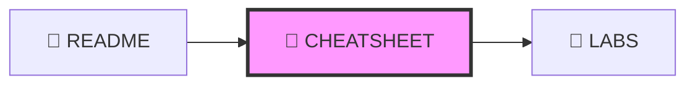

# 📝 CHEATSHEET DESIGN - Quy Chuẩn Thiết Kế Cheatsheet

---

## 📋 DOCUMENT INFORMATION (Thông tin tài liệu)

| Thuộc tính | Giá trị |
|------------|---------|
| **Tên** | Cheatsheet Design Specification |
| **Phiên bản** | 1.0 |
| **Ngày tạo** | 2025-12-28 |
| **Liên quan** | [CONTENT_STANDARDS.md](./CONTENT_STANDARDS.md) |

---

## 1. 🗺️ NAVIGATION POSITION (Vị trí điều hướng)



**Navigation Footer:**

```markdown
---

[⬅️ README](./README.md) | [📚 Track](../README.md) | [LABS ➡️](./LABS.md)
```

---

## 2. 🎯 PURPOSE (Mục đích)

- Bảng tra cứu nhanh các lệnh, cấu hình mẫu
- **Copy-paste friendly** - học viên có thể copy và dùng ngay
- Tổng hợp lỗi thường gặp và cách sửa
- Không phải đọc lại lý thuyết dài

---

## 3. 📋 REQUIRED SECTIONS (Các phần bắt buộc)

| # | Section | Mô tả | Bắt buộc |
|---|---------|-------|----------|
| 1 | **YAML Front-matter** | Metadata | ✅ |
| 2 | **Header** | `## MODULE X.Y – <Tên> Cheatsheet` | ✅ |
| 3 | **Quick Reference** | 3-5 điểm quan trọng nhất | ✅ |
| 4 | **Common Commands** | Bảng lệnh theo nhóm | ✅ |
| 5 | **Snippets/Config** | Code samples copy-paste | ✅ |
| 6 | **Common Errors & Fixes** | Bảng lỗi-nguyên nhân-giải pháp | ✅ |
| 7 | **References** | Links tài liệu | ⭕ |
| 8 | **Navigation Footer** | Điều hướng | ✅ |

---

## 4. 📝 TEMPLATE (Mẫu)

```markdown
---
module: "X.Y"
title: "<Tên Module> – Cheatsheet"
track: "X"
version: "1.0"
last_updated: "YYYY-MM-DD"
---

## MODULE X.Y – <Tên Module> Cheatsheet

### Quick Reference

- **Điểm 1:** Mô tả ngắn
- **Điểm 2:** Mô tả ngắn
- **Điểm 3:** Mô tả ngắn

---

### Common Commands

#### Category 1

| Command | Description | Example |
|---------|-------------|---------|
| `cmd1` | Mô tả | `cmd1 --flag` |
| `cmd2` | Mô tả | `cmd2 arg` |

#### Category 2

| Command | Description | Example |
|---------|-------------|---------|
| `cmd3` | Mô tả | `cmd3 --opt` |

---

### Snippets / Config Samples

#### Config Type 1

```yaml
# Description
key: value
nested:
  key: value
```

#### Config Type 2

```dockerfile
FROM image:tag
WORKDIR /app
COPY . .
CMD ["command"]
```

---

### Common Errors & Fixes

| Error | Cause | Solution |
|-------|-------|----------|
| `Error message 1` | Nguyên nhân | Cách sửa |
| `Error message 2` | Nguyên nhân | Cách sửa |

---

### References

- [Official Documentation](https://...)
- [GLOSSARY](../../resources/GLOSSARY.md)

---

[⬅️ README](./README.md) | [📚 Track](../README.md) | [LABS ➡️](./LABS.md)

```

---

## 5. 📏 STYLE GUIDE (Hướng dẫn định dạng)

| Quy tắc | Mô tả |
|---------|-------|
| Mô tả lệnh | ≤ 50 từ |
| Ví dụ | Phải chạy được |
| Sắp xếp | Theo nhóm chức năng logic |
| Code block | Có ngôn ngữ cụ thể |

---

## 6. ✅ REVIEW CHECKLIST (Danh sách kiểm tra)

- [ ] YAML front-matter đầy đủ
- [ ] Có Quick Reference 3-5 điểm
- [ ] Bảng lệnh đầy đủ ví dụ
- [ ] Snippets có comment giải thích
- [ ] Bảng lỗi có solution
- [ ] **Navigation Footer** ⭐
- [ ] Tất cả lệnh đã test

---

## 7. ✅ DO'S AND DON'TS (Nên và Không nên)

### ✅ NÊN LÀM

- Sắp xếp lệnh theo nhóm chức năng
- Thêm comment trong code snippets
- Ghi chú các tùy chọn quan trọng
- Test lệnh trước khi đưa vào

### ❌ KHÔNG NÊN LÀM

- Sử dụng lệnh deprecated
- Bỏ qua việc giải thích tham số
- Để ví dụ không chạy được
- Thiếu Navigation Footer

---

*Cập nhật: 2025-12-28 | Phiên bản: 1.0*


