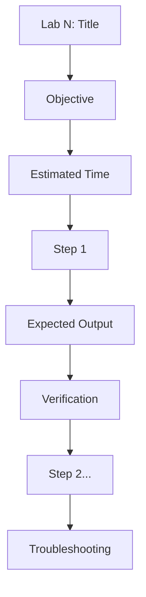

# 🔬 LABS DESIGN - Quy Chuẩn Thiết Kế Labs

---

## 📋 DOCUMENT INFORMATION (Thông tin tài liệu)

| Thuộc tính | Giá trị |
|------------|---------|
| **Tên** | Labs Design Specification |
| **Phiên bản** | 1.0 |
| **Ngày tạo** | 2025-12-28 |
| **Liên quan** | [CONTENT_STANDARDS.md](./CONTENT_STANDARDS.md) |

---

## 1. 🗺️ NAVIGATION POSITION (Vị trí điều hướng)


**Navigation Footer:**

```markdown
---

[⬅️ CHEATSHEET](./CHEATSHEET.md) | [📚 Track](../README.md) | [QUIZ ➡️](./QUIZ.md)
```

---

## 2. 🎯 PURPOSE (Mục đích)

- Hướng dẫn thực hành **chi tiết từng bước**
- Học viên có thể **copy-paste và chạy ngay**
- Có **Expected Output** để verify
- Khác với EXERCISES (tự làm không hướng dẫn)

---

## 3. 📋 REQUIRED SECTIONS (Các phần bắt buộc)

| # | Section | Mô tả | Bắt buộc |
|---|---------|-------|----------|
| 1 | **YAML Front-matter** | Metadata + total_labs, estimated_time | ✅ |
| 2 | **Header** | `## MODULE X.Y – <Tên> Labs` | ✅ |
| 3 | **Overview** | Số labs, thời gian, độ khó | ✅ |
| 4 | **Prerequisites** | Checklist công cụ, kiến thức | ✅ |
| 5 | **Environment Check** ⭐ | Lệnh verify môi trường | ✅ |
| 6 | **Labs 1, 2, 3...** | Chi tiết từng lab | ✅ |
| 7 | **Cleanup** | Lệnh dọn dẹp | ✅ |
| 8 | **Summary** | Tổng kết | ⭕ |
| 9 | **References** | Links tài liệu | ⭕ |
| 10 | **Navigation Footer** | Điều hướng | ✅ |

---

## 4. 📝 TEMPLATE (Mẫu)

```markdown
---
module: "X.Y"
title: "<Tên Module> – Labs"
track: "X"
version: "1.0"
last_updated: "YYYY-MM-DD"
total_labs: 3
estimated_time: "60-90 minutes"
difficulty: "Beginner"
---

## MODULE X.Y – <Tên Module> Labs

### Overview

- **Số lượng labs:** 3 bài
- **Thời gian ước tính:** 60-90 phút
- **Mức độ khó:** Beginner
- **Yêu cầu:** Hoàn thành tất cả 3 labs

---

### Prerequisites

#### Công cụ
- [ ] Tool 1 đã cài đặt
- [ ] Tool 2 đã cài đặt

#### Kiến thức
- [ ] Đã đọc README.md của module này

---

### 🔍 Environment Check

Chạy các lệnh sau để đảm bảo môi trường sẵn sàng:

| Kiểm tra | Lệnh | Kết quả mong đợi |
|----------|------|------------------|
| Tool 1 | `tool1 --version` | `v1.x.x` |
| Tool 2 | `tool2 --version` | `v2.x.x` |

> ⚠️ **Nếu có lỗi:** Xem [TROUBLESHOOTING](../../Setup_Environment/TROUBLESHOOTING.md)

---

## Lab 1: <Tên Lab>

### Objective

Mục tiêu của lab này.

### Estimated Time

15 phút

---

### Step 1: <Mô tả bước>

```bash
# Comment giải thích
command --flag value
```

**Expected Output:**

```
output mẫu ở đây
```

**Verification:**

```bash
# Lệnh verify
verify-command
```

---

### Step 2: <Mô tả bước>

[Tương tự Step 1]

---

### Troubleshooting

| Error | Cause | Solution |
|-------|-------|----------|
| `Error message` | Nguyên nhân | Cách sửa |

---

## Lab 2: <Tên Lab>

[Cấu trúc tương tự Lab 1]

---

## Cleanup

Sau khi hoàn thành tất cả labs:

```bash
# Dọn dẹp resources
cleanup-command
```

---

### Summary

Sau khi hoàn thành các labs, bạn đã biết:

- ✅ Skill 1
- ✅ Skill 2
- ✅ Skill 3

---

### References

- [Official Documentation](https://...)
- [GLOSSARY](../../resources/GLOSSARY.md)

---

[⬅️ CHEATSHEET](./CHEATSHEET.md) | [📚 Track](../README.md) | [QUIZ ➡️](./QUIZ.md)

```

---

## 5. 📏 LAB STRUCTURE (Cấu trúc mỗi Lab)



**Mỗi Step phải có:**

1. Mô tả ngắn
2. Lệnh với comment
3. Expected Output
4. Verification (nếu cần)

---

## 6. ✅ REVIEW CHECKLIST (Danh sách kiểm tra)

- [ ] YAML có total_labs và estimated_time
- [ ] Có Environment Check ⭐
- [ ] Mỗi lab có Objective và Estimated Time
- [ ] Mỗi step có Expected Output
- [ ] Có Troubleshooting table
- [ ] Có Cleanup section
- [ ] **Navigation Footer** ⭐
- [ ] Test tất cả lệnh trên môi trường thực

---

## 7. ✅ DO'S AND DON'TS (Nên và Không nên)

### ✅ NÊN LÀM

- Test từng bước trên môi trường thực
- Cung cấp Expected Output chính xác
- Comment trong code giải thích
- Checkpoint sau mỗi milestone

### ❌ KHÔNG NÊN LÀM

- Lệnh không chạy được
- Thiếu Expected Output
- Sử dụng lệnh nguy hiểm không cảnh báo
- Bỏ qua Cleanup section

---

*Cập nhật: 2025-12-28 | Phiên bản: 1.0*

