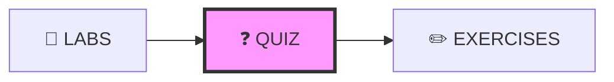

# ❓ QUIZ DESIGN - Quy Chuẩn Thiết Kế Quiz

---

## 📋 DOCUMENT INFORMATION (Thông tin tài liệu)

| Thuộc tính | Giá trị |
|------------|---------|
| **Tên** | Quiz Design Specification |
| **Phiên bản** | 1.0 |
| **Ngày tạo** | 2025-12-28 |
| **Liên quan** | [CONTENT_STANDARDS.md](./CONTENT_STANDARDS.md) |

---

## 1. 🗺️ NAVIGATION POSITION (Vị trí điều hướng)



**Navigation Footer:**

```markdown
---

[⬅️ LABS](./LABS.md) | [📚 Track](../README.md) | [EXERCISES ➡️](./EXERCISES.md)
```

---

## 2. 🎯 PURPOSE (Mục đích)

- Ôn lại kiến thức sau khi học lý thuyết và làm labs
- Đánh giá nhanh mức độ hiểu bài
- 15-20 câu hỏi trắc nghiệm mỗi module
- Đáp án ẩn bằng `<details>` để tự kiểm tra

---

## 3. 📋 REQUIRED SECTIONS (Các phần bắt buộc)

| # | Section | Mô tả | Bắt buộc |
|---|---------|-------|----------|
| 1 | **YAML Front-matter** | Metadata + total_questions, passing_score | ✅ |
| 2 | **Header** | `## MODULE X.Y – <Tên> Quiz` | ✅ |
| 3 | **Instructions** | Số câu, thời gian, điểm pass | ✅ |
| 4 | **Questions** | Câu hỏi với 4 lựa chọn A,B,C,D | ✅ |
| 5 | **Answer Key** | Bảng đáp án (ẩn) | ✅ |
| 6 | **Scoring Guide** | Thang điểm | ✅ |
| 7 | **References** | Link về lý thuyết | ⭕ |
| 8 | **Navigation Footer** | Điều hướng | ✅ |

---

## 4. 📝 TEMPLATE (Mẫu)

```markdown
---
module: "X.Y"
title: "<Tên Module> – Quiz"
track: "X"
version: "1.0"
last_updated: "YYYY-MM-DD"
total_questions: 15
passing_score: 70
time_limit: "15 minutes"
---

## MODULE X.Y – <Tên Module> Quiz

### Instructions

- **Số lượng câu hỏi:** 15 câu
- **Thời gian:** 15 phút
- **Điểm pass:** 70% (đúng ít nhất 11/15 câu)
- **Cách tính:** Mỗi câu đúng = 1 điểm, không trừ điểm câu sai

---

### Questions

#### 1. <Câu hỏi>?

A) Lựa chọn A  
B) Lựa chọn B  
C) Lựa chọn C  
D) Lựa chọn D

<details>
<summary>Xem đáp án</summary>

**Đáp án: B**

**Giải thích:** Lý do tại sao B đúng...
</details>

---

#### 2. <Câu hỏi>?

A) Lựa chọn A  
B) Lựa chọn B  
C) Lựa chọn C  
D) Lựa chọn D

<details>
<summary>Xem đáp án</summary>

**Đáp án: C**

**Giải thích:** Lý do tại sao C đúng...
</details>

---

[... Câu 3-15 ...]

---

### Answer Key

<details>
<summary>Xem bảng đáp án</summary>

| Câu | Đáp án | Câu | Đáp án |
|-----|--------|-----|--------|
| 1 | B | 9 | A |
| 2 | C | 10 | B |
| 3 | A | 11 | C |
| 4 | D | 12 | B |
| 5 | B | 13 | A |
| 6 | C | 14 | D |
| 7 | A | 15 | B |
| 8 | B | | |

</details>

---

### Scoring Guide

| Số câu đúng | Điểm | Đánh giá |
|-------------|------|----------|
| 14-15 | 93-100% | Xuất sắc ⭐⭐⭐ |
| 12-13 | 80-87% | Tốt ⭐⭐ |
| 11 | 73% | Pass ⭐ |
| < 11 | < 70% | Cần ôn lại |

---

### References

- [README.md - Lý thuyết](./README.md)
- [GLOSSARY](../../resources/GLOSSARY.md)

---

[⬅️ LABS](./LABS.md) | [📚 Track](../README.md) | [EXERCISES ➡️](./EXERCISES.md)
```

---

## 5. 📊 QUESTION TYPES (Loại câu hỏi)

| Loại | Mô tả | Ví dụ | Tỷ lệ |
|------|-------|-------|-------|
| **Knowledge** | Định nghĩa, khái niệm | "Docker image là gì?" | 30% |
| **Comprehension** | Hiểu biết, so sánh | "Sự khác biệt giữa CMD và ENTRYPOINT?" | 30% |
| **Application** | Áp dụng | "Lệnh nào để xem logs container?" | 25% |
| **Analysis** | Phân tích | "Nguyên nhân lỗi khi...?" | 15% |

---

## 6. 📏 STYLE GUIDE (Hướng dẫn style)

| Quy tắc | Mô tả |
|---------|-------|
| Câu hỏi | Rõ ràng, chỉ có 1 đáp án đúng |
| Lựa chọn | Độ dài tương đương, không có gợi ý |
| Giải thích | Ngắn gọn, giải thích tại sao đúng |
| Đa dạng | Kết hợp nhiều loại câu hỏi |

---

## 7. ✅ REVIEW CHECKLIST (Danh sách kiểm tra)

- [ ] YAML có total_questions và passing_score
- [ ] Đủ 15-20 câu hỏi
- [ ] Mỗi câu chỉ có 1 đáp án đúng
- [ ] Các lựa chọn không có gợi ý rõ ràng
- [ ] Có giải thích cho mỗi đáp án
- [ ] Đáp án ẩn bằng `<details>` ⭐
- [ ] Có Answer Key tổng hợp
- [ ] **Navigation Footer** ⭐

---

## 8. ✅ DO'S AND DON'TS (Những điều nên và không nên làm)

### ✅ DO'S (Nên làm)

- Câu hỏi phản ánh nội dung đã học
- Sắp xếp theo độ khó tăng dần
- Cung cấp giải thích chi tiết
- Đa dạng loại câu hỏi

### ❌ DON'TS (Không nên làm)

- Câu hỏi mơ hồ, nhiều đáp án đúng
- Lựa chọn "All of the above" quá nhiều
- Đáp án quá dễ đoán
- Câu hỏi không liên quan đến module

---

*Cập nhật: 2025-12-28 | Phiên bản: 1.0*

