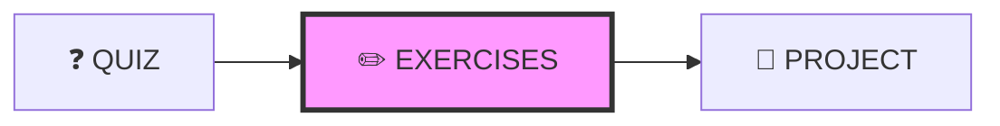
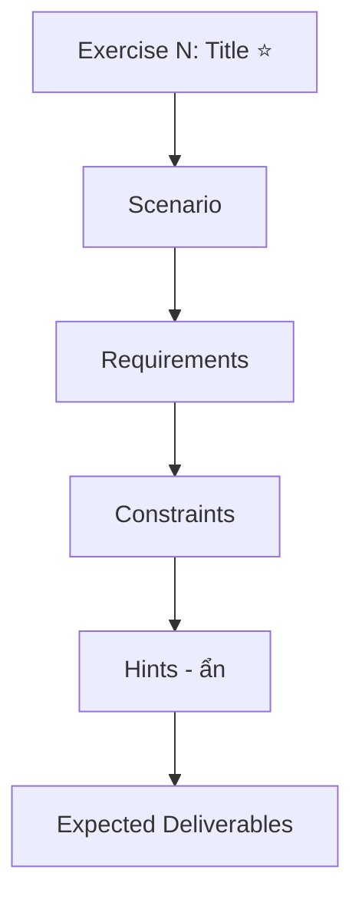

# ✏️ EXERCISES DESIGN - Quy Chuẩn Thiết Kế Exercises

---

## 📋 DOCUMENT INFORMATION (Thông tin tài liệu)

| Thuộc tính | Giá trị |
|------------|---------|
| **Tên** | Exercises Design Specification |
| **Phiên bản** | 1.0 |
| **Ngày tạo** | 2025-12-28 |
| **Liên quan** | [CONTENT_STANDARDS.md](./CONTENT_STANDARDS.md) |

---

## 1. 🗺️ NAVIGATION POSITION (Vị trí điều hướng)



**Navigation Footer:**

```markdown
---

[⬅️ QUIZ](./QUIZ.md) | [📚 Track](../README.md) | [PROJECT ➡️](./PROJECT.md)
```

---

## 2. 🎯 PURPOSE (Mục đích)

- Bài tập **tình huống thực tế**, yêu cầu tự suy luận
- **KHÔNG có đáp án** trong file này (đáp án ở SOLUTIONS.md)
- Khác với LABS (có hướng dẫn từng bước)
- Rèn luyện kỹ năng giải quyết vấn đề

---

## 3. 📋 REQUIRED SECTIONS (Các phần bắt buộc)

| # | Section | Mô tả | Bắt buộc |
|---|---------|-------|----------|
| 1 | **YAML Front-matter** | Metadata + difficulty, estimated_time | ✅ |
| 2 | **Header** | `## MODULE X.Y – <Tên> Exercises` | ✅ |
| 3 | **Overview** | Số bài, thời gian, độ khó | ✅ |
| 4 | **Prerequisites** | Kiến thức/công cụ cần có | ✅ |
| 5 | **Exercises 1, 2, 3...** | Chi tiết từng bài | ✅ |
| 6 | **Evaluation Criteria** | Tiêu chí chấm điểm | ✅ |
| 7 | **Submission Guidelines** | Hướng dẫn nộp bài | ⭕ |
| 8 | **Navigation Footer** | Điều hướng | ✅ |

---

## 4. 📝 TEMPLATE (Mẫu)

```markdown
---
module: "X.Y"
title: "<Tên Module> – Exercises"
track: "X"
version: "1.0"
last_updated: "YYYY-MM-DD"
difficulty: "Beginner to Intermediate"
estimated_time: "60-90 minutes"
---

## MODULE X.Y – <Tên Module> Exercises

### Overview

- **Số lượng bài tập:** 3 bài
- **Thời gian ước tính:** 60-90 phút
- **Mức độ khó:** Từ Beginner đến Intermediate
- **Yêu cầu:** Hoàn thành ít nhất 2/3 bài tập

---

### Prerequisites

- [ ] Đã hoàn thành README.md và LABS.md của module này
- [ ] Tool 1 đã cài đặt
- [ ] Tool 2 đã cài đặt

---

### Exercise 1: <Tên> ⭐

#### Scenario

Bạn là DevOps Engineer tại công ty ABC. Team lead giao cho bạn task: [mô tả tình huống thực tế]

#### Requirements

1. Yêu cầu cụ thể 1
2. Yêu cầu cụ thể 2
3. Yêu cầu cụ thể 3

#### Constraints

- Ràng buộc 1
- Ràng buộc 2

#### Hints

<details>
<summary>Hint 1: Hướng tiếp cận</summary>
Gợi ý không tiết lộ đáp án
</details>

<details>
<summary>Hint 2: Công cụ</summary>
Gợi ý về công cụ/lệnh cần dùng
</details>

#### Expected Deliverables

- [ ] File 1
- [ ] File 2
- [ ] Screenshot kết quả

---

### Exercise 2: <Tên> ⭐⭐

[Cấu trúc tương tự Exercise 1]

---

### Exercise 3: <Tên> ⭐⭐⭐

[Cấu trúc tương tự Exercise 1]

---

### Evaluation Criteria

| Tiêu chí | Điểm tối đa | Mô tả |
|----------|-------------|-------|
| Đúng yêu cầu | 40 | Hoàn thành đầy đủ requirements |
| Cấu trúc đúng | 20 | Code/config đúng cú pháp và best practices |
| Tối ưu | 20 | Hiệu quả, không lệnh thừa |
| Giải thích | 10 | Comment/ghi chú rõ ràng |
| Clean up | 10 | Dọn dẹp resources sau khi xong |
| **Tổng** | **100** | |

**Điểm pass:** ≥ 60/100

---

### Submission Guidelines

1. Tạo folder với tên: `<TenHocVien>_Module<X.Y>_Exercises`
2. Bao gồm: files, screenshots, file `NOTES.md` ghi chú
3. Nén thành file `.zip`
4. Nộp qua [link nộp bài]

---

[⬅️ QUIZ](./QUIZ.md) | [📚 Track](../README.md) | [PROJECT ➡️](./PROJECT.md)
```

---

## 5. 📊 DIFFICULTY (Độ khó)

| Mức độ | Ký hiệu | Mô tả |
|--------|---------|-------|
| Easy | ⭐ | Áp dụng 1-2 khái niệm đơn giản |
| Medium | ⭐⭐ | Kết hợp nhiều khái niệm |
| Hard | ⭐⭐⭐ | Phức tạp, yêu cầu research thêm |

---

## 6. 📏 EXERCISE STRUCTURE (Cấu trúc mỗi Exercise)



---

## 7. ✅ REVIEW CHECKLIST (Danh sách kiểm tra)

- [ ] YAML có difficulty và estimated_time
- [ ] Mỗi exercise có Scenario thực tế
- [ ] Requirements cụ thể, có thể verify
- [ ] Hints không tiết lộ đáp án
- [ ] Có Evaluation Criteria công bằng
- [ ] **KHÔNG có đáp án** (để SOLUTIONS.md) ⭐
- [ ] **Navigation Footer** ⭐

---

## 8. ✅ DO'S AND DON'TS (Những điều nên và không nên làm)

### ✅ DO'S (Nên làm)

- Đặt tình huống thực tế, gần gũi công việc
- Cung cấp ràng buộc rõ ràng
- Cho gợi ý từng bước (không phải đáp án)
- Đa dạng mức độ khó

### ❌ DON'TS (Không nên làm)

- Đặt yêu cầu mơ hồ, không verify được
- Đưa đáp án trong đề bài
- Bỏ qua Evaluation Criteria
- Thiếu thông tin về môi trường/công cụ

---

*Cập nhật: 2025-12-28 | Phiên bản: 1.0*

