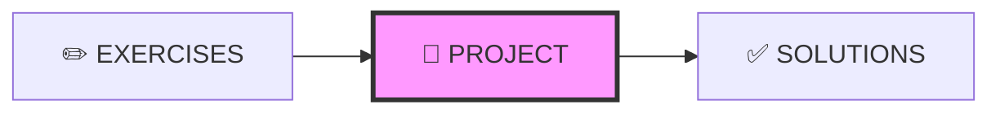
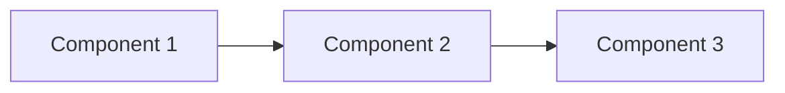

# 🚀 PROJECT DESIGN - Quy Chuẩn Thiết Kế Project

---

## 📋 DOCUMENT INFORMATION (Thông tin tài liệu)

| Thuộc tính | Giá trị |
|------------|---------|
| **Tên** | Project Design Specification |
| **Phiên bản** | 1.0 |
| **Ngày tạo** | 2025-12-28 |
| **Liên quan** | [CONTENT_STANDARDS.md](./CONTENT_STANDARDS.md) |

---

## 1. 🗺️ NAVIGATION POSITION (Vị trí điều hướng)



**Navigation Footer:**

```markdown
---

[⬅️ EXERCISES](./EXERCISES.md) | [📚 Track](../README.md) | [SOLUTIONS ➡️](./SOLUTIONS.md)
```

---

## 2. 🎯 PURPOSE (Mục đích)

- Dự án **tổng hợp toàn bộ kiến thức** module
- Có thể **đưa vào portfolio** và CV
- Thời gian: 2-4 giờ (tùy module)
- Có **Architecture Diagram** và **Evaluation Criteria**

---

## 3. 📋 REQUIRED SECTIONS (Các phần bắt buộc)

| # | Section | Mô tả | Bắt buộc |
|---|---------|-------|----------|
| 1 | **YAML Front-matter** | Metadata + technologies | ✅ |
| 2 | **Header** | `## MODULE X.Y – <Tên> Project` | ✅ |
| 3 | **Project Overview** | Mô tả, tại sao quan trọng | ✅ |
| 4 | **Learning Objectives** | Kỹ năng áp dụng | ✅ |
| 5 | **Prerequisites** | Kiến thức, công cụ | ✅ |
| 6 | **Architecture Diagram** ⭐ | Sơ đồ hệ thống | ✅ |
| 7 | **Requirements** | Functional, Non-functional, Bonus | ✅ |
| 8 | **Step-by-Step Guide** | Các Phase/Milestone | ✅ |
| 9 | **Expected Deliverables** | Files cần nộp | ✅ |
| 10 | **Evaluation Criteria** | Bảng điểm chi tiết | ✅ |
| 11 | **Submission Guidelines** | Cách nộp | ⭕ |
| 12 | **Tips** | Mẹo thực hiện | ⭕ |
| 13 | **Navigation Footer** | Điều hướng | ✅ |

---

## 4. 📝 TEMPLATE (Mẫu)

```markdown
---
module: "X.Y"
title: "<Tên Module> – Project"
track: "X"
version: "1.0"
last_updated: "YYYY-MM-DD"
difficulty: "Intermediate"
estimated_time: "3-4 hours"
technologies: ["Tool1", "Tool2", "Tool3"]
---

## MODULE X.Y – <Tên Module> Project

### 🚀 <Tên Dự Án>

---

## 1. Project Overview (Tổng quan dự án)

### Mô tả

Bạn sẽ xây dựng **[Tên Project]** - một [mô tả ngắn]. Dự án bao gồm:

- **Component 1:** Mô tả
- **Component 2:** Mô tả
- **Component 3:** Mô tả

### Tại sao dự án này quan trọng?

- Áp dụng tất cả kiến thức đã học
- Thực hành [skill X, Y, Z]
- Có sản phẩm hoàn chỉnh để demo

### Sản phẩm cuối cùng

[Mô tả output của project]

---

## 2. Learning Objectives (Mục tiêu học)

Sau khi hoàn thành dự án, bạn sẽ:

- [ ] Skill 1
- [ ] Skill 2
- [ ] Skill 3
- [ ] Skill 4

---

## 3. Prerequisites (Yêu cầu tiên quyết)

### Kiến thức
- [ ] Đã hoàn thành MODULE X.Y - <Tên>
- [ ] Hiểu cơ bản về [topic]

### Công cụ
- [ ] Tool 1 đã cài đặt
- [ ] Tool 2 đã cài đặt

---

## 4. Architecture Diagram (Sơ đồ kiến ​​trúc)

```

┌─────────────────────────────────────────────────────────────┐
│                    Project Architecture                      │
├─────────────────────────────────────────────────────────────┤
│                                                              │
│  ┌──────────────┐    ┌──────────────┐    ┌──────────────┐   │
│  │   Component  │    │   Component  │    │   Component  │   │
│  │      1       │───▶│      2       │───▶│      3       │   │
│  └──────────────┘    └──────────────┘    └──────────────┘   │
│                                                              │
└─────────────────────────────────────────────────────────────┘

```

Hoặc dùng Mermaid:



### Mô tả các thành phần

| Component | Công nghệ | Mô tả |
|-----------|-----------|-------|
| Component 1 | Tool1 | Mô tả |
| Component 2 | Tool2 | Mô tả |

---

## 5. Project Requirements (Yêu cầu dự án)

### 5.1 Functional Requirements (Chức năng bắt buộc)

| ID | Requirement | Mô tả |
|----|-------------|-------|
| FR1 | ... | ... |
| FR2 | ... | ... |

### 5.2 Non-functional Requirements (Chức năng không bắt buộc)

| ID | Requirement | Mô tả |
|----|-------------|-------|
| NFR1 | ... | ... |

### 5.3 Bonus Features (Tính năng bổ sung)

| ID | Feature | Điểm bonus |
|----|---------|------------|
| B1 | ... | +5 |
| B2 | ... | +10 |

---

## 6. Step-by-Step Implementation (Thực hiện từng bước)

### Phase 1: Setup (30 mins)

#### 1.1 Tạo cấu trúc thư mục

```bash
mkdir project-name
cd project-name
```

#### 1.2 Checkpoint (Điểm kiểm tra)

- [ ] Thư mục đã được tạo
- [ ] Cấu trúc đúng

---

### Phase 2: Core Implementation (Thực hiện core) (60 mins)

[Chi tiết các bước]

---

### Phase 3: Testing & Documentation (Kiểm thử & Tài liệu) (30 mins)

[Chi tiết các bước]

---

## 7. Expected Deliverables (Tài liệu cần nộp)

### Files cần nộp

```
project-name/
├── file1.ext              ✅ Required
├── file2.ext              ✅ Required
├── README.md              ✅ Required
└── screenshots/
    ├── screen1.png        ✅ Required
    └── screen2.png        ✅ Required
```

---

## 8. Evaluation Criteria (Bảng điểm)

| Tiêu chí | Điểm | Mô tả |
|----------|------|-------|
| **Setup** | 15 | Cấu trúc đúng |
| **Functionality** | 35 | Hoạt động đúng |
| **Architecture** | 20 | Thiết kế hợp lý |
| **Code Quality** | 15 | Clean code |
| **Documentation** | 15 | README rõ ràng |
| **Bonus** | +20 | Tính năng thêm |
| **Tổng** | **100 (+20)** | |

### Thang điểm

- **90-100+:** Xuất sắc ⭐⭐⭐
- **80-89:** Tốt ⭐⭐
- **70-79:** Pass ⭐
- **< 70:** Cần làm lại

---

## 9. Submission Guidelines (Cách nộp)

1. **Tên folder:** `<HọTên>_Module<X.Y>_Project`
2. **Format:** Nén thành file `.zip`
3. **Bao gồm:** Tất cả files + screenshots + README
4. **Không bao gồm:** node_modules, .git, volumes data

---

## 10. 💡 Tips (Mẹo)

1. **Test từng phần** trước khi combine
2. **Đọc logs** khi gặp lỗi
3. **Clean up** khi cần reset

---

[⬅️ EXERCISES](./EXERCISES.md) | [📚 Track](../README.md) | [SOLUTIONS ➡️](./SOLUTIONS.md)

```

---

## 5. 📏 STYLE GUIDE (Hướng dẫn định dạng)

| Quy tắc | Mô tả |
|---------|-------|
| Architecture | Luôn có diagram (Mermaid hoặc ASCII) |
| Requirements | Chia rõ Functional/Non-functional/Bonus |
| Phases | Hướng dẫn theo milestones |
| Checkpoint | Có verify sau mỗi phase |

---

## 6. ✅ REVIEW CHECKLIST (Danh sách kiểm tra)

- [ ] YAML có technologies và estimated_time
- [ ] Có Architecture Diagram ⭐
- [ ] Requirements chia theo Functional/Non-functional/Bonus
- [ ] Có Step-by-Step với checkpoints
- [ ] Có Evaluation Criteria với điểm số
- [ ] Có Expected Deliverables rõ ràng
- [ ] **Navigation Footer** ⭐

---

## 7. ✅ DO'S AND DON'TS (Nên và Không nên)

### ✅ NÊN LÀM

- Thiết kế dự án có thể đưa vào portfolio
- Cung cấp starter code nếu cần
- Có nhiều mức độ hoàn thành (basic → advanced)
- Guide từng bước nhưng không đưa đáp án hoàn chỉnh

### ❌ KHÔNG NÊN LÀM

- Dự án quá đơn giản, không có giá trị
- Yêu cầu mơ hồ, không verify được
- Bỏ qua bonus features
- Thiếu Architecture Diagram

---

*Cập nhật: 2025-12-28 | Phiên bản: 1.0*


