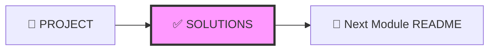
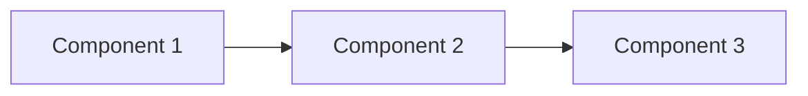
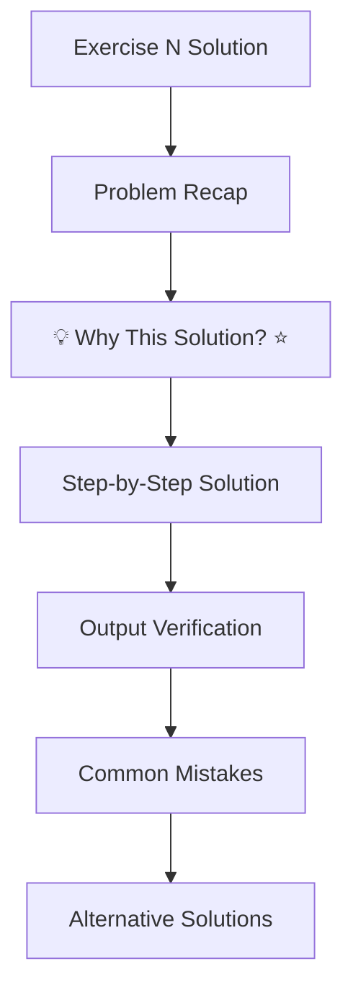

# ✅ SOLUTIONS DESIGN - Quy Chuẩn Thiết Kế Solutions

---

## 📋 DOCUMENT INFORMATION (Thông tin tài liệu)

| Thuộc tính | Giá trị |
|------------|---------|
| **Tên** | Solutions Design Specification |
| **Phiên bản** | 1.0 |
| **Ngày tạo** | 2025-12-28 |
| **Liên quan** | [CONTENT_STANDARDS.md](./CONTENT_STANDARDS.md) |

---

## 1. 🗺️ NAVIGATION POSITION (Vị trí điều hướng)



**Navigation Footer:**

```markdown
---

[⬅️ PROJECT](./PROJECT.md) | [📚 Track](../README.md) | [Next Module ➡️](../X.Y+1_Folder/README.md)
```

---

## 2. 🎯 PURPOSE (Mục đích)

- Đáp án chi tiết cho **EXERCISES** và **PROJECT**
- Học viên nên **tự làm trước** khi xem
- Giải thích **TƯ DUY** đằng sau giải pháp (Why This Solution?)
- Liệt kê **Alternative Solutions** và **Common Mistakes**

---

## 3. 📋 REQUIRED SECTIONS (Các phần bắt buộc)

| # | Section | Mô tả | Bắt buộc |
|---|---------|-------|----------|
| 1 | **YAML Front-matter** | Metadata + exercises_covered | ✅ |
| 2 | **Header** | `## MODULE X.Y – <Tên> Solutions` | ✅ |
| 3 | **Important Notes** ⭐ | Khuyến cáo tự làm trước | ✅ |
| 4 | **Exercise Solutions** | Giải chi tiết từng bài | ✅ |
| 5 | **Project Solution** | Giải chi tiết project | ✅ |
| 6 | **References** | Tài liệu bổ sung | ⭕ |
| 7 | **Navigation Footer** | Điều hướng | ✅ |

---

## 4. 📝 TEMPLATE (Mẫu)

```markdown
---
module: "X.Y"
title: "<Tên Module> – Solutions"
track: "X"
version: "1.0"
last_updated: "YYYY-MM-DD"
exercises_covered: [1, 2, 3]
---

## MODULE X.Y – <Tên Module> Solutions

### ⚠️ Important Notes

> **Lưu ý:** Hãy tự làm bài tập trước khi xem đáp án. 
> Có thể có nhiều cách giải đúng, solutions dưới đây chỉ là một trong số đó.

---

## Exercise 1 Solution

### Problem Recap

Tóm tắt lại yêu cầu của Exercise 1.

---

### 💡 Why This Solution?

| Quyết định | Lý do | So sánh |
|------------|-------|---------|
| Dùng alpine image | Giảm size | ubuntu=900MB vs alpine=50MB |
| Multi-stage build | Loại devDependencies | Single-stage=500MB vs Multi=100MB |

> 📝 **Ghi nhớ:** Trong production, luôn ưu tiên image nhỏ và security.

---

### Step-by-Step Solution

#### Bước 1: Tạo thư mục

```bash
mkdir project-name
cd project-name
```

#### Bước 2: Tạo file

```bash
# Tạo file với nội dung
cat > file.ext << 'EOF'
content here
EOF
```

---

### Output Verification

```bash
# Kiểm tra kết quả
verify-command

# Output mong đợi:
# expected output here
```

---

### Common Mistakes

| Lỗi | Nguyên nhân | Cách sửa |
|-----|-------------|----------|
| Error 1 | Nguyên nhân | Cách sửa |
| Error 2 | Nguyên nhân | Cách sửa |

---

### Alternative Solutions

**Cách 2: [Mô tả]**

```bash
# Alternative approach
alternative-command
```

**Khi nào dùng:** [Mô tả trường hợp]

---

## Exercise 2 Solution

[Cấu trúc tương tự Exercise 1]

---

## Exercise 3 Solution

[Cấu trúc tương tự Exercise 1]

---

## Project Solution

### Project Recap

Tóm tắt yêu cầu của Project.

---

### Architecture Overview



---

### Step-by-Step Implementation

#### Phase 1: Setup

[Chi tiết]

#### Phase 2: Core

[Chi tiết]

#### Phase 3: Testing

[Chi tiết]

---

### Final Verification

```bash
# Test tất cả
test-command

# Expected: All tests passed
```

---

### Bonus Improvements

Nếu muốn cải thiện thêm:

1. **Improvement 1:** Mô tả
2. **Improvement 2:** Mô tả

---

## References

- [Official Documentation](https://...)
- [Best Practices](https://...)
- [GLOSSARY](../../resources/GLOSSARY.md)

---

[⬅️ PROJECT](./PROJECT.md) | [📚 Track](../README.md) | [Next Module ➡️](../X.Y+1_Folder/README.md)

```

---

## 5. 💡 "WHY THIS SOLUTION?" SECTION (Giải thích lý do)

Đây là section **quan trọng nhất**, giải thích TƯ DUY:

```markdown
### 💡 Why This Solution?

**Q: Tại sao dùng `node:18-alpine` thay vì `node:18`?**

- **`node:18`**: Base Debian, size ~900MB, nhiều tool không cần
- **`node:18-alpine`**: Base Alpine, size ~50MB, minimal và secure

**Q: Tại sao dùng `COPY package*.json ./` trước `COPY . .`?**

- Docker cache mỗi layer riêng biệt
- Nếu source code thay đổi nhưng package.json không đổi → npm install được cache
- Tiết kiệm thời gian build đáng kể
```

---

## 6. 📏 SOLUTION STRUCTURE (Cấu trúc solution)



---

## 7. ✅ REVIEW CHECKLIST (Danh sách kiểm tra)

- [ ] YAML có exercises_covered
- [ ] Có Important Notes cảnh báo tự làm trước
- [ ] Mỗi solution có **"Why This Solution?"** ⭐
- [ ] Step-by-step có code và giải thích
- [ ] Có Output Verification
- [ ] Có Common Mistakes table
- [ ] Có Alternative Solutions (nếu có)
- [ ] **Navigation Footer** ⭐

---

## 8. ✅ DO'S AND DON'TS (Những điều nên và không nên làm)

### ✅ DO'S (Nên làm)

- Giải thích lý do lựa chọn giải pháp ⭐
- Thêm comment trong code
- Cung cấp Output mẫu để verify
- Đề cập các cách giải khác

### ❌ DON'TS (Không nên làm)

- Chỉ đưa code mà không giải thích
- Bỏ qua "Why This Solution?"
- Thiếu Output Verification
- Quên Alternative Solutions

---

*Cập nhật: 2025-12-28 | Phiên bản: 1.0*

