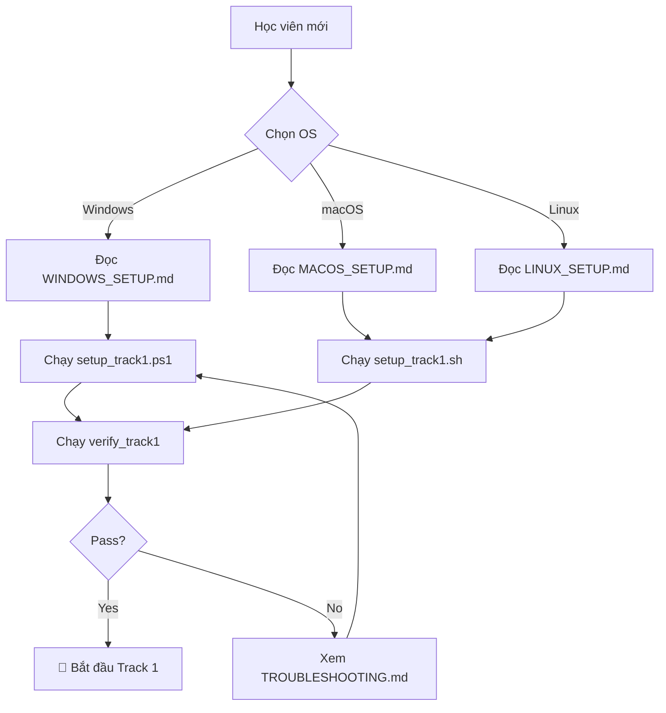
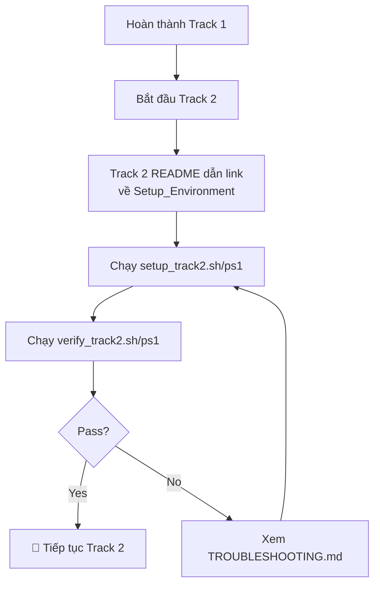

# 🛠️ SETUP_ENVIRONMENT - Design Specification

---

## 📋 DOCUMENT INFORMATION (Thông tin tài liệu)

| Thuộc tính | Giá trị |
|------------|---------|
| **Module** | Setup_Environment |
| **Phiên bản** | 1.0 |
| **Ngày tạo** | 2025-12-28 |
| **Trạng thái** | 📝 THIẾT KẾ |

---

## 1. 🎯 PURPOSE AND OVERVIEW (Mục đích và Tổng quan)

### 1.1 Mục đích

Cung cấp giới thiệu và hướng dẫn **chi tiết từng bước** để thiết lập môi trường học tập cho **tất cả các hệ điều hành** (Windows, macOS, Linux) với:

- **Cách thủ công**: Hướng dẫn từng bước với screenshots
- **Cách tự động**: Scripts `.sh` (Linux/macOS) và `.ps1` (Windows)
- **File verify**: Kiểm tra môi trường đã sẵn sàng cho từng Track

### 1.2 Đặc điểm chính

```
┌─────────────────────────────────────────────────────────────────┐
│                    SETUP_ENVIRONMENT                             │
├─────────────────────────────────────────────────────────────────┤
│                                                                  │
│  ┌──────────────┐  ┌──────────────┐  ┌──────────────┐          │
│  │   Windows    │  │    macOS     │  │    Linux     │          │
│  │  (WSL2 +     │  │  (Homebrew)  │  │  (apt/yum)   │          │
│  │  PowerShell) │  │              │  │              │          │
│  └──────┬───────┘  └──────┬───────┘  └──────┬───────┘          │
│         │                 │                 │                   │
│         ▼                 ▼                 ▼                   │
│  ┌─────────────────────────────────────────────────────────┐   │
│  │              TRACK-BASED INSTALLATION                    │   │
│  ├─────────────────────────────────────────────────────────┤   │
│  │  Track 1: Git, Docker, VS Code, NGINX                   │   │
│  │  Track 2: + Jenkins, kubectl, Helm                      │   │
│  │  Track 3: + Terraform, AWS CLI                          │   │
│  │  Track 4: + Trivy, OWASP tools                          │   │
│  │  Track 5: + (No additional tools)                       │   │
│  └─────────────────────────────────────────────────────────┘   │
│                              │                                  │
│                              ▼                                  │
│  ┌─────────────────────────────────────────────────────────┐   │
│  │              VERIFICATION SCRIPTS                        │   │
│  │  verify_track1.sh/ps1 → ✅ PASS / ❌ FAIL               │   │
│  │  verify_track2.sh/ps1 → ✅ PASS / ❌ FAIL               │   │
│  │  ...                                                     │   │
│  └─────────────────────────────────────────────────────────┘   │
│                                                                  │
└─────────────────────────────────────────────────────────────────┘
```

---

## 2. 📁 DIRECTORY STRUCTURE (Cấu trúc thư mục)

```
Setup_Environment/
│
├── images/                           # Screenshots cho hướng dẫn
│   ├── windows/
│   ├── macos/
│   └── linux/
│
├── scripts/                          # Scripts tự động
│   ├── toolAllinOne/                 # Tool đa năng bao gồm tự động cài đặt cho cả 3 môi trường (Phát triển tool này sau)
│   |
│   ├── windows/
│   │   ├── setup_track1.ps1          # Cài đặt cho Track 1
│   │   ├── setup_track2.ps1          # Cài đặt bổ sung cho Track 2
│   │   ├── setup_track3.ps1          # Cài đặt bổ sung cho Track 3
│   │   ├── setup_track4.ps1          # Cài đặt bổ sung cho Track 4
│   │   ├── verify_track1.ps1         # Verify Track 1
│   │   ├── verify_track2.ps1         # Verify Track 2
│   │   ├── verify_track3.ps1         # Verify Track 3
│   │   ├── verify_track4.ps1         # Verify Track 4
│   │   └── verify_all.ps1            # Verify tất cả
│   │
│   ├── macos/
│   │   ├── setup_track1.sh
│   │   ├── setup_track2.sh
│   │   ├── setup_track3.sh
│   │   ├── setup_track4.sh
│   │   ├── verify_track1.sh
│   │   ├── verify_track2.sh
│   │   ├── verify_track3.sh
│   │   ├── verify_track4.sh
│   │   └── verify_all.sh
│   │
│   └── linux/
│       ├── setup_track1.sh
│       ├── setup_track2.sh
│       ├── setup_track3.sh
│       ├── setup_track4.sh
│       ├── verify_track1.sh
│       ├── verify_track2.sh
│       ├── verify_track3.sh
│       ├── verify_track4.sh
│       └── verify_all.sh
│
├── README.md                         # Giáo trình chính (điều hướng)
├── WINDOWS_SETUP.md                  # Hướng dẫn chi tiết Windows
├── MACOS_SETUP.md                    # Hướng dẫn chi tiết macOS
├── LINUX_SETUP.md                    # Hướng dẫn chi tiết Linux
├── TOOLS_OVERVIEW.md                 # Tổng quan tất cả tools
├── TROUBLESHOOTING.md                # Xử lý lỗi phổ biến
├── CHEATSHEET.md                     # Tra cứu nhanh
└── QUIZ.md                           # Kiểm tra kiến thức
```

---

## 3. 📦 TRACK-SPECIFIC TOOLS (Tools theo từng TRACK)

### 3.1 Tổng Quan Tools

| Tool | Track 1 | Track 2 | Track 3 | Track 4 | Mô tả |
|------|---------|---------|---------|---------|-------|
| **WSL2** (Windows) | ✅ | - | - | - | Linux subsystem cho Windows |
| **Homebrew** (macOS) | ✅ | - | - | - | Package manager cho macOS |
| **Git** | ✅ | - | - | - | Version control |
| **VS Code** | ✅ | - | - | - | Code editor |
| **Docker Desktop** | ✅ | - | - | - | Container runtime |
| **NGINX** | ✅ | - | - | - | Web server (test local) |
| **Node.js** (optional) | ✅ | - | - | - | JavaScript runtime |
| **Jenkins** | - | ✅ | - | - | CI/CD server |
| **kubectl** | - | ✅ | - | - | Kubernetes CLI |
| **Minikube/Kind** | - | ✅ | - | - | Local Kubernetes |
| **Helm** | - | ✅ | - | - | K8s package manager |
| **Terraform** | - | - | ✅ | - | IaC tool |
| **AWS CLI** | - | - | ✅ | - | AWS command line |
| **Trivy** | - | - | - | ✅ | Container scanner |
| **OWASP ZAP** | - | - | - | ✅ | Web app scanner |

### 3.2 Chi Tiết Từng Track

#### 🔵 TRACK 1: Foundation & Static Web

**Tools cần cài:**

| # | Tool | Version | Verify command | Expected output |
|---|------|---------|----------------|-----------------|
| 1 | WSL2 (Windows only) | 2.x | `wsl --version` | `WSL version: 2.x.x` |
| 2 | Git | 2.40+ | `git --version` | `git version 2.4x.x` |
| 3 | VS Code | Latest | `code --version` | `1.8x.x` |
| 4 | Docker | 24.0+ | `docker --version` | `Docker version 24.x.x` |
| 5 | Docker Compose | 2.20+ | `docker compose version` | `Docker Compose version v2.2x.x` |
| 6 | NGINX (Docker) | Latest | `docker run --rm nginx:alpine nginx -v` | `nginx version: nginx/1.2x.x` |

**Sau khi hoàn thành:**

- Có thể clone repository từ GitHub
- Có thể build và run Docker container
- Có thể serve static website với NGINX container

---

#### 🟢 TRACK 2: Orchestration & Automation

**Tools bổ sung (sau Track 1):**

| # | Tool | Version | Verify command | Expected output |
|---|------|---------|----------------|-----------------|
| 1 | kubectl | 1.28+ | `kubectl version --client` | `Client Version: v1.2x.x` |
| 2 | Minikube | 1.31+ | `minikube version` | `minikube version: v1.3x.x` |
| 3 | Helm | 3.12+ | `helm version` | `version.BuildInfo{Version:"v3.1x.x"}` |
| 4 | Jenkins (Docker) | LTS | `docker run --rm jenkins/jenkins:lts cat /etc/os-release` | Container runs ok |

**Sau khi hoàn thành:**

- Có thể deploy Pod lên local Kubernetes
- Có thể sử dụng kubectl để quản lý resources
- Có thể cài đặt applications bằng Helm

---

#### 🟡 TRACK 3: Cloud, Network & Design

**Tools bổ sung (sau Track 2):**

| # | Tool | Version | Verify command | Expected output |
|---|------|---------|----------------|-----------------|
| 1 | Terraform | 1.5+ | `terraform --version` | `Terraform v1.x.x` |
| 2 | AWS CLI | 2.x | `aws --version` | `aws-cli/2.x.x` |
| 3 | AWS Credentials | - | `aws sts get-caller-identity` | JSON with Account ID |

**Sau khi hoàn thành:**

- Có thể chạy `terraform init/plan/apply`
- Có thể tương tác với AWS bằng CLI
- Có AWS account với IAM user configured

---

#### 🔴 TRACK 4: DevSecOps

**Tools bổ sung (sau Track 3):**

| # | Tool | Version | Verify command | Expected output |
|---|------|---------|----------------|-----------------|
| 1 | Trivy | Latest | `trivy --version` | `Version: 0.x.x` |
| 2 | OWASP ZAP (Docker) | Latest | `docker run --rm owasp/zap2docker-stable zap.sh -version` | `ZAP 2.x.x` |
| 3 | Hadolint | Latest | `docker run --rm hadolint/hadolint hadolint --version` | `Hadolint 2.x.x` |

**Sau khi hoàn thành:**

- Có thể scan Docker images với Trivy
- Có thể scan web applications với OWASP ZAP
- Có thể lint Dockerfile với Hadolint

---

## 4. 📝 FILE CONTENTS (Nội dung các file)

### 4.1 README.md (File chính - Điều hướng)

**Cấu trúc:**

```markdown
# Setup Environment - Thiết Lập Môi Trường

## Giới thiệu
- Mục đích của module này
- Tại sao cần thiết lập môi trường đúng cách

## Bạn đang dùng hệ điều hành nào?

| Hệ điều hành | Hướng dẫn | Script tự động |
|--------------|-----------|----------------|
| Windows 10/11 | [WINDOWS_SETUP.md](./WINDOWS_SETUP.md) | `scripts/windows/` |
| macOS | [MACOS_SETUP.md](./MACOS_SETUP.md) | `scripts/macos/` |
| Linux (Ubuntu/Debian) | [LINUX_SETUP.md](./LINUX_SETUP.md) | `scripts/linux/` |

## Bạn đang học Track nào?

| Track | Cần cài đặt | Verify script |
|-------|-------------|---------------|
| Track 1 | [Xem danh sách](#track-1) | `verify_track1.sh/ps1` |
| Track 2 | [Xem danh sách](#track-2) | `verify_track2.sh/ps1` |
| Track 3 | [Xem danh sách](#track-3) | `verify_track3.sh/ps1` |
| Track 4 | [Xem danh sách](#track-4) | `verify_track4.sh/ps1` |

## Navigation
[📚 Mục lục](../README.md) | [Track 1 ➡️](../Track1_Foundation_StaticWeb/README.md)
```

---

### 4.2 WINDOWS_SETUP.md

**Cấu trúc:**

```markdown
# Windows Setup Guide

## Track 1 Setup

### Cách 1: Tự động (Khuyến nghị)

1. Mở PowerShell với quyền Administrator
2. Chạy lệnh:
   ```powershell
   Set-ExecutionPolicy Bypass -Scope Process -Force
   .\scripts\windows\setup_track1.ps1
   ```

1. Verify:

   ```powershell
   .\scripts\windows\verify_track1.ps1
   ```

### Cách 2: Thủ công

#### Bước 1: Cài đặt WSL2

[Chi tiết từng bước với screenshots]

#### Bước 2: Cài đặt Docker Desktop

[Chi tiết từng bước với screenshots]

...

### Verify Track 1

[Bảng kết quả expected]

---

## Track 2 Setup (Sau khi hoàn thành Track 1)

### Cách 1: Tự động

...

### Cách 2: Thủ công

...

---

## Track 3 Setup (Sau khi hoàn thành Track 2)

...

## Track 4 Setup (Sau khi hoàn thành Track 3)

...

```

---

### 4.3 TOOLS_OVERVIEW.md

**Cấu trúc:**

```markdown
# Tools Overview - Tổng Quan Công Cụ

## Bảng tổng hợp tất cả tools

| Tool | Track | Mô tả | Tại sao cần |
|------|-------|-------|-------------|
| Git | 1 | Version control | Quản lý code |
| Docker | 1 | Containerization | Đóng gói ứng dụng |
| ... | ... | ... | ... |

## Chi tiết từng tool

### Git
- **Là gì**: Hệ thống quản lý phiên bản phân tán
- **Tại sao học**: Mọi dự án đều dùng Git
- **Website**: https://git-scm.com/
- **Documentation**: https://git-scm.com/doc

### Docker
...
```

---

### 4.4 Verify Scripts

#### verify_track1.sh (Linux/macOS)

```bash
#!/bin/bash
# verify_track1.sh - Kiểm tra môi trường Track 1

echo "🔍 Đang kiểm tra môi trường Track 1..."
echo "========================================"

PASS=0
FAIL=0

# Check Git
if command -v git &> /dev/null; then
    echo "✅ Git: $(git --version)"
    ((PASS++))
else
    echo "❌ Git: CHƯA CÀI ĐẶT"
    ((FAIL++))
fi

# Check Docker
if command -v docker &> /dev/null; then
    if docker info &> /dev/null; then
        echo "✅ Docker: $(docker --version)"
        ((PASS++))
    else
        echo "⚠️ Docker: Đã cài nhưng không chạy"
        ((FAIL++))
    fi
else
    echo "❌ Docker: CHƯA CÀI ĐẶT"
    ((FAIL++))
fi

# ... more checks ...

echo "========================================"
echo "📊 Kết quả: $PASS ✅ PASS | $FAIL ❌ FAIL"

if [ $FAIL -eq 0 ]; then
    echo "🎉 CHÚC MỪNG! Bạn đã sẵn sàng học Track 1!"
else
    echo "⚠️ Vui lòng cài đặt các tools còn thiếu trước khi tiếp tục."
fi
```

#### verify_track1.ps1 (Windows)

```powershell
# verify_track1.ps1 - Kiểm tra môi trường Track 1

Write-Host "🔍 Đang kiểm tra môi trường Track 1..." -ForegroundColor Cyan
Write-Host "========================================"

$pass = 0
$fail = 0

# Check WSL
try {
    $wslVersion = wsl --version 2>$null
    Write-Host "✅ WSL: Installed" -ForegroundColor Green
    $pass++
} catch {
    Write-Host "❌ WSL: CHƯA CÀI ĐẶT" -ForegroundColor Red
    $fail++
}

# Check Git
try {
    $gitVersion = git --version 2>$null
    Write-Host "✅ Git: $gitVersion" -ForegroundColor Green
    $pass++
} catch {
    Write-Host "❌ Git: CHƯA CÀI ĐẶT" -ForegroundColor Red
    $fail++
}

# ... more checks ...

Write-Host "========================================"
Write-Host "📊 Kết quả: $pass ✅ PASS | $fail ❌ FAIL"

if ($fail -eq 0) {
    Write-Host "🎉 CHÚC MỪNG! Bạn đã sẵn sàng học Track 1!" -ForegroundColor Green
} else {
    Write-Host "⚠️ Vui lòng cài đặt các tools còn thiếu." -ForegroundColor Yellow
}
```

---

## 5. 🔄 WORKFLOW USE (Quy trình sử dụng)

### 5.1 Học viên mới (Bắt đầu Track 1)



### 5.2 Chuyển sang Track mới (Ví dụ: Track 1 → Track 2)



---

## 6. 📌 LINKS FROM THE TRACKS REGARDING THE SETUP (Link các TRACKS về SETUP)

Mỗi Track README sẽ có section đầu tiên:

```markdown
## Yêu cầu trước khi bắt đầu

Trước khi học Track X, bạn cần:

1. ✅ Hoàn thành Track X-1
2. ✅ Cài đặt tools cho Track X

### Kiểm tra môi trường

```bash
# Linux/macOS
./Setup_Environment/scripts/linux/verify_trackX.sh

# Windows PowerShell
.\Setup_Environment\scripts\windows\verify_trackX.ps1
```

Nếu có lỗi, xem [Setup_Environment/TROUBLESHOOTING.md](../Setup_Environment/TROUBLESHOOTING.md)

```

---

## 7. 📋 IMPLEMENTATION CHECKLIST (Checklist triển khai)

### 7.1 Files cần tạo

- [ ] `README.md` - Điều hướng chính
- [ ] `WINDOWS_SETUP.md` - Hướng dẫn Windows
- [ ] `MACOS_SETUP.md` - Hướng dẫn macOS
- [ ] `LINUX_SETUP.md` - Hướng dẫn Linux
- [ ] `TOOLS_OVERVIEW.md` - Tổng quan tools
- [ ] `TROUBLESHOOTING.md` - Xử lý lỗi
- [ ] `CHEATSHEET.md` - Tra cứu nhanh
- [ ] `QUIZ.md` - Kiểm tra kiến thức

### 7.2 Scripts cần tạo

**Windows (PowerShell):**
- [ ] `setup_track1.ps1`
- [ ] `setup_track2.ps1`
- [ ] `setup_track3.ps1`
- [ ] `setup_track4.ps1`
- [ ] `verify_track1.ps1`
- [ ] `verify_track2.ps1`
- [ ] `verify_track3.ps1`
- [ ] `verify_track4.ps1`

**macOS & Linux (Bash):**
- [ ] `setup_track1.sh`
- [ ] `setup_track2.sh`
- [ ] `setup_track3.sh`
- [ ] `setup_track4.sh`
- [ ] `verify_track1.sh`
- [ ] `verify_track2.sh`
- [ ] `verify_track3.sh`
- [ ] `verify_track4.sh`

---

## 8. 📚 REFERENCES (Nguồn tham khảo)

| Loại | Đường dẫn | Sử dụng cho |
|------|-----------|-------------|
| Nội dung | `Reference/_NoiDungMau/Setup_Environment/` | Cấu trúc gốc |
| Nội dung | `Reference/_NoiDungMau/DevOps-2/01_LINUX/` | Hướng dẫn Linux |
| Nội dung | `Reference/_NoiDungMau/DevOps-3/FOUNDATION/PREREQUISITES.md` | Yêu cầu chuẩn bị |
| Quy tắc | `Reference/_QuytacThietke/.design/` | Templates |

---

*Cập nhật: 2025-12-28 | Trạng thái: CHỜ DUYỆT*


