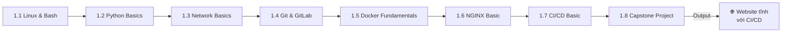
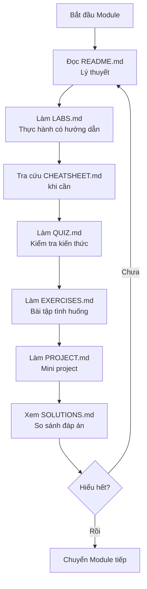

# 📦 TRACK 1: FOUNDATION & STATIC WEB - Design Specification

---

## 📋 DOCUMENT INFORMATION (Thông tin tài liệu)

| Thuộc tính | Giá trị |
|------------|---------|
| **Track** | 1 - Foundation & Static Web |
| **Phiên bản** | 1.0 |
| **Ngày tạo** | 2025-12-28 |
| **Trạng thái** | 📝 THIẾT KẾ |

---

## 1. 🎯 PURPOSE AND OVERVIEW (Mục đích và Tổng quan)

### 1.1 Mục tiêu của Track

> **Mục tiêu cuối cùng:** Học viên có thể **xây dựng và triển khai website tĩnh với CI/CD hoàn chỉnh**.

**Sau khi hoàn thành Track 1, học viên sẽ:**

- ✅ Sử dụng thành thạo Linux command line
- ✅ Hiểu cơ bản về Network (TCP/IP, DNS, HTTP)
- ✅ Quản lý code với Git & GitHub
- ✅ Containerize ứng dụng với Docker
- ✅ Serve static website với NGINX
- ✅ Setup CI/CD pipeline với GitHub Actions
- ✅ **Hoàn thành Capstone Project: Website tĩnh CI/CD**

### 1.2 Đối tượng

| Level | Mô tả |
|-------|-------|
| **Yêu cầu đầu vào** | Có kiến thức cơ bản về máy tính, biết sử dụng internet |
| **Đầu ra** | Beginner DevOps, sẵn sàng cho Track 2 |

### 1.3 Thời lượng ước tính

| Module | Thời gian | Tổng cộng |
|--------|-----------|-----------|
| 8 modules x ~8-12 giờ/module | 8-12 giờ | **64-96 giờ** (~2.5-3.5 tháng học part-time) |

---

## 2. 📁 MODULE STRUCTURE (Cấu trúc Modules)

### 2.1 Tổng quan 8 Modules



### 2.2 Chi tiết từng Module

---

## 📘 MODULE 1.1: LINUX & BASH

### Thông tin chung

| Thuộc tính | Giá trị |
|------------|---------|
| **Tên đầy đủ** | Linux Fundamentals & Bash Scripting |
| **Thời lượng** | 10-15 giờ |
| **Độ khó** | Beginner |
| **Yêu cầu trước** | Setup Environment hoàn thành |

### Mục tiêu học tập

Sau khi hoàn thành module này, học viên sẽ:

- [ ] Hiểu được Linux là gì và tại sao DevOps cần biết
- [ ] Điều hướng thành thạo trong file system
- [ ] Thao tác files và directories
- [ ] Quản lý users, permissions, processes
- [ ] Viết được Bash script cơ bản
- [ ] Sử dụng package manager (apt)

### Nội dung chi tiết

| # | Chủ đề | Kiến thức cụ thể | Thời lượng |
|---|--------|------------------|------------|
| 1 | Linux là gì? | Lịch sử, distros, tại sao DevOps cần | 30 phút |
| 2 | File System | Cấu trúc thư mục, `/home`, `/etc`, `/var`, `/tmp` | 1 giờ |
| 3 | Điều hướng | `pwd`, `ls`, `cd`, absolute vs relative paths | 1 giờ |
| 4 | Thao tác files | `touch`, `mkdir`, `cp`, `mv`, `rm`, `cat`, `less` | 2 giờ |
| 5 | Tìm kiếm | `find`, `grep`, `which`, `locate` | 1 giờ |
| 6 | Permissions | `chmod`, `chown`, rwx, numeric mode | 2 giờ |
| 7 | Processes | `ps`, `top`, `kill`, `systemctl` | 1.5 giờ |
| 8 | Package Manager | `apt update`, `apt install`, `apt remove` | 1 giờ |
| 9 | Bash Scripting | Variables, conditionals, loops, functions | 3 giờ |
| 10 | Pipes & Redirect | `|`,`>`,`>>`,`<`, command chaining | 1 giờ |

### Nguồn tham khảo

| Nguồn | Đường dẫn | Sử dụng |
|-------|-----------|---------|
| DevOps-2 | `_NoiDungMau/DevOps-2/01_LINUX/README.md` | Nội dung chính (rất chi tiết) |
| DevOps-2 | `_NoiDungMau/DevOps-2/01_LINUX/LABS.md` | Labs thực hành |
| DevOps-2 | `_NoiDungMau/DevOps-2/01_LINUX/SCENARIOS.md` | Scenarios thực tế |
| DevOps-2 | `_NoiDungMau/DevOps-2/03_SCRIPTING/` | Bash scripting |
| DevOps-3 | `_NoiDungMau/DevOps-3/FOUNDATION/01_LINUX_BASICS/` | Nội dung cơ bản thêm |

---

## 🐍 MODULE 1.2: PYTHON FOR DEVOPS (BASICS)

### Thông tin chung

| Thuộc tính | Giá trị |
|------------|---------|
| **Tên đầy đủ** | Python for DevOps (Basics) |
| **Thời lượng** | 6-8 giờ |
| **Độ khó** | Beginner |
| **Yêu cầu trước** | Module 1.1 hoàn thành |

### Mục tiêu học tập

Sau khi hoàn thành module này, học viên sẽ:

- [ ] Hiểu tại sao Python hữu ích cho DevOps
- [ ] Cài đặt Python và môi trường ảo (venv)
- [ ] Biết cú pháp Python cơ bản (biến, kiểu dữ liệu, vòng lặp, hàm)
- [ ] Đọc và ghi file với Python
- [ ] Tương tác với hệ thống (os, subprocess)
- [ ] Sử dụng package manager `pip`

### Nội dung chi tiết

| # | Chủ đề | Kiến thức cụ thể | Thời lượng |
|---|--------|------------------|------------|
| 1 | Why Python? | So sánh với Bash, use cases trong DevOps | 30 phút |
| 2 | Setup | Cài đặt Python, pip, virtual environments (venv) | 1 giờ |
| 3 | Python Basics | Biến, strings, lists, dicts, if/else | 1.5 giờ |
| 4 | Functions & Loops | `for`/`while` loops, định nghĩa hàm | 1.5 giờ |
| 5 | File I/O | Đọc, ghi file text | 1 giờ |
| 6 | System Interaction | Chạy shell commands với `os` và `subprocess` | 1 giờ |
| 7 | pip | Cài đặt packages từ PyPI, `requirements.txt` | 1 giờ |

### Nguồn tham khảo

| Nguồn | Đường dẫn | Sử dụng |
|-------|-----------|---------|
| BaiTap | `_BaiTap/Devops-Exercises/coding/python/` | **Nội dung chính & Labs** |
| Real Python | `https://realpython.com/` | Hướng dẫn cho người mới bắt đầu |

---

## 📗 MODULE 1.3: NETWORK BASICS

### Thông tin chung

| Thuộc tính | Giá trị |
|------------|---------|
| **Tên đầy đủ** | Networking Fundamentals |
| **Thời lượng** | 8-10 giờ |
| **Độ khó** | Beginner |
| **Yêu cầu trước** | Module 1.2 hoàn thành |

### Mục tiêu học tập

Sau khi hoàn thành module này, học viên sẽ:

- [ ] Hiểu mô hình OSI và TCP/IP
- [ ] Hiểu cách DNS hoạt động
- [ ] Biết cách sử dụng các công cụ network troubleshooting
- [ ] Hiểu về ports, protocols, firewalls

### Nội dung chi tiết

| # | Chủ đề | Kiến thức cụ thể | Thời lượng |
|---|--------|------------------|------------|
| 1 | Mô hình OSI | 7 layers, ví dụ thực tế | 1 giờ |
| 2 | TCP/IP | 4 layers, so sánh với OSI | 1 giờ |
| 3 | IP Address | IPv4, IPv6, CIDR, subnet | 1.5 giờ |
| 4 | DNS | Domain resolution, `/etc/hosts`, `nslookup`, `dig` | 1.5 giờ |
| 5 | Ports & Protocols | TCP vs UDP, common ports (22, 80, 443) | 1 giờ |
| 6 | HTTP/HTTPS | Request/Response, methods, status codes | 1.5 giờ |
| 7 | Troubleshooting | `ping`, `traceroute`, `netstat`, `ss`, `curl` | 2 giờ |

### Nguồn tham khảo

| Nguồn | Đường dẫn | Sử dụng |
|-------|-----------|---------|
| DevOps-2 | `_NoiDungMau/DevOps-2/02_NETWORKING/` | **14 files rất chi tiết** |
| | `01_IP_OSI.md` | OSI, IP |
| | `02_TCP_UDP_DNS.md` | TCP/UDP, DNS |
| | `07_APIS.md` | HTTP, REST |
| | `11_TROUBLESHOOTING.md` | Debug network |
| DevOps-3 | `_NoiDungMau/DevOps-3/FOUNDATION/03_NETWORKING_INTRO/` | Intro level |

---

## 📙 MODULE 1.4: GIT & GITLAB

### Thông tin chung

| Thuộc tính | Giá trị |
|------------|---------|
| **Tên đầy đủ** | Git Version Control & GitHub/GitLab |
| **Thời lượng** | 8-10 giờ |
| **Độ khó** | Beginner |
| **Yêu cầu trước** | Module 1.3 hoàn thành |

### Mục tiêu học tập

Sau khi hoàn thành module này, học viên sẽ:

- [ ] Hiểu version control là gì và tại sao cần
- [ ] Thao tác Git cơ bản: init, add, commit, push, pull
- [ ] Làm việc với branches và merge
- [ ] Giải quyết merge conflicts
- [ ] Sử dụng GitHub/GitLab: Issues, PRs, Wiki

### Nội dung chi tiết

| # | Chủ đề | Kiến thức cụ thể | Thời lượng |
|---|--------|------------------|------------|
| 1 | Version Control | Tại sao cần, lịch sử Git | 30 phút |
| 2 | Git Basics | `init`, `add`, `commit`, `status`, `log` | 2 giờ |
| 3 | Remote | `clone`, `push`, `pull`, `fetch`, `remote` | 1.5 giờ |
| 4 | Branching | `branch`, `checkout`, `switch`, branching strategies | 2 giờ |
| 5 | Merging | `merge`, `rebase`, conflict resolution | 2 giờ |
| 6 | GitHub/GitLab | Repository, Issues, Pull Requests, Actions | 2 giờ |

### Nguồn tham khảo

| Nguồn | Đường dẫn | Sử dụng |
|-------|-----------|---------|
| DevOps-2 | `_NoiDungMau/DevOps-2/04_GIT/` | Nội dung chính |
| DevOps-3 | `_NoiDungMau/DevOps-3/FOUNDATION/02_GIT_GITHUB/` | Nội dung bổ sung |
| BaiTap | `_BaiTap/Devops-Exercises/topics/git/` | Câu hỏi & exercises |

---

## 📕 MODULE 1.5: DOCKER FUNDAMENTALS

### Thông tin chung

| Thuộc tính | Giá trị |
|------------|---------|
| **Tên đầy đủ** | Docker Fundamentals - Containerization Basics |
| **Thời lượng** | 12-15 giờ |
| **Độ khó** | Beginner-Intermediate |
| **Yêu cầu trước** | Module 1.4 hoàn thành |

### Mục tiêu học tập

Sau khi hoàn thành module này, học viên sẽ:

- [ ] Hiểu container là gì, khác gì với VM
- [ ] Viết Dockerfile cơ bản
- [ ] Build và run Docker containers
- [ ] Quản lý images, containers, volumes
- [ ] Hiểu Docker networking cơ bản

### Nội dung chi tiết

| # | Chủ đề | Kiến thức cụ thể | Thời lượng |
|---|--------|------------------|------------|
| 1 | Containers 101 | Container vs VM, Docker architecture | 1 giờ |
| 2 | Docker CLI | `pull`, `run`, `ps`, `stop`, `rm`, `logs`, `exec` | 2 giờ |
| 3 | Images | `images`, `rmi`, `build`, `tag`, `push` | 1.5 giờ |
| 4 | Dockerfile | `FROM`, `RUN`, `COPY`, `WORKDIR`, `EXPOSE`, `CMD`, `ENTRYPOINT` | 3 giờ |
| 5 | Volumes | Named volumes, bind mounts, data persistence | 2 giờ |
| 6 | Networking | Bridge, host, port mapping | 1.5 giờ |
| 7 | Best Practices | Layer caching, multi-stage (intro), .dockerignore | 2 giờ |

### Nguồn tham khảo

| Nguồn | Đường dẫn | Sử dụng |
|-------|-----------|---------|
| DevOps-2 | `_NoiDungMau/DevOps-2/07_DOCKER/` | Nội dung chính |
| DevOps-3 | `_NoiDungMau/DevOps-3/FOUNDATION/05_DOCKER_BASICS/` | Basics |
| BaiTap | `_BaiTap/Devops-Exercises/topics/containers/` | Exercises |

---

## 📓 MODULE 1.6: NGINX BASIC

### Thông tin chung

| Thuộc tính | Giá trị |
|------------|---------|
| **Tên đầy đủ** | NGINX Web Server Basics |
| **Thời lượng** | 6-8 giờ |
| **Độ khó** | Beginner |
| **Yêu cầu trước** | Module 1.5 hoàn thành |

### Mục tiêu học tập

Sau khi hoàn thành module này, học viên sẽ:

- [ ] Hiểu web server là gì
- [ ] Cấu hình NGINX serve static files
- [ ] Hiểu về reverse proxy (intro)
- [ ] Đọc và phân tích NGINX logs

### Nội dung chi tiết

| # | Chủ đề | Kiến thức cụ thể | Thời lượng |
|---|--------|------------------|------------|
| 1 | Web Server 101 | Tại sao cần, NGINX vs Apache | 30 phút |
| 2 | NGINX Installation | Install với Docker, file cấu hình | 1 giờ |
| 3 | Static Files | Server block, root, index | 2 giờ |
| 4 | Virtual Hosts | Multiple sites, server_name | 1.5 giờ |
| 5 | Reverse Proxy | Proxy_pass concept (intro) | 1 giờ |
| 6 | Logs | Access log, error log, log format | 1 giờ |
| 7 | HTTPS (intro) | SSL/TLS concept, Let's Encrypt | 1 giờ |

### Nguồn tham khảo

| Nguồn | Đường dẫn | Sử dụng |
|-------|-----------|---------|
| DevOps-2 | `_NoiDungMau/DevOps-2/05_WEB_SERVERS/` | Nội dung chính |
| DevOps-3 | `_NoiDungMau/DevOps-3/FOUNDATION/07_WEB_SERVERS_BASICS/` | Basics |

---

## 📒 MODULE 1.7: CI/CD BASIC

### Thông tin chung

| Thuộc tính | Giá trị |
|------------|---------|
| **Tên đầy đủ** | CI/CD Fundamentals with GitHub Actions |
| **Thời lượng** | 10-12 giờ |
| **Độ khó** | Beginner-Intermediate |
| **Yêu cầu trước** | Module 1.6 hoàn thành |

### Mục tiêu học tập

Sau khi hoàn thành module này, học viên sẽ:

- [ ] Hiểu CI/CD là gì và lợi ích
- [ ] Viết GitHub Actions workflow
- [ ] Setup pipeline: build → test → deploy
- [ ] Sử dụng secrets và environment variables

### Nội dung chi tiết

| # | Chủ đề | Kiến thức cụ thể | Thời lượng |
|---|--------|------------------|------------|
| 1 | CI/CD 101 | Continuous Integration, Delivery, Deployment | 1 giờ |
| 2 | GitHub Actions | Workflow, Jobs, Steps, Runners | 2 giờ |
| 3 | Workflow Syntax | YAML, triggers, events, matrix | 2 giờ |
| 4 | Build & Test | Build Docker image, run tests | 2 giờ |
| 5 | Secrets | GitHub Secrets, environment variables | 1 giờ |
| 6 | Deploy | Deploy to GitHub Pages, Docker Hub | 2 giờ |
| 7 | Caching | Cache dependencies, artifacts | 1 giờ |

### Nguồn tham khảo

| Nguồn | Đường dẫn | Sử dụng |
|-------|-----------|---------|
| DevOps-2 | `_NoiDungMau/DevOps-2/08_CI/` | CI concepts |
| DevOps-2 | `_NoiDungMau/DevOps-2/10_CD/` | CD concepts |
| DevOps-3 | `_NoiDungMau/DevOps-3/FOUNDATION/06_CI_BASICS/` | Basics |
| DevOps-1 | `_NoiDungMau/DevOps-1_TrainingRoadmap/Lesson02-scm-and-ci/` | GitLab CI examples |

---

## 🏆 MODULE 1.8: CAPSTONE PROJECT

### Thông tin chung

| Thuộc tính | Giá trị |
|------------|---------|
| **Tên đầy đủ** | Capstone Project: Static Website with CI/CD |
| **Thời lượng** | 8-12 giờ |
| **Độ khó** | Intermediate (tổng hợp) |
| **Yêu cầu trước** | Module 1.1 - 1.7 hoàn thành |

### Mục tiêu

Xây dựng **portfolio website tĩnh** với:

- HTML/CSS/JS cơ bản
- Dockerized với NGINX
- CI/CD pipeline tự động
- Deploy lên GitHub Pages hoặc tương đương

### Yêu cầu dự án

```
📁 my-portfolio/
├── src/
│   ├── index.html
│   ├── css/style.css
│   └── js/script.js
├── Dockerfile
├── nginx.conf
├── .github/workflows/
│   └── deploy.yml
└── README.md
```

### Tiêu chí đánh giá

| # | Tiêu chí | Điểm |
|---|----------|------|
| 1 | Code structure & HTML/CSS đúng chuẩn | 15% |
| 2 | Dockerfile hoạt động đúng | 20% |
| 3 | NGINX config serve static files | 15% |
| 4 | GitHub Actions workflow chạy thành công | 25% |
| 5 | Website được deploy và accessible | 15% |
| 6 | README documentation | 10% |

---

## 3. 📁 DIRECTORY STRUCTURE (Cấu trúc thư mục)

```
Track1_Foundation_StaticWeb/
│
├── 1.1_Linux_Bash/
│   ├── (cấu trúc 7 files)
│
├── 1.2_Python_Basics/
│   ├── (cấu trúc 7 files)
│
├── 1.3_Network_Basics/
│   ├── (cấu trúc tương tự)
│
├── 1.4_Git_GitLab/
│   ├── (cấu trúc tương tự)
│
├── 1.5_Docker_Fundamentals/
│   ├── (cấu trúc tương tự)
│
├── 1.6_NGINX_Basic/
│   ├── (cấu trúc tương tự)
│
├── 1.7_CICD_Basic/
│   ├── (cấu trúc tương tự)
│
└── 1.8_Capstone_Project/
    ├── images/
    ├── README.md
    ├── STARTER_CODE/
    └── SOLUTIONS.md
```

---

## 4. 📋 7 STANDARD FILES PER MODULE (7 file chuẩn mỗi module)

Theo quy tắc từ `MASTER_BLUEPRINT.md`:

| File | Mục đích | Độ dài ước tính |
|------|----------|-----------------|
| `README.md` | Giáo trình lý thuyết, diagrams, best practices | 500-1500 dòng |
| `CHEATSHEET.md` | Tra cứu nhanh lệnh, snippets | 100-300 dòng |
| `LABS.md` | 3-5 bài thực hành có hướng dẫn từng bước | 300-800 dòng |
| `QUIZ.md` | 15-20 câu hỏi trắc nghiệm | 200-400 dòng |
| `EXERCISES.md` | 5-10 bài tập tình huống tự làm | 150-300 dòng |
| `PROJECT.md` | Mini project tổng hợp | 100-200 dòng |
| `SOLUTIONS.md` | Đáp án cho Quiz, Exercises, Project | 300-600 dòng |

---

## 5. 🔗 PREREQUISITES CHECK (Kiểm tra yêu cầu)

Khi bắt đầu Track 1, học viên cần verify:

```bash
# Verify Setup Environment completion
./Setup_Environment/scripts/verify_track1.sh
```

**Nếu chưa có, cần cài đặt:**

- WSL2 (Windows only)
- Git
- VS Code
- Docker Desktop
- Python
- (NGINX sẽ chạy qua Docker)

---

## 6. 🔄 WORKFLOW (Quy trình học)



---

## 7. 📌 NAVIGATION LINKS (Đường dẫn điều hướng)

### 7.1 Từ Track README về các Modules

```markdown
## Track 1 - Foundation & Static Web

| # | Module | Mô tả | Thời lượng |
|---|--------|-------|------------|
| 1.1 | [Linux & Bash](./1.1_Linux_Bash/README.md) | Linux fundamentals | 10-15h |
| 1.2 | [Python Basics](./1.2_Python_Basics/README.md) | Python for DevOps | 6-8h |
| 1.3 | [Network Basics](./1.3_Network_Basics/README.md) | Networking 101 | 8-10h |
| ... | ... | ... | ... |
```

### 7.2 Navigation Footer mỗi Module

```markdown
---

[⬅️ Setup Environment](../Setup_Environment/README.md) | [📚 Track 1](./README.md) | [1.2 Python Basics ➡️](../1.2_Python_Basics/README.md)
```

---

## 8. 📊 IMPLEMENTATION CHECKLIST (Checklist triển khai)

### 8.1 Thư mục

- [ ] Tạo `Track1_Foundation_StaticWeb/`
- [ ] Tạo 8 thư mục modules (1.1 - 1.8)
- [ ] Tạo thư mục `images/` trong mỗi module

### 8.2 Files mỗi Module (8 modules)

**Module 1.1 Linux & Bash:**

- [ ] README.md
- [ ] CHEATSHEET.md
- [ ] LABS.md
- [ ] QUIZ.md
- [ ] EXERCISES.md
- [ ] PROJECT.md
- [ ] SOLUTIONS.md

**Module 1.2 - 1.7:** (lặp lại)

**Module 1.8 Capstone:**

- [ ] README.md
- [ ] STARTER_CODE/
- [ ] SOLUTIONS.md

---

## 9. 📚 REFERENCES (Nguồn tham khảo)

| Module | Nguồn chính | Nguồn phụ |
|--------|-------------|-----------|
| 1.1 Linux | `DevOps-2/01_LINUX/`, `DevOps-2/03_SCRIPTING/` | `DevOps-3/01_LINUX_BASICS/` |
| 1.2 Python | `BaiTap/Devops-Exercises/coding/python/` | Real Python |
| 1.3 Network | `DevOps-2/02_NETWORKING/` (14 files) | `DevOps-3/03_NETWORKING_INTRO/` |
| 1.4 Git | `DevOps-2/04_GIT/` | `DevOps-3/02_GIT_GITHUB/` |
| 1.5 Docker | `DevOps-2/07_DOCKER/` | `DevOps-3/05_DOCKER_BASICS/` |
| 1.6 NGINX | `DevOps-2/05_WEB_SERVERS/` | `DevOps-3/07_WEB_SERVERS_BASICS/` |
| 1.7 CI/CD | `DevOps-2/08_CI/`, `DevOps-2/10_CD/` | `DevOps-3/06_CI_BASICS/` |
| 1.8 Capstone | Tự thiết kế | Tham khảo `DevOps-1/Final-project/` |

---

## 10. ⚠️ NOTES (Lưu ý)

> **Quan trọng:** Track 1 là nền tảng cho toàn bộ khóa học.

**Khuyến nghị:**

1. Không bỏ qua bất kỳ module nào
2. Hoàn thành tất cả Labs trước khi chuyển module
3. Đừng ngại quay lại ôn tập khi cần
4. Capstone Project là bắt buộc để chuyển Track 2

---

*Cập nhật: 2025-12-28 | Trạng thái: CHỜ DUYỆT*

