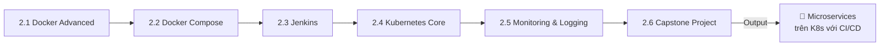
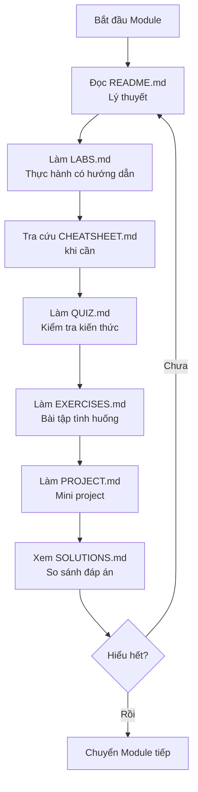

# 🔧 TRACK 2: ORCHESTRATION & AUTOMATION - Design Specification

---

## 📋 DOCUMENT INFORMATION (Thông tin tài liệu)

| Thuộc tính | Giá trị |
|------------|---------|
| **Track** | 2 - Orchestration & Automation |
| **Phiên bản** | 1.0 |
| **Ngày tạo** | 2025-12-28 |
| **Trạng thái** | 📝 THIẾT KẾ |

---

## 1. 🎯 PURPOSE AND OVERVIEW (Mục đích và Tổng quan)

### 1.1 Mục tiêu của Track

> **Mục tiêu cuối cùng:** Học viên có thể **triển khai microservices trên Kubernetes với CI/CD hoàn chỉnh**.

**Sau khi hoàn thành Track 2, học viên sẽ:**

- ✅ Sử dụng Docker nâng cao (multi-stage, healthcheck, security)
- ✅ Điều phối multi-container với Docker Compose
- ✅ Setup Jenkins pipeline
- ✅ Deploy applications lên Kubernetes
- ✅ Implement monitoring & logging (Prometheus, Grafana, EFK)
- ✅ **Hoàn thành Capstone Project: Microservices trên K8s với CI/CD**

### 1.2 Đối tượng

| Level | Mô tả |
|-------|-------|
| **Yêu cầu đầu vào** | Hoàn thành Track 1 hoặc có kiến thức tương đương |
| **Đầu ra** | Intermediate DevOps, sẵn sàng cho Track 3 |

### 1.3 Thời lượng ước tính

| Module | Thời gian | Tổng cộng |
|--------|-----------|-----------|
| 6 modules x ~10-15 giờ/module | 10-15 giờ | **60-90 giờ** (~2-3 tháng học part-time) |

---

## 2. 📁 MODULE STRUCTURE (Cấu trúc Modules)

### 2.1 Tổng quan 6 Modules



### 2.2 Chi tiết từng Module

---

## 📘 MODULE 2.1: DOCKER ADVANCED

### Thông tin chung

| Thuộc tính | Giá trị |
|------------|---------|
| **Tên đầy đủ** | Docker Advanced - Production-Ready Containers |
| **Thời lượng** | 10-12 giờ |
| **Độ khó** | Intermediate |
| **Yêu cầu trước** | Track 1 hoàn thành (đặc biệt 1.4 Docker Fundamentals) |

### Mục tiêu học tập

Sau khi hoàn thành module này, học viên sẽ:

- [ ] Viết Dockerfile tối ưu với multi-stage builds
- [ ] Implement healthchecks cho containers
- [ ] Áp dụng Docker security best practices
- [ ] Sử dụng Docker BuildKit và caching hiệu quả
- [ ] Hiểu về Docker image layers và optimization

### Nội dung chi tiết

| # | Chủ đề | Kiến thức cụ thể | Thời lượng |
|---|--------|------------------|------------|
| 1 | Multi-stage Builds | Reduce image size, separate build/runtime | 2 giờ |
| 2 | Healthchecks | HEALTHCHECK instruction, health states | 1.5 giờ |
| 3 | Security | Non-root user, secrets, image scanning | 2 giờ |
| 4 | BuildKit | DOCKER_BUILDKIT, cache mounts, SSH forwarding | 1.5 giờ |
| 5 | Image Optimization | Layer caching, .dockerignore, slim images | 2 giờ |
| 6 | Docker Registry | Private registry, push/pull, tagging strategies | 1.5 giờ |

### Nguồn tham khảo

| Nguồn | Đường dẫn | Sử dụng |
|-------|-----------|---------|
| DevOps-2 | `_NoiDungMau/DevOps-2/07_DOCKER/` | Nội dung chính (phần advanced) |
| BaiTap | `_BaiTap/Devops-Exercises/topics/containers/` | Exercises nâng cao |

---

## 📗 MODULE 2.2: DOCKER COMPOSE

### Thông tin chung

| Thuộc tính | Giá trị |
|------------|---------|
| **Tên đầy đủ** | Docker Compose - Multi-Container Applications |
| **Thời lượng** | 8-10 giờ |
| **Độ khó** | Intermediate |
| **Yêu cầu trước** | Module 2.1 hoàn thành |

### Mục tiêu học tập

Sau khi hoàn thành module này, học viên sẽ:

- [ ] Viết docker-compose.yml cho multi-service apps
- [ ] Quản lý networks và volumes trong Compose
- [ ] Sử dụng depends_on và healthcheck
- [ ] Scaling services với Docker Compose
- [ ] Environment management (dev, staging, prod)

### Nội dung chi tiết

| # | Chủ đề | Kiến thức cụ thể | Thời lượng |
|---|--------|------------------|------------|
| 1 | Compose Basics | docker-compose.yml, services, version | 1.5 giờ |
| 2 | Services | build, image, ports, environment | 2 giờ |
| 3 | Networks | Custom networks, service discovery | 1.5 giờ |
| 4 | Volumes | Named volumes, bind mounts, data sharing | 1.5 giờ |
| 5 | Dependencies | depends_on, healthcheck, startup order | 1.5 giờ |
| 6 | Scaling | docker-compose up --scale, load balancing | 1 giờ |
| 7 | Multi-environment | Override files, .env, profiles | 1 giờ |

### Nguồn tham khảo

| Nguồn | Đường dẫn | Sử dụng |
|-------|-----------|---------|
| DevOps-2 | `_NoiDungMau/DevOps-2/07_DOCKER/` | Docker Compose sections |
| DevOps-course | `_NoiDungMau/DevOps-course/02_BUILD/` | Compose examples |

---

## 📙 MODULE 2.3: JENKINS

### Thông tin chung

| Thuộc tính | Giá trị |
|------------|---------|
| **Tên đầy đủ** | Jenkins CI/CD - Pipeline as Code |
| **Thời lượng** | 12-15 giờ |
| **Độ khó** | Intermediate |
| **Yêu cầu trước** | Module 2.2 hoàn thành |

### Mục tiêu học tập

Sau khi hoàn thành module này, học viên sẽ:

- [ ] Cài đặt và cấu hình Jenkins
- [ ] Viết Jenkinsfile (Declarative Pipeline)
- [ ] Integrate Jenkins với Docker
- [ ] Implement multi-branch pipelines
- [ ] Sử dụng Jenkins credentials và secrets

### Nội dung chi tiết

| # | Chủ đề | Kiến thức cụ thể | Thời lượng |
|---|--------|------------------|------------|
| 1 | Jenkins Installation | Docker-based setup, initial configuration | 1.5 giờ |
| 2 | Jenkins UI | Jobs, builds, views, plugins | 1.5 giờ |
| 3 | Pipeline Basics | Jenkinsfile, stages, steps, post | 2 giờ |
| 4 | Declarative vs Scripted | Syntax differences, when to use | 1 giờ |
| 5 | Docker Integration | Docker agent, Docker pipeline plugin | 2 giờ |
| 6 | Multi-branch Pipeline | Branch detection, PR builds | 2 giờ |
| 7 | Credentials | Jenkins credentials, secrets management | 1.5 giờ |
| 8 | Shared Libraries | Reusable pipeline code | 1.5 giờ |
| 9 | Best Practices | Pipeline optimization, security | 1 giờ |

### Nguồn tham khảo

| Nguồn | Đường dẫn | Sử dụng |
|-------|-----------|---------|
| DevOps-2 | `_NoiDungMau/DevOps-2/08_CI/` | CI concepts |
| DevOps-1 | `_NoiDungMau/DevOps-1_TrainingRoadmap/Lesson02-scm-and-ci/07-gitlab-ci-pipeline/` | CI pipeline examples |

---

## 📕 MODULE 2.4: KUBERNETES CORE

### Thông tin chung

| Thuộc tính | Giá trị |
|------------|---------|
| **Tên đầy đủ** | Kubernetes Core - Container Orchestration |
| **Thời lượng** | 15-20 giờ |
| **Độ khó** | Intermediate-Advanced |
| **Yêu cầu trước** | Module 2.3 hoàn thành |

### Mục tiêu học tập

Sau khi hoàn thành module này, học viên sẽ:

- [ ] Hiểu Kubernetes architecture
- [ ] Sử dụng kubectl thành thạo
- [ ] Deploy applications với Pods, Deployments, Services
- [ ] Quản lý ConfigMaps và Secrets
- [ ] Hiểu về Namespaces và RBAC basics

### Nội dung chi tiết

| # | Chủ đề | Kiến thức cụ thể | Thời lượng |
|---|--------|------------------|------------|
| 1 | K8s Architecture | Control plane, worker nodes, etcd | 2 giờ |
| 2 | Minikube/Kind Setup | Local K8s cluster, kubectl config | 1.5 giờ |
| 3 | Pods | Pod spec, multi-container pods, lifecycle | 2 giờ |
| 4 | Deployments | Replicas, rolling updates, rollback | 2.5 giờ |
| 5 | Services | ClusterIP, NodePort, LoadBalancer | 2 giờ |
| 6 | ConfigMaps | External configuration, environment vars | 1.5 giờ |
| 7 | Secrets | Sensitive data, encoding, mounting | 1.5 giờ |
| 8 | Namespaces | Resource isolation, multi-tenancy | 1 giờ |
| 9 | Labels & Selectors | Organization, filtering, matching | 1 giờ |
| 10 | Ingress | External access, routing, TLS | 2 giờ |
| 11 | Helm Basics | Charts, releases, values | 2 giờ |

### Nguồn tham khảo

| Nguồn | Đường dẫn | Sử dụng |
|-------|-----------|---------|
| DevOps-2 | `_NoiDungMau/DevOps-2/09_KUBERNETES/` | **Nội dung chính** |
| DevOps-1 | `_NoiDungMau/DevOps-1_TrainingRoadmap/Lesson03-containerization-and-orchestration/09-kubernetes-basics/` | K8s basics |
| BaiTap | `_BaiTap/Devops-Exercises/topics/kubernetes/` | Exercises |

---

## 📓 MODULE 2.5: MONITORING & LOGGING

### Thông tin chung

| Thuộc tính | Giá trị |
|------------|---------|
| **Tên đầy đủ** | Monitoring & Logging - Observability Stack |
| **Thời lượng** | 12-15 giờ |
| **Độ khó** | Intermediate |
| **Yêu cầu trước** | Module 2.4 hoàn thành |

### Mục tiêu học tập

Sau khi hoàn thành module này, học viên sẽ:

- [ ] Hiểu observability: metrics, logs, traces
- [ ] Setup Prometheus để thu thập metrics
- [ ] Tạo dashboards với Grafana
- [ ] Implement centralized logging (EFK/Loki)
- [ ] Cấu hình alerting

### Nội dung chi tiết

| # | Chủ đề | Kiến thức cụ thể | Thời lượng |
|---|--------|------------------|------------|
| 1 | Observability 101 | Metrics, logs, traces, why matters | 1 giờ |
| 2 | Prometheus Setup | Installation, configuration, targets | 2 giờ |
| 3 | PromQL | Query language, aggregations, functions | 2 giờ |
| 4 | Grafana Setup | Installation, data sources, dashboards | 2 giờ |
| 5 | Dashboard Design | Panels, variables, best practices | 1.5 giờ |
| 6 | Alerting | Alertmanager, rules, notifications | 2 giờ |
| 7 | Logging Basics | Log levels, structured logging | 1 giờ |
| 8 | EFK/Loki Stack | Elasticsearch, Fluentd, Kibana / Loki, Promtail | 2.5 giờ |
| 9 | K8s Monitoring | kube-state-metrics, node-exporter | 1.5 giờ |

### Nguồn tham khảo

| Nguồn | Đường dẫn | Sử dụng |
|-------|-----------|---------|
| DevOps-2 | `_NoiDungMau/DevOps-2/14_OBSERVABILITY/` | **Nội dung chính** |
| DevOps-1 | `_NoiDungMau/DevOps-1_TrainingRoadmap/Lesson05-monitoring-logging-alerting/` | Prometheus, EFK |
| DevOps-3 | `_NoiDungMau/DevOps-3/FOUNDATION/09_MONITORING_BASICS/` | Basics (8 files) |

---

## 🏆 MODULE 2.6: CAPSTONE PROJECT

### Thông tin chung

| Thuộc tính | Giá trị |
|------------|---------|
| **Tên đầy đủ** | Capstone Project: Microservices on Kubernetes with CI/CD |
| **Thời lượng** | 15-20 giờ |
| **Độ khó** | Advanced (tổng hợp) |
| **Yêu cầu trước** | Module 2.1 - 2.5 hoàn thành |

### Mục tiêu

Xây dựng **microservices application** với:

- 2-3 services (Frontend, Backend API, Database)
- Dockerized với multi-stage builds
- Deployed trên Kubernetes (Minikube/Kind)
- CI/CD với Jenkins
- Monitoring với Prometheus + Grafana

### Yêu cầu dự án

```
📁 microservices-app/
├── frontend/
│   ├── src/
│   ├── Dockerfile
│   └── k8s/
│       ├── deployment.yaml
│       └── service.yaml
├── backend/
│   ├── src/
│   ├── Dockerfile
│   └── k8s/
│       ├── deployment.yaml
│       ├── service.yaml
│       ├── configmap.yaml
│       └── secret.yaml
├── monitoring/
│   ├── prometheus/
│   └── grafana/
├── docker-compose.yml          # Local development
├── Jenkinsfile                 # CI/CD pipeline
└── README.md
```

### Tiêu chí đánh giá

| # | Tiêu chí | Điểm |
|---|----------|------|
| 1 | Microservices architecture đúng | 15% |
| 2 | Dockerfiles optimized (multi-stage, healthcheck) | 15% |
| 3 | Kubernetes manifests (Deployment, Service, ConfigMap, Secret) | 20% |
| 4 | Jenkins pipeline hoạt động | 20% |
| 5 | Prometheus + Grafana dashboard | 15% |
| 6 | Documentation & README | 10% |
| 7 | Clean code & best practices | 5% |

---

## 3. 📁 DIRECTORY STRUCTURE (Cấu trúc thư mục)

```
Track2_Orchestration_Automation/
│
├── 2.1_Docker_Advanced/
│   ├── images/
│   ├── README.md           # Giáo trình lý thuyết
│   ├── CHEATSHEET.md       # Tra cứu nhanh
│   ├── LABS.md             # 3-5 labs thực hành
│   ├── QUIZ.md             # 15-20 câu hỏi
│   ├── EXERCISES.md        # 5-10 bài tập tình huống
│   ├── PROJECT.md          # Mini project
│   └── SOLUTIONS.md        # Đáp án
│
├── 2.2_Docker_Compose/
│   ├── (cấu trúc tương tự)
│
├── 2.3_Jenkins/
│   ├── (cấu trúc tương tự)
│
├── 2.4_Kubernetes_Core/
│   ├── (cấu trúc tương tự)
│
├── 2.5_Monitoring_Logging/
│   ├── (cấu trúc tương tự)
│
└── 2.6_Capstone_Project/
    ├── images/
    ├── README.md           # Mô tả dự án + yêu cầu
    ├── STARTER_CODE/       # Boilerplate code
    └── SOLUTIONS.md        # Solution mẫu
```

---

## 4. 📋 7 STANDARD FILES PER MODULE (7 file chuẩn mỗi module)

Theo quy tắc từ `MASTER_BLUEPRINT.md`:

| File | Mục đích | Độ dài ước tính |
|------|----------|-----------------|
| `README.md` | Giáo trình lý thuyết, diagrams, best practices | 500-1500 dòng |
| `CHEATSHEET.md` | Tra cứu nhanh lệnh, snippets | 100-300 dòng |
| `LABS.md` | 3-5 bài thực hành có hướng dẫn từng bước | 300-800 dòng |
| `QUIZ.md` | 15-20 câu hỏi trắc nghiệm | 200-400 dòng |
| `EXERCISES.md` | 5-10 bài tập tình huống tự làm | 150-300 dòng |
| `PROJECT.md` | Mini project tổng hợp | 100-200 dòng |
| `SOLUTIONS.md` | Đáp án cho Quiz, Exercises, Project | 300-600 dòng |

---

## 5. 🔗 PREREQUISITES CHECK (Kiểm tra yêu cầu)

Khi bắt đầu Track 2, học viên cần verify:

```bash
# Verify Track 1 completion
./Setup_Environment/scripts/verify_track1.sh

# Install Track 2 tools
./Setup_Environment/scripts/setup_track2.sh

# Verify Track 2 ready
./Setup_Environment/scripts/verify_track2.sh
```

**Tools cần cho Track 2:**

- kubectl
- Minikube hoặc Kind
- Helm
- (Jenkins sẽ chạy qua Docker)

## 6. 🔄 WORKFLOW (Quy trình học)



---

## 7. 📌 NAVIGATION LINKS (Đường dẫn điều hướng)

### 7.1 Từ Track README về các Modules

```markdown
## Track 2 - Orchestration & Automation

| # | Module | Mô tả | Thời lượng |
|---|--------|-------|------------|
| 2.1 | [Docker Advanced](./2.1_Docker_Advanced/README.md) | Production-ready containers | 10-12h |
| 2.2 | [Docker Compose](./2.2_Docker_Compose/README.md) | Multi-container apps | 8-10h |
| ... | ... | ... | ... |
```

### 7.2 Navigation Footer mỗi Module

```markdown
---

[⬅️ Track 1](../Track1_Foundation_StaticWeb/README.md) | [📚 Track 2](./README.md) | [2.2 Docker Compose ➡️](../2.2_Docker_Compose/README.md)
```

---

## 8. 📊 IMPLEMENTATION CHECKLIST (Checklist triển khai)

### 8.1 Thư mục

- [ ] Tạo `Track2_Orchestration_Automation/`
- [ ] Tạo 6 thư mục modules (2.1 - 2.6)
- [ ] Tạo thư mục `images/` trong mỗi module

### 8.2 Files mỗi Module (6 modules x 7 files = 42 files)

**Module 2.1 - 2.5:** 7 files mỗi module
**Module 2.6 Capstone:** README.md, STARTER_CODE/, SOLUTIONS.md

---

## 9. 📚 REFERENCES (Nguồn tham khảo)

| Module | Nguồn chính | Nguồn phụ |
|--------|-------------|-----------|
| 2.1 Docker Adv | `DevOps-2/07_DOCKER/` (advanced) | Exercises |
| 2.2 Compose | `DevOps-2/07_DOCKER/` | `DevOps-course/02_BUILD/` |
| 2.3 Jenkins | `DevOps-2/08_CI/` | `DevOps-1/Lesson02-scm-and-ci/` |
| 2.4 K8s | `DevOps-2/09_KUBERNETES/` | `DevOps-1/Lesson03/09-kubernetes/` |
| 2.5 Monitoring | `DevOps-2/14_OBSERVABILITY/` | `DevOps-1/Lesson05/`, `DevOps-3/09_MONITORING/` |
| 2.6 Capstone | Tự thiết kế | Tham khảo tất cả |

---

## 10. ⚠️ NOTES (Lưu ý)

> **Quan trọng:** Track 2 yêu cầu máy tính có cấu hình đủ mạnh để chạy Kubernetes.

**Khuyến nghị:**

1. RAM tối thiểu 8GB (khuyến nghị 16GB) cho Minikube/Kind
2. Cần có Docker Desktop running trước khi start K8s cluster
3. Jenkins có thể tốn RAM - đóng các ứng dụng không cần thiết
4. Lưu ý quota khi push images lên Docker Hub

---

*Cập nhật: 2025-12-28 | Trạng thái: CHỜ DUYỆT*

