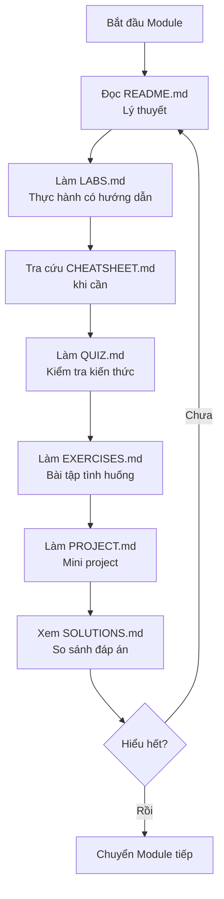

# ☁️ TRACK 3: CLOUD, NETWORK & SYSTEM DESIGN - Design Specification

---

## 📋 DOCUMENT INFORMATION (Thông tin tài liệu)

| Thuộc tính | Giá trị |
|------------|---------|
| **Track** | 3 - Cloud, Network & System Design |
| **Phiên bản** | 1.0 |
| **Ngày tạo** | 2025-12-28 |
| **Trạng thái** | 📝 THIẾT KẾ |

---

## 1. 🎯 PURPOSE AND OVERVIEW (Mục đích và Tổng quan)

### 1.1 Mục tiêu của Track

> **Mục tiêu cuối cùng:** Học viên có thể **xây dựng môi trường cloud-native với Terraform và hiểu thiết kế hệ thống**.

**Sau khi hoàn thành Track 3, học viên sẽ:**

- ✅ Hiểu sâu về networking nâng cao (VPC, subnets, security groups)
- ✅ Sử dụng AWS core services (EC2, S3, RDS, ELB)
- ✅ Quản lý CSDL với "Databases for DevOps"
- ✅ Cấu hình máy chủ với "Configuration Management (Ansible)"
- ✅ Viết Terraform code để provision infrastructure
- ✅ Hiểu về system design và reliability engineering
- ✅ **Hoàn thành Capstone Project: Cloud-native environment với Terraform**

### 1.2 Đối tượng

| Level | Mô tả |
|-------|-------|
| **Yêu cầu đầu vào** | Hoàn thành Track 2 hoặc có kiến thức tương đương |
| **Đầu ra** | Intermediate-Advanced DevOps, sẵn sàng cho Track 4 |

### 1.3 Thời lượng ước tính

| Module | Thời gian | Tổng cộng |
|--------|-----------|-----------|
| 7 modules x ~12-18 giờ/module | 12-18 giờ | **84-126 giờ** (~3-4 tháng học part-time) |

---

## 2. 📁 MODULE STRUCTURE (Cấu trúc Modules)

### 2.1 Tổng quan 7 Modules

```mermaid
graph LR
    M1[3.1 Network Advanced] --> M2[3.2 AWS Core Services]
    M2 --> M3[3.3 Databases for DevOps]
    M3 --> M4[3.4 Config Management (Ansible)]
    M4 --> M5[3.5 Terraform IaC]
    M5 --> M6[3.6 System Design & Reliability]
    M6 --> M7[3.7 Capstone Project]
    
    M7 --> |Output| W[☁️ Cloud-native<br/>với Terraform & Ansible]
```

### 2.2 Chi tiết từng Module

---

## 📘 MODULE 3.1: NETWORK ADVANCED

### Thông tin chung

| Thuộc tính | Giá trị |
|------------|---------|
| **Tên đầy đủ** | Advanced Networking - Cloud Network Architecture |
| **Thời lượng** | 12-15 giờ |
| **Độ khó** | Intermediate-Advanced |
| **Yêu cầu trước** | Track 2 hoàn thành (đặc biệt 1.2 Network Basics) |

### Mục tiêu học tập

Sau khi hoàn thành module này, học viên sẽ:

- [ ] Thiết kế VPC architecture
- [ ] Cấu hình subnets (public/private)
- [ ] Hiểu về routing tables và NAT Gateway
- [ ] Cấu hình security groups và NACLs
- [ ] Hiểu VPN và peering concepts

### Nội dung chi tiết

| # | Chủ đề | Kiến thức cụ thể | Thời lượng |
|---|--------|------------------|------------|
| 1 | VPC Fundamentals | VPC creation, CIDR planning | 2 giờ |
| 2 | Subnets | Public vs private, availability zones | 2 giờ |
| 3 | Routing | Route tables, internet gateway, NAT gateway | 2.5 giờ |
| 4 | Security Groups | Inbound/outbound rules, stateful | 2 giờ |
| 5 | NACLs | Network ACLs, stateless, subnet level | 1.5 giờ |
| 6 | VPC Peering | Cross-VPC connectivity | 1 giờ |
| 7 | VPN Basics | Site-to-site VPN, client VPN concepts | 1.5 giờ |

### Nguồn tham khảo

| Nguồn | Đường dẫn | Sử dụng |
|-------|-----------|---------|
| DevOps-2 | `_NoiDungMau/DevOps-2/02_NETWORKING/` | **14 files chi tiết** |
| | `05_AVAILABILITY.md` | HA concepts |
| | `10_ARCHITECTURE.md` | Network architecture |
| BaiTap | `_BaiTap/Devops-Exercises/topics/aws/` | AWS VPC exercises |

---

## 📗 MODULE 3.2: AWS CORE SERVICES

### Thông tin chung

| Thuộc tính | Giá trị |
|------------|---------|
| **Tên đầy đủ** | AWS Core Services - Essential Cloud Services |
| **Thời lượng** | 15-18 giờ |
| **Độ khó** | Intermediate |
| **Yêu cầu trước** | Module 3.1 hoàn thành |

### Mục tiêu học tập

Sau khi hoàn thành module này, học viên sẽ:

- [ ] Quản lý IAM users, roles, policies
- [ ] Launch và manage EC2 instances
- [ ] Sử dụng S3 cho object storage
- [ ] Setup RDS databases
- [ ] Configure Elastic Load Balancing

### Nội dung chi tiết

| # | Chủ đề | Kiến thức cụ thể | Thời lượng |
|---|--------|------------------|------------|
| 1 | IAM | Users, groups, roles, policies, MFA | 3 giờ |
| 2 | EC2 Basics | Instance types, AMIs, key pairs | 2.5 giờ |
| 3 | EC2 Advanced | User data, instance metadata, placement groups | 2 giờ |
| 4 | S3 | Buckets, objects, versioning, lifecycle | 2.5 giờ |
| 5 | S3 Security | Bucket policies, ACLs, encryption | 1.5 giờ |
| 6 | RDS | MySQL/PostgreSQL setup, backups, read replicas | 2.5 giờ |
| 7 | ELB | ALB, NLB, target groups, health checks | 2 giờ |
| 8 | CloudWatch | Metrics, logs, alarms basics | 1.5 giờ |

### Nguồn tham khảo

| Nguồn | Đường dẫn | Sử dụng |
|-------|-----------|---------|
| DevOps-2 | `_NoiDungMau/DevOps-2/11_CLOUD/` | **Nội dung chính** |
| DevOps-1 | `_NoiDungMau/DevOps-1_TrainingRoadmap/Lesson06-cloud-platforms/14-aws-core-services/` | AWS lessons |
| BaiTap | `_BaiTap/Devops-Exercises/topics/aws/` | Exercises |

---

## 📙 MODULE 3.3: DATABASES FOR DEVOPS

### Thông tin chung

| Thuộc tính | Giá trị |
|------------|---------|
| **Tên đầy đủ** | Database Management for DevOps |
| **Thời lượng** | 12-15 giờ |
| **Độ khó** | Intermediate |
| **Yêu cầu trước** | Module 3.2 hoàn thành |

### Mục tiêu học tập

Sau khi hoàn thành module này, học viên sẽ:

- [ ] Hiểu vai trò của database trong kiến trúc hiện đại
- [ ] Phân biệt SQL và NoSQL từ góc độ vận hành
- [ ] Implement chiến lược backup và restore
- [ ] Hiểu về database migrations và schema management
- [ ] Giám sát (monitor) performance cơ bản của database

### Nội dung chi tiết

| # | Chủ đề | Kiến thức cụ thể | Thời lượng |
|---|--------|------------------|------------|
| 1 | Database Landscape | SQL vs NoSQL, CAP Theorem | 2 giờ |
| 2 | SQL Databases | MySQL/PostgreSQL, connection pooling, indexing | 2.5 giờ |
| 3 | NoSQL Databases | Redis (caching), MongoDB (document), Prometheus (time-series) | 2.5 giờ |
| 4 | Backup & Restore | Strategies (full, incremental), RTO/RPO | 2 giờ |
| 5 | Database Migrations | Schema evolution, tools (Flyway, Liquibase) | 2 giờ |
| 6 | Monitoring | Key metrics (latency, QPS), alerting | 2 giờ |

### Nguồn tham khảo

| Nguồn | Đường dẫn | Sử dụng |
|-------|-----------|---------|
| DevOps-2 | `_NoiDungMau/DevOps-2/06_DATABASES/` | **Nội dung chính** |
| DevOps-2 | `_NoiDungMau/DevOps-2/15_SRE/` | Database reliability |

---

## 📕 MODULE 3.4: CONFIGURATION MANAGEMENT (ANSIBLE)

### Thông tin chung

| Thuộc tính | Giá trị |
|------------|---------|
| **Tên đầy đủ** | Configuration Management with Ansible |
| **Thời lượng** | 12-15 giờ |
| **Độ khó** | Intermediate |
| **Yêu cầu trước** | Module 3.3 hoàn thành |

### Mục tiêu học tập

Sau khi hoàn thành module này, học viên sẽ:

- [ ] Hiểu về Configuration Management và "desired state"
- [ ] Viết Ansible playbooks
- [ ] Sử dụng variables, templates, and roles
- [ ] Quản lý secrets với Ansible Vault
- [ ] Tích hợp Ansible với Terraform

### Nội dung chi tiết

| # | Chủ đề | Kiến thức cụ thể | Thời lượng |
|---|--------|------------------|------------|
| 1 | Config Mgmt Intro | Desired state, idempotency, Ansible vs others | 1.5 giờ |
| 2 | Ansible Basics | Inventory, modules, ad-hoc commands | 2 giờ |
| 3 | Playbooks | Plays, tasks, handlers, running playbooks | 2.5 giờ |
| 4 | Variables & Templates | Jinja2 templates, register, facts | 2.5 giờ |
| 5 | Roles | Structuring playbooks, Ansible Galaxy | 2 giờ |
| 6 | Ansible Vault | Encrypting sensitive data | 1.5 giờ |
| 7 | Dynamic Inventory | Integrating with cloud providers (AWS) | 2 giờ |

### Nguồn tham khảo

| Nguồn | Đường dẫn | Sử dụng |
|-------|-----------|---------|
| DevOps-1 | `_BaiTap/DevOps-1_Exercises/Exercises04-cm-and-iac/10-ansible-config-management/` | **Nội dung chính & Labs** |
| BaiTap | `_BaiTap/Devops-Exercises/topics/ansible/` | Exercises |

---

## 📒 MODULE 3.5: TERRAFORM IaC

### Thông tin chung

| Thuộc tính | Giá trị |
|------------|---------|
| **Tên đầy đủ** | Terraform - Infrastructure as Code |
| **Thời lượng** | 15-18 giờ |
| **Độ khó** | Intermediate-Advanced |
| **Yêu cầu trước** | Module 3.4 hoàn thành |

### Mục tiêu học tập

Sau khi hoàn thành module này, học viên sẽ:

- [ ] Viết Terraform configuration files
- [ ] Quản lý Terraform state
- [ ] Sử dụng modules và workspaces
- [ ] Implement best practices cho IaC
- [ ] Integrate Terraform với CI/CD

### Nội dung chi tiết

| # | Chủ đề | Kiến thức cụ thể | Thời lượng |
|---|--------|------------------|------------|
| 1 | IaC Concepts | Why IaC, Terraform vs others | 1 giờ |
| 2 | Terraform Basics | Providers, resources, terraform init/plan/apply | 2.5 giờ |
| 3 | HCL Syntax | Variables, locals, outputs, expressions | 2 giờ |
| 4 | State Management | Local state, remote state, state locking | 2.5 giờ |
| 5 | Modules | Creating modules, module registry, composition | 2.5 giờ |
| 6 | Workspaces | Environment separation, workspace commands | 1.5 giờ |
| 7 | Data Sources | Reading existing resources | 1 giờ |
| 8 | Terraform CI/CD | Atlantis, Terraform Cloud, GitHub Actions | 2 giờ |
| 9 | Best Practices | Code organization, naming, documentation | 1.5 giờ |

### Nguồn tham khảo

| Nguồn | Đường dẫn | Sử dụng |
|-------|-----------|---------|
| DevOps-2 | `_NoiDungMau/DevOps-2/12_IAC/` | **Nội dung chính** |
| DevOps-1 | `_NoiDungMau/DevOps-1_TrainingRoadmap/Lesson04-cm-and-iac/11-terraform-iac/` | Terraform lessons |
| BaiTap | `_BaiTap/Devops-Exercises/topics/terraform/` | Exercises |

---

## 📓 MODULE 3.6: SYSTEM DESIGN & RELIABILITY

### Thông tin chung

| Thuộc tính | Giá trị |
|------------|---------|
| **Tên đầy đủ** | System Design & Reliability Engineering |
| **Thời lượng** | 12-15 giờ |
| **Độ khó** | Advanced |
| **Yêu cầu trước** | Module 3.5 hoàn thành |

### Mục tiêu học tập

Sau khi hoàn thành module này, học viên sẽ:

- [ ] Hiểu SLA, SLO, SLI concepts
- [ ] Thiết kế High Availability architectures
- [ ] Implement auto-scaling strategies
- [ ] Lập kế hoạch Disaster Recovery
- [ ] Hiểu về fault tolerance và resilience

### Nội dung chi tiết

| # | Chủ đề | Kiến thức cụ thể | Thời lượng |
|---|--------|------------------|------------|
| 1 | Reliability Concepts | SLA, SLO, SLI, error budgets | 2 giờ |
| 2 | High Availability | Multi-AZ, multi-region, failover | 2.5 giờ |
| 3 | Scalability | Vertical vs horizontal, auto-scaling | 2 giờ |
| 4 | Load Balancing Patterns | Round robin, least connections, sticky sessions | 1.5 giờ |
| 5 | Caching Strategies | CDN, Redis/Memcached, cache invalidation | 1.5 giờ |
| 6 | Database Scaling | Read replicas, sharding, connection pooling | 2 giờ |
| 7 | Disaster Recovery | RTO, RPO, backup strategies, DR plans | 2 giờ |
| 8 | Chaos Engineering | Concepts, tools (Chaos Monkey intro) | 1 giờ |

### Nguồn tham khảo

| Nguồn | Đường dẫn | Sử dụng |
|-------|-----------|---------|
| DevOps-2 | `_NoiDungMau/DevOps-2/15_SRE/` | **Nội dung chính** |
| DevOps-2 | `_NoiDungMau/DevOps-2/02_NETWORKING/05_AVAILABILITY.md` | HA concepts |
| DevOps-2 | `_NoiDungMau/DevOps-2/02_NETWORKING/04_CACHING_CDN.md` | Caching |

---

## 🏆 MODULE 3.7: CAPSTONE PROJECT

### Thông tin chung

| Thuộc tính | Giá trị |
|------------|---------|
| **Tên đầy đủ** | Capstone Project: Cloud-Native Infrastructure with Terraform |
| **Thời lượng** | 15-20 giờ |
| **Độ khó** | Advanced (tổng hợp) |
| **Yêu cầu trước** | Module 3.1 - 3.6 hoàn thành |

### Mục tiêu

Xây dựng **cloud infrastructure** với:

- VPC with public/private subnets
- EC2 instances (web servers) trong ASG
- RDS database (private subnet)
- S3 for static assets
- ALB for load balancing
- All provisioned with Terraform

### Yêu cầu dự án

```
📁 cloud-infra/
├── terraform/
│   ├── main.tf
│   ├── variables.tf
│   ├── outputs.tf
│   ├── providers.tf
│   ├── modules/
│   │   ├── vpc/
│   │   ├── ec2/
│   │   ├── rds/
│   │   ├── s3/
│   │   └── alb/
│   └── environments/
│       ├── dev/
│       └── prod/
├── scripts/
│   └── user_data.sh
├── docs/
│   ├── architecture.md
│   └── runbook.md
└── README.md
```

### Tiêu chí đánh giá

| # | Tiêu chí | Điểm |
|---|----------|------|
| 1 | VPC architecture đúng (public/private subnets) | 15% |
| 2 | EC2 với Auto Scaling Group | 15% |
| 3 | RDS trong private subnet | 15% |
| 4 | ALB configuration | 10% |
| 5 | Terraform modules tổ chức tốt | 20% |
| 6 | Multi-environment (dev/prod) | 10% |
| 7 | Documentation (architecture diagram, runbook) | 15% |

---

## 3. 📁 DIRECTORY STRUCTURE (Cấu trúc thư mục)

```
Track3_Cloud_Network_Design/
│
├── 3.1_Network_Advanced/
│   ├── images/
│   ├── README.md           # Giáo trình lý thuyết
│   ├── CHEATSHEET.md       # Tra cứu nhanh
│   ├── LABS.md             # 3-5 labs thực hành
│   ├── QUIZ.md             # 15-20 câu hỏi
│   ├── EXERCISES.md        # 5-10 bài tập tình huống
│   ├── PROJECT.md          # Mini project
│   └── SOLUTIONS.md        # Đáp án
|
├── 3.2_AWS_Core_Services/
│   ├── (cấu trúc 7 files)
│
├── 3.3_Databases_for_DevOps/
│   ├── (cấu trúc 7 files)
│
├── 3.4_Config_Management_Ansible/
│   ├── (cấu trúc 7 files)
│
├── 3.5_Terraform_IaC/
│   ├── (cấu trúc 7 files)
│
├── 3.6_System_Design_Reliability/
│   ├── (cấu trúc 7 files)
│
└── 3.7_Capstone_Project/
    ├── images/
    ├── README.md
    ├── STARTER_CODE/
    └── SOLUTIONS.md
```

---

## 4. 📋 7 STANDARD FILES PER MODULE (7 file chuẩn mỗi module)

Theo quy tắc từ `MASTER_BLUEPRINT.md`:

| File | Mục đích | Độ dài ước tính |
|------|----------|-----------------|
| `README.md` | Giáo trình lý thuyết, diagrams, best practices | 500-1500 dòng |
| `CHEATSHEET.md` | Tra cứu nhanh lệnh, snippets | 100-300 dòng |
| `LABS.md` | 3-5 bài thực hành có hướng dẫn từng bước | 300-800 dòng |
| `QUIZ.md` | 15-20 câu hỏi trắc nghiệm | 200-400 dòng |
| `EXERCISES.md` | 5-10 bài tập tình huống tự làm | 150-300 dòng |
| `PROJECT.md` | Mini project tổng hợp | 100-200 dòng |
| `SOLUTIONS.md` | Đáp án cho Quiz, Exercises, Project | 300-600 dòng |

---

## 5. 🔗 PREREQUISITES CHECK (Kiểm tra yêu cầu)

Khi bắt đầu Track 3, học viên cần verify:

```bash
# Verify Track 2 completion
./Setup_Environment/scripts/verify_track2.sh

# Install Track 3 tools
./Setup_Environment/scripts/setup_track3.sh

# Verify Track 3 ready
./Setup_Environment/scripts/verify_track3.sh
```

**Tools cần cho Track 3:**

- Terraform CLI
- Ansible
- AWS CLI (configured với credentials)
- AWS Account (Free Tier recommended)

## 6. 🔄 WORKFLOW (Quy trình học)



---

## 7. 📌 NAVIGATION LINKS (Đường dẫn điều hướng)

### 7.1 Từ Track README về các Modules

```markdown
## Track 3 - Cloud, Network & System Design

| # | Module | Mô tả | Thời lượng |
|---|--------|-------|------------|
| 3.1 | [Network Advanced](./3.1_Network_Advanced/README.md) | Cloud network architecture | 12-15h |
| 3.2 | [AWS Core Services](./3.2_AWS_Core_Services/README.md) | Essential AWS | 15-18h |
| 3.3 | [Databases for DevOps](./3.3_Databases_for_DevOps/README.md) | Database Management | 12-15h |
| 3.4 | [Config Management (Ansible)](./3.4_Config_Management_Ansible/README.md) | Desired State with Ansible | 12-15h |
| 3.5 | [Terraform IaC](./3.5_Terraform_IaC/README.md) | Infrastructure as Code | 15-18h |
| 3.6 | [System Design & Reliability](./3.6_System_Design_Reliability/README.md) | SRE Concepts | 12-15h |
| 3.7 | [Capstone Project](./3.7_Capstone_Project/README.md) | Final Project | 15-20h |
```

### 7.2 Navigation Footer mỗi Module

```markdown
---

[⬅️ Track 2](../Track2_Orchestration_Automation/README.md) | [📚 Track 3](./README.md) | [3.2 AWS Core Services ➡️](../3.2_AWS_Core_Services/README.md)
```

---

## 8. 📊 IMPLEMENTATION CHECKLIST (Checklist triển khai)

### 8.1 Thư mục

- [ ] Tạo `Track3_Cloud_Network_Design/`
- [ ] Tạo 7 thư mục modules (3.1 - 3.7)
- [ ] Tạo thư mục `images/` trong mỗi module

### 8.2 Files mỗi Module (7 modules)

**Module 3.1 - 3.6:** 7 files mỗi module
**Module 3.7 Capstone:** README.md, STARTER_CODE/, SOLUTIONS.md

---

## 9. 📚 REFERENCES (Nguồn tham khảo)

| Module | Nguồn chính | Nguồn phụ |
|--------|-------------|-----------|
| 3.1 Network Adv | `DevOps-2/02_NETWORKING/` | `05_AVAILABILITY.md`, `10_ARCHITECTURE.md` |
| 3.2 AWS | `DevOps-2/11_CLOUD/` | `DevOps-1/Lesson06/14-aws/` |
| 3.3 Databases | `DevOps-2/06_DATABASES/` | SRE concepts |
| 3.4 Ansible | `DevOps-1/Exercises04/10-ansible/` | `BaiTap/topics/ansible/` |
| 3.5 Terraform | `DevOps-2/12_IAC/` | `DevOps-1/Lesson04/11-terraform/` |
| 3.6 System Design | `DevOps-2/15_SRE/` | `02_NETWORKING/` (HA, caching) |
| 3.7 Capstone | Tự thiết kế | Tham khảo tất cả |

---

## 10. ⚠️ AWS COST NOTES (Lưu ý chi phí AWS)

> **CẢNH BÁO:** Track này sử dụng AWS services có thể phát sinh chi phí.

**Khuyến nghị:**

1. Sử dụng AWS Free Tier account
2. Set billing alerts
3. Terminate resources sau mỗi lab
4. Sử dụng `terraform destroy` sau khi hoàn thành

---

*Cập nhật: 2025-12-28 | Trạng thái: CHỜ DUYỆT*
