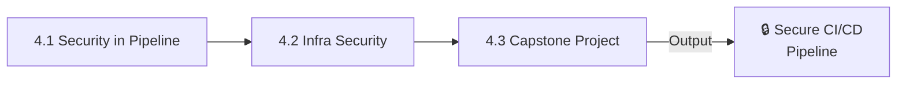
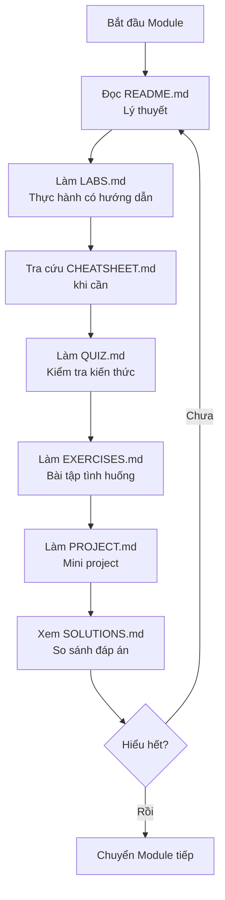

# 🔒 TRACK 4: DEVSECOPS - Design Specification

---

## 📋 DOCUMENT INFORMATION (Thông tin tài liệu)

| Thuộc tính | Giá trị |
|------------|---------|
| **Track** | 4 - DevSecOps |
| **Phiên bản** | 1.0 |
| **Ngày tạo** | 2025-12-28 |
| **Trạng thái** | 📝 THIẾT KẾ |

---

## 1. 🎯 PURPOSE AND OVERVIEW (Mục đích và Tổng quan)

### 1.1 Mục tiêu của Track

> **Mục tiêu cuối cùng:** Học viên có thể **xây dựng pipeline CI/CD an toàn và hạ tầng bảo mật**.

**Sau khi hoàn thành Track 4, học viên sẽ:**

- ✅ Implement security trong CI/CD pipeline (Shift-Left Security)
- ✅ Scan container images cho vulnerabilities
- ✅ Thực hiện SAST/DAST scanning
- ✅ Quản lý secrets an toàn
- ✅ Harden Linux và infrastructure
- ✅ **Hoàn thành Capstone Project: Secure CI/CD Pipeline**

### 1.2 Đối tượng

| Level | Mô tả |
|-------|-------|
| **Yêu cầu đầu vào** | Hoàn thành Track 3 hoặc có kiến thức tương đương |
| **Đầu ra** | Advanced DevOps với security mindset, sẵn sàng cho Track 5 |

### 1.3 Thời lượng ước tính

| Module | Thời gian | Tổng cộng |
|--------|-----------|-----------|
| 3 modules x ~15-20 giờ/module | 15-20 giờ | **45-60 giờ** (~1.5-2 tháng học part-time) |

---

## 2. 📁 MODULE STRUCTURE (Cấu trúc Modules)

### 2.1 Tổng quan 3 Modules



### 2.2 Chi tiết từng Module

---

## 📘 MODULE 4.1: SECURITY IN PIPELINE

### Thông tin chung

| Thuộc tính | Giá trị |
|------------|---------|
| **Tên đầy đủ** | Security in CI/CD Pipeline - Shift-Left Security |
| **Thời lượng** | 15-18 giờ |
| **Độ khó** | Advanced |
| **Yêu cầu trước** | Track 3 hoàn thành |

### Mục tiêu học tập

Sau khi hoàn thành module này, học viên sẽ:

- [ ] Hiểu Shift-Left Security concept
- [ ] Implement container image scanning (Trivy)
- [ ] Thực hiện SAST với SonarQube
- [ ] Thực hiện DAST với OWASP ZAP
- [ ] Quản lý secrets với Vault hoặc AWS Secrets Manager
- [ ] Lint Dockerfiles và IaC code

### Nội dung chi tiết

| # | Chủ đề | Kiến thức cụ thể | Thời lượng |
|---|--------|------------------|------------|
| 1 | DevSecOps Intro | Shift-Left, security as code, culture | 1.5 giờ |
| 2 | Container Scanning | Trivy, Clair, image vulnerabilities | 2.5 giờ |
| 3 | Dockerfile Security | Hadolint, best practices, non-root | 2 giờ |
| 4 | SAST | SonarQube, static code analysis | 2.5 giờ |
| 5 | DAST | OWASP ZAP, dynamic application testing | 2.5 giờ |
| 6 | Dependency Scanning | npm audit, pip safety, Dependabot | 2 giờ |
| 7 | Secrets Management | HashiCorp Vault, AWS Secrets Manager, GitLeaks | 2.5 giờ |
| 8 | IaC Security | Checkov, tfsec, Terraform security | 2 giờ |

### Nguồn tham khảo

| Nguồn | Đường dẫn | Sử dụng |
|-------|-----------|---------|
| DevOps-2 | `_NoiDungMau/DevOps-2/13_SECURITY/` | **Nội dung chính** |
| DevOps-2 | `_NoiDungMau/DevOps-2/02_NETWORKING/06_SECURITY.md` | Network security |

---

## 📗 MODULE 4.2: INFRA SECURITY

### Thông tin chung

| Thuộc tính | Giá trị |
|------------|---------|
| **Tên đầy đủ** | Infrastructure Security - Hardening & Compliance |
| **Thời lượng** | 15-18 giờ |
| **Độ khó** | Advanced |
| **Yêu cầu trước** | Module 4.1 hoàn thành |

### Mục tiêu học tập

Sau khi hoàn thành module này, học viên sẽ:

- [ ] Harden Linux servers
- [ ] Cấu hình Kubernetes network policies
- [ ] Implement audit logging
- [ ] Hiểu compliance basics (SOC2, PCI-DSS, HIPAA)
- [ ] Thực hiện vulnerability management

### Nội dung chi tiết

| # | Chủ đề | Kiến thức cụ thể | Thời lượng |
|---|--------|------------------|------------|
| 1 | Linux Hardening | SSH config, firewall, user management, auditd | 3 giờ |
| 2 | Container Hardening | Seccomp, AppArmor, Pod Security Standards | 2.5 giờ |
| 3 | K8s Network Policies | Ingress/egress rules, namespace isolation | 2.5 giờ |
| 4 | K8s RBAC | Roles, RoleBindings, service accounts | 2.5 giờ |
| 5 | Audit Logging | Linux audit, K8s audit, centralized logging | 2 giờ |
| 6 | Compliance Intro | SOC2, PCI-DSS, HIPAA basics | 1.5 giờ |
| 7 | Vulnerability Management | Scanning schedule, patching, reporting | 2 giờ |
| 8 | Incident Response | Playbooks, communication, post-mortems | 1.5 giờ |

### Nguồn tham khảo

| Nguồn | Đường dẫn | Sử dụng |
|-------|-----------|---------|
| DevOps-2 | `_NoiDungMau/DevOps-2/13_SECURITY/` | **Nội dung chính** |
| DevOps-2 | `_NoiDungMau/DevOps-2/13_SECURITY/LABS.md` | Hardening labs |

---

## 🏆 MODULE 4.3: CAPSTONE PROJECT

### Thông tin chung

| Thuộc tính | Giá trị |
|------------|---------|
| **Tên đầy đủ** | Capstone Project: Secure CI/CD Pipeline |
| **Thời lượng** | 15-20 giờ |
| **Độ khó** | Advanced (tổng hợp) |
| **Yêu cầu trước** | Module 4.1 - 4.2 hoàn thành |

### Mục tiêu

Xây dựng **secure CI/CD pipeline** với:

- Container image scanning (Trivy)
- SAST scanning (SonarQube)
- Secrets management (Vault hoặc Sealed Secrets)
- Dockerfile linting (Hadolint)
- IaC scanning (Checkov/tfsec)
- Signed container images

### Yêu cầu dự án

```
📁 secure-pipeline/
├── app/
│   ├── src/
│   ├── Dockerfile
│   └── tests/
├── k8s/
│   ├── deployment.yaml
│   ├── network-policy.yaml
│   └── sealed-secrets.yaml
├── security/
│   ├── trivy-config.yaml
│   ├── sonarqube/
│   └── hadolint.yaml
├── .github/workflows/
│   └── secure-pipeline.yml
├── docs/
│   ├── security-checklist.md
│   └── threat-model.md
└── README.md
```

### Tiêu chí đánh giá

| # | Tiêu chí | Điểm |
|---|----------|------|
| 1 | Container scanning integrated | 15% |
| 2 | SAST scanning integrated | 15% |
| 3 | Secrets không hardcoded | 15% |
| 4 | Dockerfile best practices (non-root, minimal) | 15% |
| 5 | K8s network policies | 10% |
| 6 | IaC/Dockerfile linting | 10% |
| 7 | Security documentation | 10% |
| 8 | Pipeline fails on critical vulnerabilities | 10% |

---

## 3. 📁 DIRECTORY STRUCTURE (Cấu trúc thư mục)

```
Track4_DevSecOps/
│
├── 4.1_Security_in_Pipeline/
│   ├── images/
│   ├── README.md           # Giáo trình lý thuyết
│   ├── CHEATSHEET.md       # Tra cứu nhanh
│   ├── LABS.md             # 3-5 labs thực hành
│   ├── QUIZ.md             # 15-20 câu hỏi
│   ├── EXERCISES.md        # 5-10 bài tập tình huống
│   ├── PROJECT.md          # Mini project
│   └── SOLUTIONS.md        # Đáp án
│
├── 4.2_Infra_Security/
│   ├── (cấu trúc tương tự)
│
└── 4.3_Capstone_Project/
    ├── images/
    ├── README.md           # Mô tả dự án + yêu cầu
    ├── STARTER_CODE/       # Boilerplate code
    └── SOLUTIONS.md        # Solution mẫu
```

---

## 4. 📋 7 STANDARD FILES PER MODULE (7 file chuẩn mỗi module)

Theo quy tắc từ `MASTER_BLUEPRINT.md`:

| File | Mục đích | Độ dài ước tính |
|------|----------|-----------------|
| `README.md` | Giáo trình lý thuyết, diagrams, best practices | 500-1500 dòng |
| `CHEATSHEET.md` | Tra cứu nhanh lệnh, snippets | 100-300 dòng |
| `LABS.md` | 3-5 bài thực hành có hướng dẫn từng bước | 300-800 dòng |
| `QUIZ.md` | 15-20 câu hỏi trắc nghiệm | 200-400 dòng |
| `EXERCISES.md` | 5-10 bài tập tình huống tự làm | 150-300 dòng |
| `PROJECT.md` | Mini project tổng hợp | 100-200 dòng |
| `SOLUTIONS.md` | Đáp án cho Quiz, Exercises, Project | 300-600 dòng |

---

## 5. 🔗 PREREQUISITES CHECK (Kiểm tra yêu cầu)

Khi bắt đầu Track 4, học viên cần verify:

```bash
# Verify Track 3 completion
./Setup_Environment/scripts/verify_track3.sh

# Install Track 4 tools
./Setup_Environment/scripts/setup_track4.sh

# Verify Track 4 ready
./Setup_Environment/scripts/verify_track4.sh
```

**Tools cần cho Track 4:**

- Trivy (container scanner)
- Hadolint (Dockerfile linter)
- OWASP ZAP (Docker image)
- (SonarQube sẽ chạy qua Docker)

## 6. 🔄 WORKFLOW (Quy trình học)



---

## 7. 📌 NAVIGATION LINKS (Đường dẫn điều hướng)

### 7.1 Từ Track README về các Modules

```markdown
## Track 4 - DevSecOps

| # | Module | Mô tả | Thời lượng |
|---|--------|-------|------------|
| 4.1 | [Security in Pipeline](./4.1_Security_in_Pipeline/README.md) | Shift-Left Security | 15-18h |
| 4.2 | [Infra Security](./4.2_Infra_Security/README.md) | Hardening & Compliance | 15-18h |
| ... | ... | ... | ... |
```

### 7.2 Navigation Footer mỗi Module

```markdown
---

[⬅️ Track 3](../Track3_Cloud_Network_Design/README.md) | [📚 Track 4](./README.md) | [4.2 Infra Security ➡️](../4.2_Infra_Security/README.md)
```

---

## 8. 📊 IMPLEMENTATION CHECKLIST (Checklist triển khai)

### 8.1 Thư mục

- [ ] Tạo `Track4_DevSecOps/`
- [ ] Tạo 3 thư mục modules (4.1 - 4.3)
- [ ] Tạo thư mục `images/` trong mỗi module

### 8.2 Files mỗi Module (3 modules)

**Module 4.1 - 4.2:** 7 files mỗi module
**Module 4.3 Capstone:** README.md, STARTER_CODE/, SOLUTIONS.md

---

## 9. 📚 REFERENCES (Nguồn tham khảo)

| Module | Nguồn chính | Nguồn phụ |
|--------|-------------|-----------|
| 4.1 Pipeline Security | `DevOps-2/13_SECURITY/` | `02_NETWORKING/06_SECURITY.md` |
| 4.2 Infra Security | `DevOps-2/13_SECURITY/` | Hardening guides |
| 4.3 Capstone | Tự thiết kế | Tham khảo tất cả |

---

## 10. ⚠️ NOTES (Lưu ý)

> **Quan trọng:** Track này đòi hỏi mindset bảo mật - "Security is everyone's responsibility".

**Khuyến nghị:**

1. Không bao giờ commit secrets vào Git (sử dụng GitLeaks để kiểm tra)
2. Luôn chạy container với non-root user
3. Scan images thường xuyên - vulnerabilities mới xuất hiện mỗi ngày
4. Cập nhật dependencies định kỳ

---

*Cập nhật: 2025-12-28 | Trạng thái: CHỜ DUYỆT*

