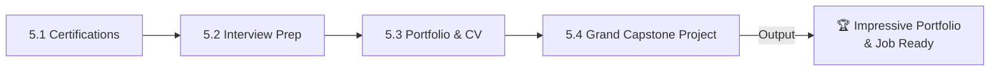
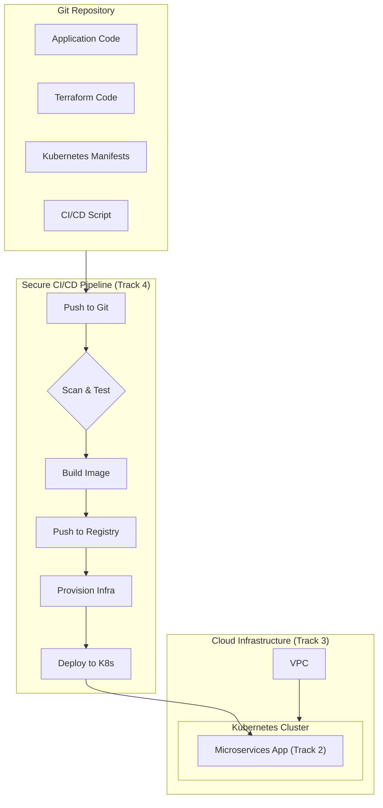
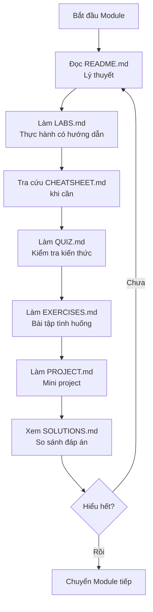

# 🎯 TRACK 5: CAREER PATH - Design Specification

---

## 📋 DOCUMENT INFORMATION (Thông tin tài liệu)

| Thuộc tính | Giá trị |
|------------|---------|
| **Track** | 5 - Career Path |
| **Phiên bản** | 1.0 |
| **Ngày tạo** | 2025-12-28 |
| **Trạng thái** | 📝 THIẾT KẾ |

---

## 1. 🎯 PURPOSE AND OVERVIEW (Mục đích và Tổng quan)

### 1.1 Mục tiêu của Track

> **Mục tiêu cuối cùng:** Học viên **sẵn sàng cho con đường nghề nghiệp DevOps** với portfolio, CV, và kỹ năng phỏng vấn.

**Sau khi hoàn thành Track 5, học viên sẽ:**

- ✅ Hiểu về các chứng chỉ DevOps phổ biến (CKA, AWS, GCP)
- ✅ Chuẩn bị tốt cho technical interviews
- ✅ Xây dựng portfolio và CV chuyên nghiệp
- ✅ **Hoàn thành Grand Capstone Project: Tích hợp toàn bộ kiến thức**

### 1.2 Đối tượng

| Level | Mô tả |
|-------|-------|
| **Yêu cầu đầu vào** | Hoàn thành Track 4 hoặc có kiến thức tương đương |
| **Đầu ra** | Job-ready DevOps Engineer |

### 1.3 Thời lượng ước tính

| Module | Thời gian | Tổng cộng |
|--------|-----------|-----------|
| 4 modules x ~12-18 giờ/module | | **48-72 giờ** (~1.5-2.5 tháng học part-time) |

---

## 2. 📁 MODULE STRUCTURE (Cấu trúc Modules)

### 2.1 Tổng quan 4 Modules



### 2.2 Chi tiết từng Module

---

## 📘 MODULE 5.1: CERTIFICATIONS

### Thông tin chung

| Thuộc tính | Giá trị |
|------------|---------|
| **Tên đầy đủ** | DevOps Certifications Guide |
| **Thời lượng** | 10-12 giờ |
| **Độ khó** | Intermediate-Advanced |
| **Yêu cầu trước** | Track 4 hoàn thành |

### Mục tiêu học tập

Sau khi hoàn thành module này, học viên sẽ:

- [ ] Hiểu landscape của các chứng chỉ DevOps
- [ ] Có roadmap học cho CKA (Certified Kubernetes Administrator)
- [ ] Có roadmap học cho AWS certifications
- [ ] Biết cách đăng ký và chuẩn bị cho kỳ thi

### Nội dung chi tiết

| # | Chủ đề | Kiến thức cụ thể | Thời lượng |
|---|--------|------------------|------------|
| 1 | Certification Overview | Tại sao cần, ROI, career impact | 1 giờ |
| 2 | CKA | Exam format, topics, preparation tips | 2.5 giờ |
| 3 | CKAD | Difference from CKA, when to take | 1 giờ |
| 4 | AWS DevOps Pro | Exam domains, study resources | 2 giờ |
| 5 | AWS Solutions Architect | Foundation cert, study path | 1.5 giờ |
| 6 | GCP DevOps | Google Cloud certifications overview | 1 giờ |
| 7 | HashiCorp | Terraform Associate, Vault Associate | 1 giờ |
| 8 | Study Tips | Time management, practice exams, exam day | 1 giờ |

### Nguồn tham khảo

| Nguồn | Đường dẫn | Sử dụng |
|-------|-----------|---------|
| BaiTap | `_BaiTap/Devops-Exercises/certificates/` | **7 certification guides** |
| DevOps-course | `_NoiDungMau/DevOps-course/CAREER_PATH.md` | Career guidance |

---

## 📗 MODULE 5.2: INTERVIEW PREP

### Thông tin chung

| Thuộc tính | Giá trị |
|------------|---------|
| **Tên đầy đủ** | DevOps Interview Preparation |
| **Thời lượng** | 12-15 giờ |
| **Độ khó** | All levels |
| **Yêu cầu trước** | Module 5.1 hoàn thành |

### Mục tiêu học tập

Sau khi hoàn thành module này, học viên sẽ:

- [ ] Trả lời được câu hỏi technical interview
- [ ] Thực hiện được system design interview
- [ ] Có soft skills cho behavioral interview
- [ ] Tự tin trong mock interviews

### Nội dung chi tiết

| # | Chủ đề | Kiến thức cụ thể | Thời lượng |
|---|--------|------------------|------------|
| 1 | Interview Process | Types, stages, what to expect | 1 giờ |
| 2 | Technical Q&A - Linux | 50+ câu hỏi Linux phổ biến | 2 giờ |
| 3 | Technical Q&A - Networking | 30+ câu hỏi networking | 1.5 giờ |
| 4 | Technical Q&A - Docker/K8s | 50+ câu hỏi containers | 2 giờ |
| 5 | Technical Q&A - CI/CD | 30+ câu hỏi CI/CD | 1.5 giờ |
| 6 | Technical Q&A - Cloud | 40+ câu hỏi AWS/Cloud | 2 giờ |
| 7 | System Design | Design patterns, whiteboard sessions | 2 giờ |
| 8 | Behavioral Interview | STAR method, common questions | 1.5 giờ |
| 9 | Mock Interviews | Practice sessions, feedback | 2 giờ |

### Nguồn tham khảo

| Nguồn | Đường dẫn | Sử dụng |
|-------|-----------|---------|
| BaiTap | `_BaiTap/Devops-Exercises/README.md` | **Câu hỏi interview (184KB)** |
| BaiTap | `_BaiTap/Devops-Exercises/prepare_for_interview.md` | **Interview preparation guide** |
| BaiTap | `_BaiTap/Devops-Exercises/topics/` | Topic-specific questions |

---

## 🎯 MODULE 5.3: PORTFOLIO & CAREER LAUNCH

### Thông tin chung

| Thuộc tính | Giá trị |
|------------|---------|
| **Tên đầy đủ** | Portfolio & Career Launch |
| **Thời lượng** | 10-15 giờ |
| **Độ khó** | All levels |
| **Yêu cầu trước** | Module 5.2 hoàn thành |

### Mục tiêu

Xây dựng **professional portfolio** với:

- GitHub profile optimized
- Portfolio website (từ Track 1)
- CV/Resume chuẩn
- LinkedIn profile
- Blog posts về các projects

### Yêu cầu dự án

```
📁 portfolio/
├── github-profile/
│   ├── README.md              # GitHub profile README
│   └── pinned-repos.md        # List of repos to pin
├── portfolio-website/
│   ├── (code từ Track 1)
│   └── projects/              # Showcase các capstone projects
├── cv/
│   ├── resume.pdf
│   ├── resume.md              # Markdown source
│   └── cover-letter-template.md
├── linkedin/
│   └── profile-sections.md
├── blog/
│   └── article-ideas.md
└── README.md
```

### Portfolio Projects để showcase

| Project | Từ Track | Mô tả |
|---------|----------|-------|
| Static Website CI/CD | Track 1 | GitHub Pages + GitHub Actions |
| Microservices on K8s | Track 2 | Full stack + monitoring |
| Cloud Infrastructure | Track 3 | Terraform + AWS |
| Secure Pipeline | Track 4 | DevSecOps implementation |

### Tiêu chí đánh giá

| # | Tiêu chí | Điểm |
|---|----------|------|
| 1 | GitHub profile README professional | 15% |
| 2 | Portfolio website live và responsive | 20% |
| 3 | 4+ projects được showcase với documentation | 25% |
| 4 | CV/Resume format chuẩn, ≤ 2 pages | 15% |
| 5 | LinkedIn profile completed | 10% |
| 6 | 1+ blog post về project | 15% |

---

## 🚀 MODULE 5.4: GRAND CAPSTONE PROJECT

### Thông tin chung

| Thuộc tính | Giá trị |
|------------|---------|
| **Tên đầy đủ** | Grand Capstone: End-to-End DevOps System |
| **Thời lượng** | 20-30 giờ |
| **Độ khó** | Expert (tổng hợp) |
| **Yêu cầu trước** | Module 5.3 hoàn thành, Hoàn thành Tracks 1-4 |

### Mục tiêu

**Tích hợp toàn bộ kiến thức đã học** để xây dựng một hệ thống hoàn chỉnh, thực tế, chứng minh năng lực của một DevOps Engineer.

### Yêu cầu dự án

Học viên sẽ triển khai ứng dụng microservices (từ Track 2) lên hạ tầng cloud (từ Track 3) bằng một pipeline bảo mật (từ Track 4).



### Tiêu chí đánh giá

| # | Tiêu chí | Mô tả | Điểm |
|---|----------|-------|------|
| 1 | **Infrastructure as Code** | Hạ tầng (VPC, K8s cluster) được tạo bởi Terraform | 20% |
| 2 | **CI/CD Pipeline** | Pipeline tự động, tích hợp build, test, deploy | 25% |
| 3 | **Security** | Pipeline có các bước security scan (SAST, DAST, trivy) | 20% |
| 4 | **Deployment** | Ứng dụng microservices chạy thành công trên K8s | 20% |
| 5 | **Documentation** | Sơ đồ kiến trúc, hướng dẫn vận hành chi tiết | 15% |

---

## 3. 📁 DIRECTORY STRUCTURE (Cấu trúc thư mục)

```
Track5_Career_Path/
│
├── 5.1_Certifications/
│   ├── (cấu trúc 7 files)
│
├── 5.2_Interview_Prep/
│   ├── (cấu trúc 7 files)
│
├── 5.3_Portfolio_Launch/
│   ├── images/
│   ├── README.md
│   ├── TEMPLATES/
│   └── SOLUTIONS.md
│
└── 5.4_Grand_Capstone/
    ├── images/
    ├── README.md
    ├── STARTER_CODE/
    └── SOLUTIONS.md
```

---

## 4. 📋 7 STANDARD FILES PER MODULE (7 file chuẩn mỗi module)

Theo quy tắc từ `MASTER_BLUEPRINT.md`:

| File | Mục đích | Độ dài ước tính |
|------|----------|-----------------|
| `README.md` | Giáo trình lý thuyết, diagrams, best practices | 500-1500 dòng |
| `CHEATSHEET.md` | Tra cứu nhanh lệnh, snippets | 100-300 dòng |
| `LABS.md` | 3-5 bài thực hành có hướng dẫn từng bước | 300-800 dòng |
| `QUIZ.md` | 15-20 câu hỏi trắc nghiệm | 200-400 dòng |
| `EXERCISES.md` | 5-10 bài tập tình huống tự làm | 150-300 dòng |
| `PROJECT.md` | Mini project tổng hợp | 100-200 dòng |
| `SOLUTIONS.md` | Đáp án cho Quiz, Exercises, Project | 300-600 dòng |

---

## 5. 🔗 PREREQUISITES CHECK (Kiểm tra yêu cầu)

Track 5 không cần thêm tools mới, nhưng cần verify:

```bash
# Verify Track 4 completion
./Setup_Environment/scripts/verify_track4.sh

# Track 5 ready (no additional tools needed)
echo "✅ Ready for Track 5!"
```

**Yêu cầu:**

- GitHub account
- LinkedIn account
- Domain name (optional, cho portfolio website)

## 6. 🔄 WORKFLOW (Quy trình học)



---

## 7. 📌 NAVIGATION LINKS (Đường dẫn điều hướng)

### 7.1 Từ Track README về các Modules

```markdown
## Track 5 - Career Path

| # | Module | Mô tả | Thời lượng |
|---|--------|-------|------------|
| 5.1 | [Certifications](./5.1_Certifications/README.md) | DevOps certifications | 10-12h |
| 5.2 | [Interview Prep](./5.2_Interview_Prep/README.md) | Technical interview | 12-15h |
| 5.3 | [Portfolio & CV](./5.3_Portfolio_Launch/README.md) | Build professional portfolio | 10-15h |
| 5.4 | [Grand Capstone](./5.4_Grand_Capstone/README.md) | Final integrative project | 20-30h |
```

### 7.2 Navigation Footer mỗi Module

```markdown
---

[⬅️ Track 4](../Track4_DevSecOps/README.md) | [📚 Track 5](./README.md) | [5.2 Interview Prep ➡️](../5.2_Interview_Prep/README.md)
```

---

## 8. 📊 IMPLEMENTATION CHECKLIST (Checklist triển khai)

### 8.1 Thư mục

- [ ] Tạo `Track5_Career_Path/`
- [ ] Tạo 4 thư mục modules (5.1 - 5.4)
- [ ] Tạo thư mục `images/` trong mỗi module

### 8.2 Files mỗi Module (4 modules)

**Module 5.1 - 5.2:** 7 files mỗi module
**Module 5.3 Portfolio & CV:** README.md, TEMPLATES/, SOLUTIONS.md
**Module 5.4 Grand Capstone:** README.md, STARTER_CODE/, SOLUTIONS.md

---

## 9. 📚 REFERENCES (Nguồn tham khảo)

| Module | Nguồn chính | Nguồn phụ |
|--------|-------------|-----------|
| 5.1 Certs | `_BaiTap/Devops-Exercises/certificates/` | Official cert guides |
| 5.2 Interview | `_BaiTap/Devops-Exercises/README.md`, `prepare_for_interview.md` | `topics/` |
| 5.3 Portfolio | Tự thiết kế | CV templates, GitHub profile guides |
| 5.4 Grand Capstone | Tự thiết kế | All previous capstone projects |

---

## 10. 🎉 COURSE COMPLETION (Hoàn thành khóa học)

Sau khi hoàn thành Track 5, học viên đã:

```
✅ Track 0: Setup Environment
✅ Track 1: Foundation & Static Web (Website CI/CD)
✅ Track 2: Orchestration & Automation (Microservices K8s)
✅ Track 3: Cloud & System Design (Terraform AWS)
✅ Track 4: DevSecOps (Secure Pipeline)
✅ Track 5: Career Path (Portfolio + Grand Capstone)

🎯 OUTPUT: Job-Ready DevOps Engineer
```

### Certificate of Completion

Học viên hoàn thành tất cả 5 Tracks sẽ nhận:

- Certificate of Completion
- Badge cho GitHub profile
- Reference letter template

---

*Cập nhật: 2025-12-28 | Trạng thái: CHỜ DUYỆT*
