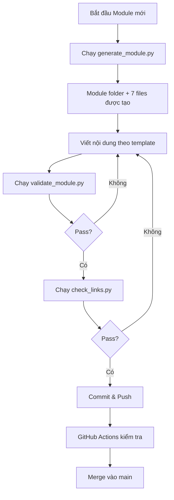

# 📋 REQUIREMENTS - DevOps-Journey Course Standards

---

## 📋 DOCUMENT INFORMATION (Thông tin tài liệu)

| Thuộc tính | Giá trị |
|------------|---------|
| **Tên tài liệu** | Bộ Yêu Cầu & Thảo Luận Quy Chuẩn |
| **Mục đích** | Trao đổi và thống nhất quy chuẩn dự án |
| **Ngày tạo** | 2025-12-28 |
| **Trạng thái** | 🔄 ĐANG THẢO LUẬN |

---

## 1. 🎯 OVERVIEW (Tổng quan)

### 1.1 Mô tả

**DevOps-Journey** là bộ tài liệu đào tạo DevOps bằng **tiếng Việt** dành cho người **bắt đầu từ zero**. Dự án được chia thành 5 Track + 1 Setup Environment:

```
DevOps-Journey/
├── Setup_Environment/                    # Thiết lập môi trường học tập
├── Track1_Foundation_StaticWeb/          # Nền tảng và Web tĩnh
├── Track2_Orchestration_Automation/      # Điều phối & Tự động hóa
├── Track3_Cloud_Network_Design/          # Thiết kế hệ thống, mạng và đám mây
├── Track4_DevSecOps/                     # DevSecOps
└── Track5_Career_Path/                   # Lộ trình nghề nghiệp
```

### 1.2 Đối tượng học viên

| Cấp độ | Mô tả |
|--------|-------|
| **Zero/Beginner** | Chưa có kiến thức IT, bắt đầu từ đầu |
| **Intermediate** | Đã có kiến thức cơ bản Linux/Networking |
| **Advanced** | Đã làm việc trong lĩnh vực IT/Dev |

---

## 2. 📁 ORGANIZED DOCUMENTS (Tài liệu đã tổ chức)

Thư mục `Reference/` đã được tổ chức lại thành **3 danh mục chính**:

```
Reference/
├── _QuytacThietke/           # 🎨 Quy tắc & Thiết kế
│   ├── .design/              # MASTER_BLUEPRINT.md + 7 file *_design.md
│   ├── README_Samples/       # Các mẫu README
│   ├── resources/            # GLOSSARY.md, SOFTWARE_LINKS.md
│   └── assets/               # Ảnh, logo
│
├── _NoiDungMau/              # 📖 Nội dung mẫu (404 items)
│   ├── Setup_Environment/    # Mẫu chuẩn
│   ├── Track1-5/             # Mẫu chuẩn theo 5 Tracks
│   ├── DevOps-1_TrainingRoadmap/  # Roadmap 7 Lessons
│   ├── DevOps-2/             # ⭐ 15 Modules chi tiết (THAM KHẢO CHÍNH)
│   ├── DevOps-3/             # Foundation
│   └── DevOps-course/        # DevOps Lifecycle
│
└── _BaiTap/                  # ✏️ Bài tập (400 items)
    ├── DevOps-1_Exercises/   # 55 exercises + solutions
    └── Devops-Exercises/     # 345+ exercises
```

### 2.1 _QuytacThietke (Quy tắc & Thiết kế)

| File/Thư mục | Mô tả |
|--------------|-------|
| `.design/MASTER_BLUEPRINT.md` | ⭐ Tài liệu master - ĐỌC TRƯỚC TIÊN |
| `.design/_Reference/*_design.md` | 7 templates cho 7 loại file |
| `resources/GLOSSARY.md` | Từ điển thuật ngữ (KHÔNG DỊCH) |
| `resources/SOFTWARE_LINKS.md` | Links tải phần mềm |

### 2.2 _NoiDungMau (Nội dung mẫu)

| Nguồn | Đặc điểm | Khuyến nghị |
|-------|----------|-------------|
| `DevOps-2/` | **Chi tiết nhất**, có câu chuyện/ẩn dụ | ⭐ Tham khảo chính |
| `Track1-5/` | Cấu trúc 7 files chuẩn | Template chuẩn |
| `DevOps-3/` | Focus basics | Cho beginner |

### 2.3 _BaiTap (Bài tập)

| Nguồn | Số lượng | Có đáp án |
|-------|----------|-----------|
| `DevOps-1_Exercises/` | 55 | ✅ Có |
| `Devops-Exercises/` | 345+ | Một phần |

---

## 3. ⚠️ PROBLEMS AND RISKS ENCOUNTERED (Vấn đề và rủi ro đã gặp)

> Dựa trên lịch sử conversation, dự án đã phải làm lại nhiều lần do vi phạm luật. Dưới đây là phân tích nguyên nhân và đề xuất giải pháp:

### 3.1 Các Vấn Đề Tiềm Năng

| # | Vấn đề | Nguyên nhân | Giải pháp đề xuất |
|---|--------|-------------|-------------------|
| 1 | **Thiếu quy trình validation** | Không có checklist bắt buộc trước khi commit | Tạo VALIDATION_CHECKLIST.md |
| 2 | **Template không được tuân thủ** | Không có công cụ tự động kiểm tra | Tạo Python/Bash script validate |
| 3 | **Thuật ngữ bị dịch sai** | Thiếu danh sách thuật ngữ "DO NOT TRANSLATE" | Mở rộng GLOSSARY.md |
| 4 | **Navigation links hỏng** | Không kiểm tra cross-reference | Script kiểm tra links |
| 5 | **YAML front-matter thiếu** | Quên thêm metadata | Linter config |
| 6 | **Diagram không dùng Mermaid** | Dùng ảnh PNG thay vì Mermaid | Review checklist |

---

## 4. ❓ DISCUSSION QUESTIONS (Câu hỏi thảo luận)

> **[USER] Vui lòng trả lời các câu hỏi dưới đây bằng cách thêm comment vào file này:**

### 4.1 Về Nội Dung

> **Q1:** Bạn đã gặp các lỗi/vi phạm cụ thể nào trong quá trình làm? Liệt kê để tôi có thể bổ sung vào quy chuẩn.

**[USER ANSWER]:**
<!-- Trả lời tại đây -->

---

> **Q2:** Trong các file design hiện có, có điểm nào bạn thấy chưa đủ chi tiết hoặc không phù hợp với người Việt zero?

**[USER ANSWER]:**
<!-- Trả lời tại đây -->

---

> **Q3:** Bạn có muốn bổ sung loại file nào ngoài 7 file chuẩn (README, CHEATSHEET, LABS, QUIZ, EXERCISES, PROJECT, SOLUTIONS)?

**[USER ANSWER]:**
<!-- Trả lời tại đây -->

---

### 4.2 Về Quy Trình

> **Q4:** Bạn muốn có công cụ tự động validate (script Python/Bash) để kiểm tra cấu trúc file trước khi commit không?

**[USER ANSWER]:**
<!-- Trả lời tại đây -->

---

> **Q5:** Có cần tạo GitHub Actions workflow để tự động kiểm tra PR/commit không?

**[USER ANSWER]:**
<!-- Trả lời tại đây -->

---

### 4.3 Về Đặc Thù Người Việt Zero

> **Q6:** Có yêu cầu đặc biệt nào cho học viên người Việt mà chưa được đề cập trong design? Ví dụ:
>
> - Thêm phần giải thích thuật ngữ tiếng Anh bằng ví dụ Việt Nam?
> - Video hướng dẫn tiếng Việt?
> - Kênh hỗ trợ Discord/Telegram?

**[USER ANSWER]:**
<!-- Trả lời tại đây -->

---

> **Q7:** Mức độ chi tiết của hướng dẫn như thế nào là phù hợp với người zero?
>
> - Chỉ cần command + output mong đợi?
> - Hay cần giải thích từng flag/option?
> - Hay cần thêm video screenshot từng bước?

**[USER ANSWER]:**
<!-- Trả lời tại đây -->

---

## 5. 📝 PROPOSED STANDARDS (Đề xuất quy chuẩn)

Sau khi nhận được câu trả lời, tôi sẽ tạo các file sau:

### 5.1 Cấu trúc `.design/` (Dự kiến)

```
DevOps-Journey/.design/
├── REQUIREMENTS.md                 # [File này] - Yêu cầu & thảo luận
├── MASTER_BLUEPRINT.md             # Bản sao từ Reference (đã cập nhật)
├── VALIDATION_CHECKLIST.md         # Checklist kiểm tra trước commit
├── TERMINOLOGY.md                  # Danh sách thuật ngữ KHÔNG DỊCH
│
├── templates/                      # Thư mục chứa templates
│   ├── README_template.md
│   ├── CHEATSHEET_template.md
│   ├── LABS_template.md
│   ├── QUIZ_template.md
│   ├── EXERCISES_template.md
│   ├── PROJECT_template.md
│   └── SOLUTIONS_template.md
│
├── scripts/                        # Scripts tự động
│   ├── validate_module.py          # Kiểm tra cấu trúc module
│   ├── check_links.py              # Kiểm tra links hỏng
│   └── generate_module.py          # Tạo module mới từ template
│
└── design/                         # Specifications chi tiết
    ├── README_design.md
    ├── CHEATSHEET_design.md
    ├── LABS_design.md
    ├── QUIZ_design.md
    ├── EXERCISES_design.md
    ├── PROJECT_design.md
    └── SOLUTIONS_design.md
```

### 5.2 Workflow Làm Việc (Dự kiến)



---

## 6. ✅ NEXT STEPS (Bước tiếp theo)

Sau khi bạn trả lời các câu hỏi trên:

1. **Cập nhật REQUIREMENTS.md** với các câu trả lời
2. **Tạo MASTER_BLUEPRINT.md** phiên bản mới (copy từ Reference + bổ sung)
3. **Tạo VALIDATION_CHECKLIST.md** với checklist chi tiết
4. **Tạo TERMINOLOGY.md** danh sách thuật ngữ không dịch
5. **Tạo các template files** trong thư mục templates/
6. **Tạo scripts** nếu cần

---

## 📌 NOTE (Ghi chú)

- File này là nơi trao đổi chính cho dự án
- Mọi thay đổi về quy chuẩn phải được thảo luận và cập nhật tại đây
- Sau khi thống nhất, sẽ chính thức đưa vào các file design

---

*Cập nhật lần cuối: 2025-12-28 | Trạng thái: ĐANG THẢO LUẬN*

