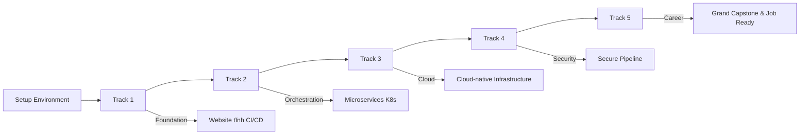

# 📊 CURRICULUM MAPPING - Phân Tích Cấu Trúc Kiến Thức

---

## 📋 DOCUMENT INFORMATION (Thông tin tài liệu)

| Thuộc tính | Giá trị |
|------------|---------|
| **Tên tài liệu** | Bản Đồ Kiến Thức & Nguồn Tham Khảo |
| **Mục đích** | Thống nhất cấu trúc kiến thức trước khi triển khai |
| **Ngày tạo** | 2025-12-28 |
| **Trạng thái** | ✅ ĐÃ CẬP NHẬT |

---

## 1. 🎯 CURRICULUM OVERVIEW (Tổng quan chương trình)

### 1.1 Lộ Trình Đào Tạo



### 1.2 Thống Kê Tổng Quan

| Track | Tên | Folder Name | Số Modules | Mục tiêu cuối |
|-------|-----|-------------|------------|---------------|
| 0 | Setup Environment | `Setup_Environment` | 1 | Môi trường đồng nhất |
| 1 | Foundation & Static Web | `Track1_Foundation_StaticWeb` | 8 | Deploy website tĩnh với CI/CD |
| 2 | Orchestration & Automation | `Track2_Microservices_K8s` | 6 | Microservices trên Kubernetes |
| 3 | Cloud & System Design | `Track3_Cloud_System_Design` | 7 | Cloud-native với Terraform & Ansible |
| 4 | DevSecOps | `Track4_DevSecOps` | 3 | Secure CI/CD Pipeline |
| 5 | Career Path | `Track5_Career_Path` | 4 | Portfolio & Grand Capstone |
| **TỔNG** | | | **29 modules** | |

---

## 2. 📚 TRACK DETAILS (Chi tiết từng Track)

---

### 🛠️ TRACK 0: SETUP ENVIRONMENT

**Mục đích:** Chuẩn bị môi trường học tập đồng nhất cho tất cả học viên.

#### Nội Dung Chính

| Chủ đề | Kiến thức cụ thể |
|--------|------------------|
| **Hệ điều hành** | WSL2 trên Windows, Ubuntu basics |
| **Editor** | VS Code + Extensions (Docker, Remote SSH, GitLens) |
| **Terminal** | Windows Terminal, Bash basics |
| **Scripting** | Python (cài đặt) |
| **Containerization** | Docker Desktop cài đặt và verify |
| **Version Control** | Git + GitHub account setup |

#### Mapping Tham Khảo

| Nguồn | File/Thư mục | Sử dụng cho |
|-------|--------------|-------------|
| Bản gốc | `_NoiDungMau/Setup_Environment/` | Cấu trúc 7 files |
| DevOps-2 | `01_LINUX/README.md` | Nội dung Linux cơ bản |
| DevOps-3 | `FOUNDATION/PREREQUISITES.md` | Yêu cầu chuẩn bị |

---

### 📦 TRACK 1: FOUNDATION & STATIC WEB

**Mục đích:** Xây dựng nền tảng vững chắc và triển khai website tĩnh với CI/CD.

**Yêu cầu:** Có kiến thức cơ bản về máy tính.

#### Chi Tiết Modules

| Module | Tên | Kiến thức cụ thể |
|--------|-----|------------------|
| **1.1** | Linux & Bash | Terminal, commands cơ bản, file system, permissions, processes, scripting |
| **1.2** | Python Basics | Cú pháp cơ bản, biến, hàm, vòng lặp, đọc ghi file |
| **1.3** | Network Basics | TCP/IP, OSI, DNS, ports, ping, traceroute, ifconfig |
| **1.4** | Git & GitLab | Repository, commit, branch, merge, remote, pull request |
| **1.5** | Docker Fundamentals | Dockerfile, build, run, images, containers, networking |
| **1.6** | NGINX Basic | Server block, static files, reverse proxy, logs |
| **1.7** | CI/CD Basic | GitHub Actions, build, test, deploy, secrets |
| **1.8** | Capstone Project | Website tĩnh hoàn chỉnh với CI/CD |

#### Mapping Tham Khảo

| Module | Nguồn chính | Files tham khảo |
|--------|------------|-----------------|
| 1.1 Linux | DevOps-2 | `01_LINUX/README.md`, `LABS.md`, `SCENARIOS.md` |
| | DevOps-3 | `FOUNDATION/01_LINUX_BASICS/` |
| 1.2 Python | _BaiTap | `Devops-Exercises/coding/python/` |
| 1.3 Network | DevOps-2 | `02_NETWORKING/` (14 files chi tiết) |
| | DevOps-3 | `FOUNDATION/03_NETWORKING_INTRO/` |
| 1.4 Git | DevOps-2 | `04_GIT/` |
| | DevOps-3 | `FOUNDATION/02_GIT_GITHUB/` |
| 1.5 Docker | DevOps-2 | `07_DOCKER/README.md` (fundamentals) |
| | DevOps-3 | `FOUNDATION/05_DOCKER_BASICS/` |
| 1.6 NGINX | DevOps-2 | `05_WEB_SERVERS/` |
| | DevOps-3 | `FOUNDATION/07_WEB_SERVERS_BASICS/` |
| 1.7 CI/CD | DevOps-2 | `08_CI/` |
| | DevOps-3 | `FOUNDATION/06_CI_BASICS/` |
| 1.8 Capstone | DevOps-1 | `training-roadmap/Lesson07-final-project/` |

---

### 🔧 TRACK 2: ORCHESTRATION & AUTOMATION

(Không thay đổi)
...

---

### ☁️ TRACK 3: CLOUD, NETWORK & SYSTEM DESIGN

**Mục đích:** Xây dựng môi trường cloud-native với Terraform và Ansible.

**Yêu cầu:** Hoàn thành Track 2.

#### Chi Tiết Modules

| Module | Tên | Kiến thức cụ thể |
|--------|-----|------------------|
| **3.1** | Network Advanced | VPC, subnets, routing, security groups, NAT, VPN |
| **3.2** | AWS Core Services | IAM, EC2, S3, RDS, ELB, CloudWatch |
| **3.3** | Databases for DevOps | SQL vs NoSQL, Backup/Restore, Migrations |
| **3.4** | Config Management (Ansible) | Playbooks, roles, templates, vault |
| **3.5** | Terraform IaC | Providers, resources, state, modules, workspaces |
| **3.6** | System Design & Reliability | SLA/SLO/SLI, HA, auto-scaling, DR, fault tolerance |
| **3.7** | Capstone Project | Cloud-native environment với Terraform & Ansible |

#### Mapping Tham Khảo

| Module | Nguồn chính | Files tham khảo |
|--------|------------|-----------------|
| 3.1 Network Adv | DevOps-2 | `02_NETWORKING/` |
| 3.2 AWS | DevOps-2 | `11_CLOUD/` |
| 3.3 Databases | DevOps-2 | `06_DATABASES/` |
| 3.4 Ansible | DevOps-1 | `Exercises04/10-ansible/` |
| 3.5 Terraform | DevOps-2 | `12_IAC/` |
| 3.6 System Design | DevOps-2 | `15_SRE/` |
| 3.7 Capstone | Tự thiết kế | Tham khảo tất cả |

---

### 🔒 TRACK 4: DEVSECOPS

(Không thay đổi)
...

---

### 🎯 TRACK 5: CAREER PATH

**Mục đích:** Chuẩn bị cho con đường nghề nghiệp DevOps.

**Yêu cầu:** Hoàn thành Track 4.

#### Chi Tiết Modules

| Module | Tên | Kiến thức cụ thể |
|--------|-----|------------------|
| **5.1** | Certifications | CKA, AWS DevOps, GCP DevOps - ôn tập, đề mẫu |
| **5.2** | Interview Prep | Câu hỏi kỹ thuật, mock interview, soft skills |
| **5.3** | Portfolio & Career Launch | Xây dựng portfolio, CV, LinkedIn |
| **5.4** | Grand Capstone Project | Tích hợp toàn bộ kiến thức khóa học |

#### Mapping Tham Khảo

| Module | Nguồn chính | Files tham khảo |
|--------|------------|-----------------|
| 5.1 Certs | _BaiTap | `Devops-Exercises/certificates/` |
| 5.2 Interview | _BaiTap | `Devops-Exercises/prepare_for_interview.md` |
| 5.3 Portfolio | Tự thiết kế | CV templates |
| 5.4 Grand Capstone | Tự thiết kế | All previous capstones |

---

## 3. 📂 REFERENCES (Tài liệu tham khảo)

(Không thay đổi)
...

---

## 4. ❓ DISCUSSION QUESTIONS (Câu hỏi thảo luận)

> **Xin bạn review và xác nhận các điểm sau:**

### 4.1 Về Cấu Trúc Tracks

| # | Câu hỏi | Đề xuất hiện tại | [USER CONFIRM] |
|---|---------|------------------|----------------|
| 1 | Track 1 có 8 modules đủ không? | Thêm Python Basics | [X] OK |
| 2 | Track 2 có cần Jenkins không? | Có (pipeline phổ biến) | [ ] OK / [ ] Bỏ |
| 3 | Track 3 có 7 modules đủ không? | Thêm Databases & Ansible | [X] OK |
| 4 | Track 4 có cần thêm module? | 2 + Capstone = 3 | [ ] OK / [ ] Thêm |
| 5 | Track 5 có 4 modules đủ không? | Thêm Grand Capstone | [X] OK |

### 4.2 Về Độ Sâu Kiến Thức

(Không thay đổi)
...

### 4.3 Về Thứ Tự Kiến Thức

> **Có cần thay đổi thứ tự modules trong mỗi Track không?**

**Track 1 hiện tại:**

```
1.1 Linux & Bash → 1.2 Python Basics → 1.3 Network → 1.4 Git → 1.5 Docker → 1.6 NGINX → 1.7 CI/CD → 1.8 Capstone
```

**[USER CONFIRM]:** [X] OK

---

## 5. ✅ NEXT STEPS (Bước tiếp theo)

Sau khi bạn xác nhận:

1. **Copy MASTER_BLUEPRINT.md** vào `DevOps-Journey/.design/`
2. **Tạo templates** cho mỗi loại file
3. **Tạo script generate_module.py** để tự động tạo module
4. **Bắt đầu viết nội dung** từ Track 0 → Track 1

---

*Cập nhật: 2025-12-28 | Trạng thái: ✅ ĐÃ CẬP NHẬT*
