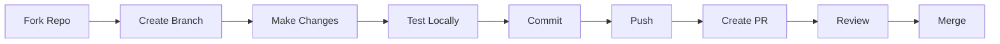

# 🤝 CONTRIBUTION GUIDE - Hướng Dẫn Đóng Góp

---

## 📋 DOCUMENT INFORMATION (Thông tin tài liệu)

| Thuộc tính | Giá trị |
|------------|---------|
| **Tên** | Contribution Guide |
| **Phiên bản** | 1.0 |
| **Ngày tạo** | 2025-12-28 |
| **Mô tả** | Hướng dẫn đóng góp nội dung cho dự án |

---

## 1. 🎯 INTRODUCTION (Giới thiệu)

Cảm ơn bạn đã quan tâm đến việc đóng góp cho **DevOps-Journey**!

Tài liệu này hướng dẫn cách:

- Báo cáo lỗi (Bug reports)
- Đề xuất cải tiến (Feature requests)
- Đóng góp nội dung (Content contributions)
- Review và sửa lỗi (Fixes)

---

## 2. 📋 CONTRIBUTION PROCESS (Quy trình đóng góp)



### 2.1 Các bước chi tiết

1. **Fork** repository về tài khoản của bạn
2. **Clone** về máy local
3. **Create branch** với tên mô tả: `feature/module-1.4-docker` hoặc `fix/typo-track2`
4. **Thực hiện thay đổi** theo quy chuẩn
5. **Test** nội dung locally
6. **Commit** với message rõ ràng
7. **Push** lên fork
8. **Tạo Pull Request** về main repo

---

## 3. 📝 CONTRIBUTION TYPES (Loại đóng góp)

### 3.1 Báo cáo lỗi (Bug Report)

**Tạo Issue với:**

```markdown
## Bug Description
Mô tả ngắn gọn lỗi.

## Steps to Reproduce
1. Vào file X
2. Chạy lệnh Y
3. Thấy lỗi Z

## Expected Behavior
Kết quả mong đợi.

## Actual Behavior
Kết quả thực tế.

## Environment
- OS: Windows/macOS/Linux
- Tool versions: Docker 24.x, etc.
```

### 3.2 Đề xuất cải tiến (Feature Request)

**Tạo Issue với:**

```markdown
## Feature Description
Mô tả tính năng muốn thêm.

## Use Case
Tại sao cần tính năng này?

## Proposed Solution
Đề xuất cách thực hiện (nếu có).
```

### 3.3 Đóng góp nội dung

| Loại | File cần đọc trước |
|------|-------------------|
| Viết module mới | [CONTENT_STANDARDS.md](./CONTENT_STANDARDS.md) |
| Viết README | [README_DESIGN.md](./README_DESIGN.md) |
| Viết Labs | [LABS_DESIGN.md](./LABS_DESIGN.md) |
| Viết code samples | [STYLE_GUIDE.md](./STYLE_GUIDE.md) |
| Viết Capstone | [CAPSTONE_DESIGN.md](./CAPSTONE_DESIGN.md) |

---

## 4. ✅ PRE-SUBMIT CHECKLIST (Checklist trước khi submit)

### 4.1 Nội dung

- [ ] Đã đọc file design tương ứng
- [ ] Theo đúng YAML front-matter
- [ ] Thuật ngữ link về GLOSSARY (lần đầu)
- [ ] Có Navigation Footer
- [ ] Không có lỗi chính tả

### 4.2 Code samples

- [ ] Đã test trên môi trường thực
- [ ] Có comment giải thích
- [ ] Theo đúng [STYLE_GUIDE.md](./STYLE_GUIDE.md)
- [ ] Không có secrets/passwords

### 4.3 Git

- [ ] Branch name đúng format
- [ ] Commit messages rõ ràng
- [ ] Không commit files không liên quan

---

## 5. 📜 COMMIT MESSAGE FORMAT (Định dạng commit message)

```
<type>(<scope>): <description>

[optional body]
```

### Types

| Type | Mô tả |
|------|-------|
| `feat` | Thêm nội dung mới |
| `fix` | Sửa lỗi |
| `docs` | Cập nhật documentation |
| `style` | Format, không thay đổi logic |
| `refactor` | Restructure nội dung |
| `chore` | Maintenance tasks |

### Ví dụ

```bash
feat(track1): add module 1.4 Docker Fundamentals

- Add README.md with theory
- Add LABS.md with 3 hands-on labs
- Add CHEATSHEET.md

Closes #42
```

```bash
fix(track2): correct kubectl command in LABS.md

Wrong: kubectl get pod
Correct: kubectl get pods
```

---

## 6. 📁 DIRECTORY STRUCTURE (Cấu trúc thư mục)

Khi thêm module mới:

```
TrackX_Name/
├── X.Y_ModuleName/
│   ├── images/            # Ảnh cho module
│   ├── README.md          # Lý thuyết
│   ├── CHEATSHEET.md      # Tra cứu nhanh
│   ├── LABS.md            # Thực hành
│   ├── QUIZ.md            # Trắc nghiệm
│   ├── EXERCISES.md       # Bài tập
│   ├── PROJECT.md         # Mini project
│   └── SOLUTIONS.md       # Đáp án
```

---

## 7. 🔍 REVIEW PROCESS (Quy trình review)

### 7.1 Reviewer sẽ kiểm tra

- [ ] Theo đúng design specifications
- [ ] Nội dung chính xác về mặt kỹ thuật
- [ ] Code samples chạy được
- [ ] Ngôn ngữ phù hợp (Tiếng Việt + thuật ngữ Anh)
- [ ] Navigation links hoạt động

### 7.2 Thời gian review

- **Bug fixes:** 1-2 ngày
- **New content:** 3-5 ngày
- **Major changes:** 1 tuần

---

## 8. 📞 CONTACT (Liên hệ)

- **Issues:** [GitHub Issues](link)
- **Email:** [Email address]
- **Discord:** [Discord server] (nếu có)

---

## 9. 🙏 CODE OF CONDUCT (Quy tắc ứng xử)

- Tôn trọng lẫn nhau
- Constructive feedback
- Không spam, không quảng cáo
- Ghi nhận credit cho contributors

---

*Cập nhật: 2025-12-28 | Phiên bản: 1.0*

